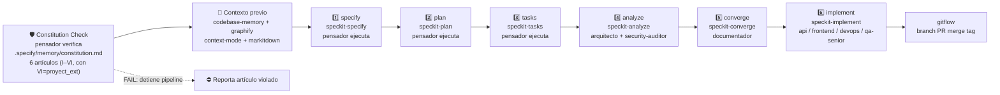

# 📋 Índice del Proyecto: Agents_IA_TECH
*Última actualización: 2026-09-20*

> Este archivo es la **memoria del proyecto** para los agentes. Lo leen primero para entender el contexto sin escanear todo. Los agentes documentales lo mantienen actualizado automáticamente.

## Stack
- Framework: (kit de agentes — sin framework de aplicación)
- Lenguaje: Markdown / YAML
- Base de datos: (ninguna — es configuración de agentes)
- Infraestructura: GitHub Copilot + OpenCode

## CI/CD (GitHub Actions)
- `agentshield.yml` — Security scan de configs de agentes (`ecc-agentshield`, solo `.github/**`)
- `security-scan.yml` — Detección de secrets (gitleaks) sobre todo el repo (push/PR)
- `spellcheck.yml` — Revisión de ortografía (codespell) sobre `.md`/`.yaml`/`.yml` (push/PR)

## Estructura del proyecto

```
Documentacion/
└── Agents_IA_TECH/           ← 📁 Carpeta PROPIA de ESTE proyecto
    ├── 00-indice.md          ← 📋 Este archivo
    ├── idioma.md             ← 🌐 Config de idioma
    ├── preferencias.md       ← 👤 Preferencias usuario
    ├── preferencias-git.md   ← 🏷️ Flujo git
    ├── referencias.md        ← 📖 Fuentes externas
    ├── roadmap.md            ← 🗺️ Backlog evolutivos
    ├── pendientes-implementacion.md ← 📋 Puente docs ↔ código
    ├── soluciones-conocidas.md ← 📚 Soluciones recurrentes
    ├── capacidad-base.md     ← 🏗️ Ref. a .doc_agents/capacidad-base.md
    ├── memoria-proyecto.md   ← 🧠 Capacidades instaladas (plataformador)
    ├── analisis-memoria.md   ← 📝 Memoria del pipeline de documentación (analista_tecnico)
    ├── reglas-transversales-agentes.md ← 🧭 Gobernanza: reglas que se cumplen SIEMPRE al crear/modificar agentes
    ├── modelo-skills-opencode.md ← 🧩 Modelo de skills: Copilot (`skills:`) vs OpenCode (`permission.skill` + tool `skill`)
    ├── mantenimiento-indices-mcp.md ← 🔧 Comandos para actualizar índices MCP + Graphify en ESTE repo (workaround --mode fast)
    │
    ├── specs/                ← 📋 speckit ESCRIBE AQUÍ (spec/plan/tasks)
    │   └── ...
    │
    ├── MCPs/                 ← 🔌 Guías de integración de MCPs
     │   ├── context-mode.md   ←   Guía práctica MCP context-mode
     │   ├── markitdown.md     ←   Guía práctica markitdown (+ markitdown-mcp)
     │   ├── codebase-memory-mcp.md ← Guía práctica MCP codebase-memory-mcp
     │   └── tokenslayer.md    ←   Guía práctica MCP tokenslayer-mcp-server
    │
    ├── README-ECOSISTEMA-DOCUMENTACION.md ← 🧠 Plan ecosistema doc sin IA de entrada (aprobado)
    │
    ├── arquitectura/         ← 📐 Decisiones arquitectura
    │   ├── adr/              ←   ADRs
    │   └── diagramas/        ←   Diagramas Mermaid
    │
    ├── agents/               ← 🤖 Config agentes para ESTE proyecto
    │   ├── pensador/spec.md
    │   ├── arquitecto/spec.md
    │   ├── documentador/spec.md
    │   ├── security-auditor/spec.md
    │   ├── analista_tecnico/spec.md ← 🧠 Nuevo agente (pipeline doc sin IA)
    │   ├── api-developer/spec.md
    │   ├── frontend-developer/spec.md
    │   ├── devops/spec.md
    │   ├── qa-senior/spec.md
    │   ├── gitflow/spec.md
    │   ├── solucionador/spec.md
    │   └── plataformador/
    │       ├── spec.md
    │       ├── capacidad-base.md
    │       └── memoria-proyecto.md
    │
    ├── bitacoras/            ← 📝 Bitácoras solucionador
    │
    ├── testing/              ← 🧪 Opcional — tests documentados
    ├── seguridad/            ← 🔒 Opcional — auditorías
    └── despliegue/           ← 🚀 Opcional — docs despliegue
```

> **Regla**: `Documentacion/Agents_IA_TECH/` es **propia de este proyecto**. NUNCA se copia ni sobrescribe. El kit transversal (`.github/`, `.opencode/`, `.doc_agents/`) SÍ se sincroniza con `sync-agents.ps1`.

## ADRs activos
<!-- Listar ADRs en Documentacion/Agents_IA_TECH/arquitectura/adr/ -->
- `adr-0001-ecosistema-documentacion-sin-ia.md` — Ecosistema de documentación técnica sin IA de entrada (pipeline de 4 herramientas + agente `analista_tecnico` + archivo de memoria `analisis-memoria.md`). **Aceptado 2026-09-12**.
- `adr-0002-flujos-kit.md` — Flujo de contexto (consultar `Documentacion/` + MCPs como optimización + actualización de memoria/índice) y flujo de actualización automática de herramientas externas. **Aceptado 2026-09-12**.
- `adr-0003-plataforma-bootstrap-instalador-unico.md` — `plataformador-bootstrap.ps1` como instalador/actualizador único (Spec-kit + MCPs + Graphify); modelo apps independientes + orquestador; resolución de app activa (`-App` + `cwd`); fusión de `sync-agents.ps1` como `Sync-TransversalKit` (Opción A). **Aceptado 2026-09-17**.
- `adr-0004-post-plataformado-speckit.md` — Flujo post-plataformado → speckit (3 escenarios A/B/C) + re-indexación automática + Constitution por proyecto + memoria auto/manual + Graphify por app. **Aceptado 2026-09-20**.

## Features activas (specs)
<!-- Listar specs en Documentacion/Agents_IA_TECH/specs/ -->
- `specs/plataforma-bootstrap-instalador-unico/` — **Feature**: `plataformador-bootstrap.ps1` como instalador/actualizador único (Spec-kit + MCPs + Graphify). Contiene `spec.md`, `plan.md`, `tasks.md`. Derivada del ADR-0003. Estado: en planificación.
- `specs/metodologia-ssd-speckit/` — **Feature**: Integración uso diario transparente SSD + Speckit + Graphify + MCPs en flujo de todos los agentes. Constitution FIRST → Speckit pipeline (specify→plan→tasks→analyze→converge→implement) → Agentes complementan. Contiene `spec.md`, `plan.md`, `tasks.md`. Estado: fase documental completada (2026-09-19).
- `specs/006-post-platforming-speckit/` — **Feature**: Flujo post-plataformado → speckit (3 escenarios A/B/C) + re-indexación automática + Constitution por proyecto + memoria auto/manual + Graphify por app + aviso re-indexación (RF-010) + gitignore graphify-out (RF-011). Contiene `spec.md`, `plan.md`, `research.md`, `data-model.md`, `analyze.md`, `converge.md`, `tasks.md`. Estado: **IMPLEMENTADA (2026-09-20)** — 31/31 tareas, pipeline completo (specify→plan→tasks→analyze→converge→implement). ADR-0004.

## Agentes del kit

| Agente | Rol | Estado |
|--------|-----|--------|
| `pensador` | Orquestador del ciclo completo: plan -> confirmar -> ejecutar -> actualizar -> preguntar. Complementa Specify (no duplica). 🔌 Puede depurar en caliente vía SSH (solo lectura) | ✅ Actualizado 2026-08-30 |
| `arquitecto` | Decisiones de arquitectura, ADRs, patrones, guardrails, spec linking | 🟢 Activo |
| `documentador` | Documentación de specs, flujos, ADRs, template system, spec versioning | 🟢 Activo |
| `security-auditor` | Revisión de seguridad en diseños | 🟢 Activo |
| `api-developer` | Implementación backend/API | 🟢 Activo |
| `frontend-developer` | Implementación frontend/UI | 🟢 Activo |
| `devops` | Infraestructura, Docker, CI/CD | 🟢 Activo |
| `qa-senior` | Tests automatizados (unit, integración, E2E), feedback loop | 🟢 Activo |
| `gitflow` | Git operations, branching, PRs, commits convencionales | 🟢 Activo |
| `solucionador` | 🔧 Diagnóstico y solución de problemas via SSH en servidores remotos | 🟢 Activo 2026-07-25 |
| `plataformador` | 🏗️ Auditoría, nivelación y replataformado de proyectos contra capacidad-base. Organiza documentación. | 🟢 Activo 2026-07-25 |
| `upgrade_framework` | 🔧 Mantenedor inteligente de dependencias externas. Gestiona proyect_ext/, clona/actualiza proyectos externos (spec-kit, graphify, etc.), y ejecuta integraciones dirigidas desde proyect_ext/ hacia Agents_IA_TECH/ usando plantillas predefinidas. Usa IA solo para analizar impacto de integración. | 🟢 Activo 2026-09-05 |
| `analista_tecnico` | 🧠 Orquesta el pipeline de documentación técnica sin IA de entrada (markitdown → graphify/codebase-memory-mcp → context-mode). Invocado por el `pensador`; retorna a él al terminar. Respeta SSD. | � Activo 2026-09-12 |

> **NOTA**: `ssh-connection-agent` y `usuario-preferencias` son agentes manuales/legacy sin skills speckit (invocación directa por usuario, fuera del pipeline). No forman parte de la tabla de 13 agentes del pipeline SSD+Speckit.

## Convenciones del proyecto

- **Pensador = Orquestador principal** que complementa Specify, no lo duplica
- **Specify maneja**: spec generation, validation, spec→plan, spec→code, template system, versioning, linking, guardrails, multi-file orchestration, feedback loop
- **Mis agentes complementan**: SSH debugging (pensador, solucionador), plataformador (auditoría/nivelación), gitflow (commits), orchestración cross-agent- **Mantenedor de dependencias**: `dependencias` - verifica y actualiza de forma segura proyectos comunitarios externos sin repetir análisis de flujos- **Persistencia obligatoria**: Toda decisión/preferencia en archivo. Sin archivo no hay memoria entre sesiones.
- **Plan aprobado → Documentar → Implementar** (siempre en ese orden)
- **Español latino neutro** en toda comunicación

## Flujo Unificado SSD + Speckit

> Constitution FIRST → Speckit pipeline (`specify → plan → tasks → analyze → converge → implement`) → Agentes complementan según su ámbito. MCPs + Graphify como **contexto previo ANTES de cada llamada `speckit-*`**. Detalle completo: `specs/metodologia-ssd-speckit/spec.md` (RF-01..RF-14).



**Contexto previo (antes de CADA fase)**: `pensador` consulta `codebase-memory` (arquitectura, dependencias, callers), `graphify` (god nodes, communities — ver `MCPs/graphify.md`), `context-mode` (`ctx_search`) y `markitdown` (`convert_to_markdown`). Log de consultas visible en cada fase (RF-09).

### Constitution Wizard (RF-14)

`pensador` incluye un wizard interactivo de 11 pasos para crear/actualizar `.specify/memory/constitution.md`. Si ya existe, ofrece modo "revisar y actualizar" sección por sección. Detalle: `specs/metodologia-ssd-speckit/spec.md` (RF-14).

| Paso | Tema | Pregunta clave |
|------|------|----------------|
| 1 | Tipo de proyecto | ¿Nuevo o existente a migrar al formato? |
| 2 | Objetivo de la solución | ¿Qué hace, qué problema resuelve, quiénes son los usuarios? |
| 3 | Arquitectura objetivo | ¿Nº componentes/apps? ¿Monolito vs microservicios? ¿Límites? |
| 4 | Stack tecnológico | ¿Lenguaje(s), framework(s), runtime(s)? |
| 5 | Metodología | Confirmar SSD + Speckit + TDD + Clean Architecture (o la elegida) |
| 6 | Base de datos | ¿Tipo SQL/NoSQL, engine, migraciones, multi-tenancy? |
| 7 | Despliegue | ¿Docker/K8s/serverless/bare-metal? ¿CI/CD? ¿Entornos? |
| 8 | Estructura de carpetas | Estándar `src/<app>/` + `Documentacion/<app>/` o personalizada |
| 9 | Artículos Constitution (**6 artículos (I–VI, con VI=proyect_ext)**) | Por artículo: Art.I Modular Agent Design, Art.II Orchestrator Pattern, Art.III Specification-Driven Development, Art.IV Copilot/Opencode Compatibility, Art.V Observability and Monitoring, Art.VI proyect_ext |
| 10 | Guardrails adicionales | ¿Naming, security, observability específicos del proyecto? |
| 11 | Validación final | Resumen completo → usuario confirma → se escribe `constitution.md` |

### Tabla Agentes / Skills Speckit / Fase Pipeline / Trigger

| Agente | Skills Speckit | Fase Pipeline | Trigger |
|--------|----------------|---------------|---------|
| `pensador` | `speckit-specify`, `speckit-plan`, `speckit-tasks`, `speckit-analyze`, `speckit-converge`, `speckit-implement` | Orquesta todo (Constitution Check + specify → implement) | Siempre (orquestador principal) |
| `arquitecto` | `speckit-analyze` | Documental (analyze: ADRs, guardrails, spec linking) | Fase analyze |
| `documentador` | `speckit-converge` | Documental (converge: flujos, templates, versionado, 00-indice) | Fase converge |
| `security-auditor` | `speckit-analyze` | Documental (analyze: threat model STRIDE, `security-risk:`, Art.V) | Fase analyze |
| `api-developer` | `speckit-implement` | Implementación (backend, APIs, DB, auth) | Tasks con `domain: backend` o `domain: api` |
| `frontend-developer` | `speckit-implement` | Implementación (UI, estado, componentes, accesibilidad) | Tasks con `domain: frontend` o `domain: ui` |
| `devops` | `speckit-implement` | Implementación (CI/CD, infra, contenedores, observabilidad) | Tasks con `domain: devops` o `domain: infra` |
| `qa-senior` | `speckit-implement` | Implementación (tests unit/integration/E2E, quality gates) | Tasks con `domain: qa` o `domain: test` |
| `gitflow` | `speckit-implement` + `speckit-converge` | Transversal (branch/PR en implement + merge/tag/changelog en converge) | Branch `feature/<task-id>` / PR / merge a main |
| `plataformador` | `speckit-analyze` | Transversal (nivelación de proyectos, diagnóstico) | Nivelación (sync-agents, constitution drift) o diagnóstico remoto (health checks, codebase-memory) |
| `upgrade_framework` | `speckit-plan` + `speckit-implement` | Transversal (migraciones de framework) | Detección de framework obsoleto + plan con `domain: upgrade` |
| `analista_tecnico` | `speckit-specify` + `speckit-analyze` | Transversal (investigación técnica, POCs) | Investigación previa a specify + POCs/evaluación de librerías (markitdown) |
| `solucionador` | `speckit-analyze` + `speckit-implement` | Transversal (incidentes, hotfixes) | Incidentes → RCA (analyze); hotfixes fast-track (skip converge si crítico) |

> Skills verificadas contra `.github/agents/*.agent.md` y `.opencode/agents/*.md` (2026-09-20). **Nota de harness**: Copilot declara skills con el campo `skills:`; OpenCode **no usa ese campo** (error `Validation: Unsupported parameter(s): skills`) — usa `permission.skill` + el tool nativo `skill`, y las skills viven en `.opencode/skills/`. Detalle: `modelo-skills-opencode.md`. `pensador` nunca implementa código; solo orquesta y valida.

### Rutas por App

- **Código**: `src/<AppName>/` — solo código de la app (specs NUNCA van aquí).
- **Specs/plans/tasks/ADRs**: `Documentacion/<AppName>/specs/` — `spec.md`, `plan.md`, `tasks.md`, `analyze.md`, `converge.md`, `adr/`, `00-indice.md`, `graphify.md`.
- **Kit transversal** (sincronizado vía `sync-agents.ps1` / `Sync-TransversalKit`): `.github/` (solo `agents/`, `prompts/`, `skills/`, `workflows/`, `copilot-instructions.md` y `progreso-skills.md` — **`context-mode/`` es propio de cada proyecto y queda excluido); `.opencode/` (solo `agents/`, `commands/`, `.gitignore`); `.doc_agents/`; `.specify/` (plantilla base); `opencode.json`; `AGENTS.md`.
- **NUNCA toca el sync**: `Documentacion/<AppName>/` — propia de cada app, jamás se copia ni sobrescribe.

### Memoria: actualización de índices + grafo (RF-08, ADR-0004)

> **Qué actualiza**: `context-mode` (docs), `codebase-memory` (código), `graphify` (grafo por app).

| Modo | Trigger | Acción |
|------|---------|--------|
| **Automática diaria** | Petición del usuario con índice stale (última actualización del día anterior o más vieja) | Actualizar automáticamente **antes de responder** |
| **Manual** | Frase "actualizar memoria" (o similar) | Actualizar índices + grafo on-demand |
| **Por aprobación** | Artefacto speckit aprobado (spec/plan/tasks) o tras implement | Re-indexar con **aviso visible** "Re-indexando..." (RF-010) |

**Reglas**:
- Re-indexar **solo con disparador válido** (no en cada cambio).
- Comandos allowlist: `context-mode index`, `codebase-memory index_repository`, `graphify update` (o `extract --code-only` si no hay grafo).
- Fail-closed: si falla, WARN en el cuadro resumen; no reintentar en bucle.
- `graphify-out/` en `.gitignore` — nunca se sube a repositorios (RF-011).
- Detalle completo: `specs/006-post-platforming-speckit/spec.md` (RF-05, RF-08, RF-010, RF-011) + ADR-0004.
- **Comandos exactos para este repo**: `mantenimiento-indices-mcp.md` (incluye el workaround `--mode fast` para el crash del indexador con `proyect_ext/spec-kit`).

### Referencias SSD + Speckit

- Metodología completa: `specs/metodologia-ssd-speckit/spec.md` (13 RFs + 11 ACs, RF-14 Constitution Wizard, RF-12 índice, RF-13 graphify).
- Guía práctica Graphify: `MCPs/graphify.md` (MCP stdio, 10 tools, queries de contexto previo por fase).

## MCPs del kit

| MCP | URL | Estado | Uso |
|-----|-----|--------|-----|
| `context-mode` | https://github.com/mksglu/context-mode | � Instalado (2026-09-12) | Optimiza ventana de contexto: indexación FTS5+BM25 de docs (`ctx_index`, `ctx_search`, `ctx_fetch_and_index`), ejecución sandbox (`ctx_execute`), continuidad de sesión, mantenimiento (`ctx_purge`, `ctx_stats`, `ctx_upgrade`, `ctx_doctor`). Instalado: `npm install -g context-mode` (v1.0.169). Registrado en `.vscode/mcp.json` + hooks `.github/hooks/context-mode.json`. Licencia **ELv2** (source-available, no MIT). Requiere Node >= 22.5. Guía: `MCPs/context-mode.md` |
| `codebase-memory-mcp` | https://github.com/DeusData/codebase-memory-mcp | � Instalado (2026-09-12) | Grafo de conocimiento del código (`index_repository`, `query`, `semantic_search`). Paso 2 del pipeline del ecosistema. Instalado: `npm install -g codebase-memory-mcp` (v0.9.0). Registrado en `.vscode/mcp.json`. Licencia **MIT** ✅ (verificada 2026-09-12). Guía: `MCPs/codebase-memory-mcp.md` |
| `markitdown` (+ `markitdown-mcp`) | https://github.com/microsoft/markitdown | 🟢 Instalado (2026-09-12) | Convierte cualquier formato (PDF, DOCX, PPTX, XLSX, HTML, etc.) a Markdown. 100% offline, sin IA. Paso 1 del pipeline del ecosistema. Instalado: `pip install 'markitdown[all]'` (v0.1.7) + `markitdown-mcp` 0.0.1a3 (requiere `mcp<2`). Registrado en `.vscode/mcp.json`. Licencia MIT. Guía: `MCPs/markitdown.md` |
| `tokenslayer-mcp-server` | https://github.com/ajvikram/TokenSlayer | 🟡 Documentado (2026-09-18) — pendiente compilar + registrar | Compactación de contexto: esqueletos AST + call graphs + patch estructural (`analyze_files`, `analyze_workspace`, `analyze_dependency_chain`, `expand_node`, `apply_patch`, `get_stats`, `clear_stats`). MCP standalone en `mcp-server/` (clonar + `npm run build`, Node v24.14.0). Extensión VS Code `ajvikram.tokenslayer` v1.5.0 instalada. Licencia **MIT** ✅. Guía: `MCPs/tokenslayer.md` |
| `graphify` | https://github.com/Graphify-Labs/graphify | 🟢 Instalado (2026-09-19) | Grafo de conocimiento de código/arquitectura (MCP stdio `python -m graphify.serve`, 10 tools: `query_graph`, `get_node`, `get_neighbors`, `get_community`, `god_nodes`, `graph_stats`, `shortest_path`, `list_prs`, `get_pr_impact`, `triage_prs`). Instalado: `uv tool install "graphifyy[mcp]"` + `pip install "graphifyy[mcp]==0.9.48"` (pin 0.9.48). Registrado en `.vscode/mcp.json` + `opencode.json` (type: stdio). Licencia **MIT** ✅ (verificada 2026-09-18). Guía: `MCPs/graphify.md` |

> **Regla MCP**: Los agentes validan al iniciar sesión si la documentación técnica y los MCPs asociados existen; si falta alguno, lo instalan o lo reportan de forma transparente.

> **⚠️ Estado de activación (2026-09-12)**: Los MCPs están **instalados y configurados** en `.vscode/mcp.json`, pero **NO están disponibles como herramientas para los agentes** en la sesión actual (requieren reiniciar la sesión de Copilot para cargarse). Por eso los agentes leen archivos directos (gastando más tokens). Ver tarea `[MCP-ACTIVAR]` en `pendientes-implementacion.md` — plan aprobado para activarlos y usarlos como herramienta primaria.

> **🔄 Plan de plataforma (2026-09-17)**: Plan aprobado para implementar Spec-kit + MCPs + Graphify en todos los proyectos, con `plataformador-bootstrap.ps1` como instalador/actualizador único (descarga apps desde git a `src\AppXXX\`, crea `.specify` + doc por app, resuelve rutas spec-kit por app activa, fusiona `sync-agents.ps1` — Opción A). Repo maestro: `https://github.com/BUSCADO-LA-VIDA/Agents_IA_TECH`. Ver tarea `[PLATAFORMA]` en `pendientes-implementacion.md`.