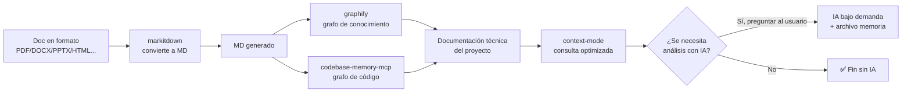

# 🔧 Guía práctica: MCP `codebase-memory-mcp`

> Guía de **instalación, configuración, uso y mantenimiento** del servidor MCP `codebase-memory-mcp` en el kit Agents_IA_TECH.
> Esta guía NO cubre el desarrollo interno del MCP — solo su integración práctica en el kit.
> Instalación: `npm install -g codebase-memory-mcp`

---

## 1. Qué es y para qué sirve

`codebase-memory-mcp` es un **servidor MCP** que construye un **grafo de conocimiento del código** (bisturí quirúrgico para código). Es el **Paso 2 del pipeline** del ecosistema de documentación técnica sin IA de entrada: indexa el repositorio y permite consultas estructurales y semánticas sobre el código.

A diferencia de `graphify` (que crea un grafo general del proyecto: código + docs + PDFs), `codebase-memory-mcp` se enfoca específicamente en el **código**, permitiendo a los agentes documentales entender la estructura, las relaciones y las dependencias sin leer archivos completos al contexto.

**Datos clave**:

| Dato | Valor |
|------|-------|
| Tipo | Servidor MCP |
| Rol en el pipeline | **Paso 2**: grafo de conocimiento del código |
| ¿Usa IA? | ❌ **No** — sin IA de entrada |
| Licencia | ⚠️ **(verificar)** — pendiente de confirmar (guardrail 8 del ADR-0001) |
| Instalación | `npm install -g codebase-memory-mcp` |
| Herramientas MCP | `index_repository`, `query`, `semantic_search` |

> ⚠️ **Licencia a verificar**: el ADR-0001 marca la licencia de `codebase-memory-mcp` como "(verificar)". La verificación final la realiza el `security-auditor` (fase documental, paso 3º) y el `upgrade_framework` (fase implementación, paso 5º) antes de integrarlo definitivamente.

---

## 2. Requisitos

- **Node.js** (para la instalación global vía npm).
- Un cliente MCP compatible (VS Code Copilot, etc.).
- Un repositorio de código para indexar.

---

## 3. Instalación

Instalar globalmente:

```bash
npm install -g codebase-memory-mcp
```

Verificar la instalación:

```bash
codebase-memory-mcp --version
```

> La configuración definitiva (`.vscode/mcp.json`, hooks) la realiza el `plataformador` en la fase de implementación.

---

## 4. Configuración en el kit

### 4.1 `.vscode/mcp.json`

Crear (o actualizar) el archivo `.vscode/mcp.json` en la raíz del proyecto:

```json
{
  "servers": {
    "codebase-memory-mcp": {
      "command": "codebase-memory-mcp",
      "type": "stdio"
    }
  }
}
```

> ⚠️ **`"type": "stdio"` es obligatorio** (decisión del usuario, 2026-09-12): especifica explícitamente el transporte del MCP. `stdio` es el transporte por defecto para MCPs locales que se lanzan como proceso hijo vía `command`. **Incluirlo siempre al configurar `codebase-memory-mcp` en cualquier proyecto.**

> ⚠️ **Nota**: la configuración exacta del comando puede variar según la versión. Verificar con `codebase-memory-mcp --help` tras la instalación.

### 4.2 Reiniciar y verificar

1. Reiniciar VS Code.
2. Invocar la herramienta `index_repository` sobre el repositorio para verificar que responde.

---

## 5. Uso de las herramientas MCP

`codebase-memory-mcp` expone herramientas para indexar y consultar el grafo de conocimiento del código:

| Herramienta | Qué hace |
|-------------|----------|
| `index_repository` | Indexa el repositorio y construye el grafo de conocimiento del código |
| `query` | Consulta estructural del grafo (relaciones, dependencias, callers, etc.) |
| `semantic_search` | Búsqueda semántica en el grafo de conocimiento del código |

---

## 6. Integración en el pipeline del ecosistema

> **Diagrama reutilizado tal cual** del plan aprobado (`README-ECOSISTEMA-DOCUMENTACION.md`) y del ADR-0001.



**Rol de `codebase-memory-mcp` en el pipeline**:

1. **Paso 2**: construye el grafo de conocimiento del **código** (bisturí quirúrgico), en paralelo con `graphify` (grafo general del proyecto).
2. Alimenta la **documentación técnica del proyecto** con la estructura y relaciones del código.
3. Es **sin IA de entrada** — no consume tokens.

**Orquestación**: el agente `analista_tecnico` (invocado por el `pensador`) ejecuta `codebase-memory-mcp` para construir el grafo de código. Al terminar, retorna al `pensador`.

---

## 7. Uso por parte de agentes documentales

Los agentes documentales (`pensador`, `arquitecto`, `documentador`) pueden usar `codebase-memory-mcp` para **contextuar mejor** sus specs y decisiones sin leer archivos completos al contexto:

| Agente | Uso recomendado |
|--------|-----------------|
| `pensador` | Indexar el repositorio al iniciar un análisis para entender la estructura del código sin escanear todo |
| `arquitecto` | Consultar relaciones y dependencias del código (`query`) para fundamentar decisiones de arquitectura y ADRs |
| `documentador` | Búsqueda semántica (`semantic_search`) para localizar el código relevante al documentar specs y flujos |

> **Beneficio**: al usar el grafo de conocimiento, los agentes documentales reducen el consumo de contexto y tokens, alineándose con el principio rector del ecosistema (IA solo bajo demanda).

---

## 8. Mantenimiento y buenas prácticas

| Práctica | Descripción |
|----------|-------------|
| **Actualizar** | `npm install -g codebase-memory-mcp@latest` |
| **Re-indexar** | Tras cambios significativos en el código, re-ejecutar `index_repository` para mantener el grafo actualizado |
| **Registrar en memoria** | Tras indexar, registrar en `Documentacion/<AppName>/analisis-memoria.md` qué repositorio/documentación ya fue indexado (evita re-indexación) |
| **No re-indexar** | Si ya está registrado como indexado en `analisis-memoria.md`, no volver a ejecutar `index_repository` (guardrail 2 del ADR-0001) |

---

## 9. Seguridad de uso

- **Licencia a verificar**: confirmar la licencia antes de integrarlo definitivamente (guardrail 8 del ADR-0001). El `security-auditor` la revisa en la fase documental.
- **Indexa el código local**: el grafo se construye sobre el repositorio local; no envía el código a servicios externos (verificar en la revisión de seguridad).
- **Entrada no confiable**: el código indexado puede contener contenido externo — aplicar prompt defense (regla del kit).

---

## Validación de instalación y configuración

> **Script de validación**: `scripts/validar-mcps.ps1` (decisión del usuario, 2026-09-12).

Verifica que este MCP esté **instalado, configurado en `.vscode/mcp.json` con `"type": "stdio"` y ejecutándose** correctamente. **Ejecutarlo siempre después de instalar o configurar los MCPs** en un proyecto.

```powershell
# Validación completa (instalación + configuración + runtime)
.\scripts\validar-mcps.ps1

# Validar solo este MCP
.\scripts\validar-mcps.ps1 -MCP codebase-memory-mcp
```

Detalle completo del script (qué valida, exit codes, notas técnicas): ver sección **9. Validación** en `Documentacion/Agents_IA_TECH/MCPs/context-mode.md`.

---

## Referencias

- Instalación: `npm install -g codebase-memory-mcp`
- Registro en el kit: `Documentacion/Agents_IA_TECH/referencias.md`
- Plan del ecosistema: `Documentacion/Agents_IA_TECH/README-ECOSISTEMA-DOCUMENTACION.md`
- ADR: `Documentacion/Agents_IA_TECH/arquitectura/adr/adr-0001-ecosistema-documentacion-sin-ia.md`
