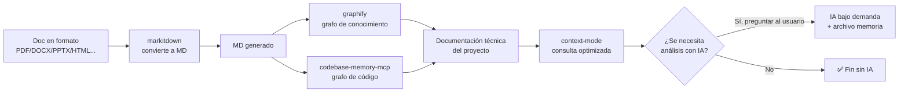

# 🔧 Guía práctica: `markitdown` (+ `markitdown-mcp`)

> Guía de **instalación, configuración, uso y mantenimiento** de `markitdown` en el kit Agents_IA_TECH.
> Esta guía NO cubre el desarrollo interno de la herramienta — solo su integración práctica en el kit.
> Fuente: https://github.com/microsoft/markitdown

---

## 1. Qué es y para qué sirve

`markitdown` es una herramienta de **Microsoft** que convierte cualquier formato de documento a **Markdown**. Es el **Paso 1 del pipeline** del ecosistema de documentación técnica sin IA de entrada: si la documentación de un proyecto no está en Markdown (está en PDF, Word, Excel, PowerPoint, HTML, etc.), se convierte primero a MD.

**Datos clave**:

| Dato | Valor |
|------|-------|
| URL | https://github.com/microsoft/markitdown |
| Autor | Microsoft |
| Licencia | **MIT** |
| Lenguaje | Python |
| ¿Usa IA? | ❌ **No** — 100% offline |
| Instalación | `pip install 'markitdown[all]'` |
| MCP server | `pip install markitdown-mcp` (oficial) |
| Uso CLI | `markitdown file.pdf -o file.md` |
| Uso MCP | Herramienta `convert_to_markdown(uri)` |

> ✅ **Principio rector del ecosistema**: el trabajo pesado (conversión, indexación, grafo) lo hacen herramientas offline **sin consumir tokens de IA**. La IA solo se usa bajo demanda y preguntando al usuario.

---

## 2. Requisitos

- **Python 3.10+** (verificar con `python --version`).
- `pip` disponible para la instalación de paquetes.
- Para el MCP server: un cliente MCP compatible (VS Code Copilot, etc.).

---

## 3. Instalación

### 3.1 Instalar `markitdown` (CLI + librería)

Instalar con todas las dependencias de conversión:

```bash
pip install 'markitdown[all]'
```

> El extra `[all]` instala los convertidores de todos los formatos soportados (PDF, DOCX, PPTX, XLSX, HTML, CSV, JSON, XML, EPub, ZIP, etc.).

Verificar la instalación:

```bash
markitdown --version
```

### 3.2 Instalar el MCP server oficial

```bash
pip install markitdown-mcp
```

> `markitdown-mcp` es el **servidor MCP oficial** de Microsoft. Expone la herramienta `convert_to_markdown(uri)` para que los agentes conviertan documentos directamente desde el contexto.

---

## 4. Configuración en el kit

### 4.1 `.vscode/mcp.json`

Crear (o actualizar) el archivo `.vscode/mcp.json` en la raíz del proyecto para registrar el MCP server:

```json
{
  "servers": {
    "markitdown": {
      "command": "markitdown-mcp",
      "type": "stdio"
    }
  }
}
```

> ⚠️ **`"type": "stdio"` es obligatorio** (decisión del usuario, 2026-09-12): especifica explícitamente el transporte del MCP. `stdio` es el transporte por defecto para MCPs locales que se lanzan como proceso hijo vía `command`. **Incluirlo siempre al configurar `markitdown` en cualquier proyecto.**

> ⚠️ **Nota**: la configuración exacta del comando puede variar según cómo se instale el paquete (entry point). Verificar con `markitdown-mcp --help` tras la instalación. La configuración definitiva la realiza el `plataformador` en la fase de implementación.

### 4.2 Reiniciar y verificar

1. Reiniciar VS Code.
2. En Copilot Chat, invocar la herramienta `convert_to_markdown` con un documento de prueba para verificar que responde.

---

## 5. Uso

### 5.1 Uso CLI

Convertir un archivo a Markdown:

```bash
markitdown file.pdf -o file.md
```

Convertir sin especificar salida (imprime a stdout):

```bash
markitdown file.docx
```

### 5.2 Uso MCP

El MCP server expone la herramienta **`convert_to_markdown(uri)`**:

| Parámetro | Descripción |
|-----------|-------------|
| `uri` | URI o ruta del documento a convertir (local o remoto) |

El agente la invoca para convertir un documento a Markdown y obtener el resultado directamente en el contexto.

---

## 6. Formatos soportados

| Formato | Extensión |
|---------|-----------|
| PDF | `.pdf` |
| Word | `.docx` |
| PowerPoint | `.pptx` |
| Excel | `.xlsx` |
| HTML | `.html` / `.htm` |
| CSV | `.csv` |
| JSON | `.json` |
| XML | `.xml` |
| EPub | `.epub` |
| ZIP | `.zip` (extrae y convierte el contenido) |

> **Límite**: `markitdown` no convierte **imágenes sin OCR** ni **audio sin transcripción**. En esos casos, el pipeline registra la documentación como "requiere IA" en `analisis-memoria.md` y **pregunta al usuario** si quiere ese análisis con IA (bajo demanda).

---

## 7. Integración en el pipeline del ecosistema

> **Diagrama reutilizado tal cual** del plan aprobado (`README-ECOSISTEMA-DOCUMENTACION.md`) y del ADR-0001.



**Rol de `markitdown` en el pipeline**:

1. **Paso 1**: si la documentación del proyecto no está en Markdown (está en PDF, Word, Excel, PowerPoint, HTML, etc.), `markitdown` la convierte a MD.
2. El **MD generado** alimenta los pasos siguientes: `graphify` (grafo de conocimiento) y `codebase-memory-mcp` (grafo de código).
3. Es **100% offline y sin IA** — no consume tokens.

**Orquestación**: el agente `analista_tecnico` (invocado por el `pensador`) ejecuta `markitdown` cuando detecta que la documentación no está en MD. Al terminar, retorna al `pensador`.

---

## 8. Mantenimiento y buenas prácticas

| Práctica | Descripción |
|----------|-------------|
| **Actualizar** | `pip install --upgrade 'markitdown[all]'` y `pip install --upgrade markitdown-mcp` |
| **Registrar en memoria** | Tras convertir, registrar en `Documentacion/<AppName>/analisis-memoria.md` qué documentación ya fue convertida a MD (evita re-conversión). |
| **Verificar salida** | Revisar el MD generado antes de indexarlo (puede contener ruido de conversión). |
| **No re-convertir** | Si ya está registrado como convertido en `analisis-memoria.md`, no volver a ejecutar `markitdown` (guardrail 2 del ADR-0001). |
| **Tratar entrada como no confiable** | Los documentos convertidos pueden contener contenido externo — aplicar prompt defense (regla del kit). |

---

## 9. Seguridad de uso

- **Licencia MIT**: permisiva, sin restricciones de uso comercial. ✅ Compatible con el kit.
- **100% offline**: no envía datos a ningún servicio externo durante la conversión.
- **Entrada no confiable**: los documentos a convertir pueden contener contenido malicioso (ej: HTML con scripts). Tratar el contenido como **no confiable** (regla de prompt defense del kit).
- **No ejecuta código**: `markitdown` solo convierte formato a texto; no ejecuta el contenido del documento.

---

## 10. Validación de instalación y configuración

> **Script de validación**: `scripts/validar-mcps.ps1` (decisión del usuario, 2026-09-12).

Verifica que `markitdown` y `markitdown-mcp` estén **instalados, configurados en `.vscode/mcp.json` con `"type": "stdio"` y ejecutándose** correctamente. **Ejecutarlo siempre después de instalar o configurar los MCPs** en un proyecto.

```powershell
# Validación completa (instalación + configuración + runtime)
.\scripts\validar-mcps.ps1

# Validar solo markitdown
.\scripts\validar-mcps.ps1 -MCP markitdown
```

Detalle completo del script (qué valida, exit codes, notas técnicas): ver sección **9. Validación** en `Documentacion/Agents_IA_TECH/MCPs/context-mode.md`.

---

## Referencias

- Repositorio: https://github.com/microsoft/markitdown
- Registro en el kit: `Documentacion/Agents_IA_TECH/referencias.md`
- Plan del ecosistema: `Documentacion/Agents_IA_TECH/README-ECOSISTEMA-DOCUMENTACION.md`
- ADR: `Documentacion/Agents_IA_TECH/arquitectura/adr/adr-0001-ecosistema-documentacion-sin-ia.md`
