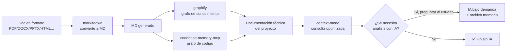

# 🔧 Guía práctica: MCP `tokenslayer-mcp-server`

> Guía de **instalación, configuración, uso y mantenimiento** del servidor MCP `tokenslayer-mcp-server` en el kit Agents_IA_TECH.
> Esta guía NO cubre el desarrollo interno del MCP — solo su integración práctica en el kit.
> Fuente: https://github.com/ajvikram/TokenSlayer | Extensión VS Code: `ajvikram.tokenslayer` v1.5.0

---

## 1. Qué es y para qué sirve

`tokenslayer-mcp-server` es un **servidor MCP standalone** (carpeta `mcp-server/` del repo TokenSlayer) que produce **esqueletos AST + call graphs + patch estructural** para compactar el contexto antes de consultar código. Es la pieza de **compactación de contexto** del ecosistema: reduce un archivo de 1.200 líneas a un esqueleto de ~8 líneas (96% menos tokens) y permite aplicar cambios por node ID (el modelo devuelve ~15 tokens de patch en vez de ~2.000 de rewrite).

A diferencia de `context-mode` (docs FTS5/BM25) y `codebase-memory-mcp` (grafo de código con `index_repository`/`query`/`semantic_search`), `tokenslayer-mcp-server` trabaja a nivel de **estructura sintáctica**: firmas, símbolos, dependencias y parches por nodo. **Complementa, no reemplaza**.

**Datos clave**:

| Dato | Valor |
|------|-------|
| URL | https://github.com/ajvikram/TokenSlayer |
| Extensión VS Code | `ajvikram.tokenslayer` v1.5.0 (instalada en VS Code del usuario) |
| Licencia | **MIT** ✅ (compatible con guardrail 8 del ADR-0001) |
| Lenguaje | TypeScript/JavaScript (Node.js) |
| Requisito | **Node.js v24.14.0** disponible (verificar con `node --version`) |
| MCP server | Carpeta `mcp-server/` del repo — **NO viene en el `.vsix`**, hay que clonarlo y compilarlo |
| Herramienta Copilot Chat | `#tokenslayer-structural-summary` (Language Model Tool registrado por la extensión) |
| Lenguajes soportados | 15 lenguajes (vía Tree-sitter / language server) |
| Tests upstream | 363 unit tests (206 extensión + 157 MCP server) + eval de 29 preguntas (28/29 PASS) |
| ¿Usa IA? | ❌ **No** — parsing AST local; la única red es la extracción semántica opcional con la propia API key del usuario |

> ✅ **Principio rector del ecosistema**: el trabajo pesado (esqueleto, grafo, índice) lo hacen herramientas locales **sin consumir tokens de IA**. La IA solo se usa bajo demanda y preguntando al usuario. TokenSlayer es la capa de **compactación previa**: esqueletizar antes de traer código al contexto.

---

## 2. Requisitos

- **Node.js v24.14.0** (verificar con `node --version`).
- `git` para clonar el repo + `npm` para compilar `mcp-server/`.
- Un cliente MCP compatible en cada harness (VS Code Copilot, OpenCode).
- La extensión `ajvikram.tokenslayer` (opcional pero recomendada en VS Code — ya instalada v1.5.0).

---

## 3. Instalación

El MCP server **no se instala vía npm global ni viene en el `.vsix`**. Se clona y compila desde el repo:

```bash
git clone https://github.com/ajvikram/TokenSlayer.git
cd TokenSlayer/mcp-server
npm install
npm run build
```

Verificar que el servidor arranca (debe responder al handshake MCP en stdio sin colgarse de forma anómala):

```bash
node dist/index.js --help
```

> La clonación, compilación, registro en `opencode.json` + `.vscode/mcp.json` y verificación de runtime las realiza el `devops` en la **fase de implementación** (tarea `[TOKENSLAYER]` en `pendientes-implementacion.md`). Esta guía solo documenta el formato esperado.

### 3.1 Comandos de la extensión VS Code (referencia)

La extensión aporta estos comandos en la paleta (no son herramientas MCP, pero comparten el motor AST):

| Comando | Qué hace |
|---------|----------|
| Analyze Workspace / Current File | Genera el resumen estructural del workspace o del archivo actual |
| Preview Skeleton | Vista previa del esqueleto AST antes de consumirlo |
| Show Dashboard | Panel con ahorro acumulado y costos |
| Export Savings Report | Exporta el reporte de ahorro de tokens |
| Clear Cache | Limpia la caché de esqueletos |
| Wire Up AI Tool | Conecta `#tokenslayer-structural-summary` como tool de Copilot Chat |
| Analyze Dependency Chain | Cadena de dependencias vía language server |
| Apply Structural Patch | Aplica un patch estructural por node ID |

---

## 4. Configuración en el kit

> ⚠️ **Esta sección describe el formato esperado. NO editar `opencode.json` ni `.vscode/mcp.json` en esta fase documental** — lo hace el `devops` en la fase de implementación.

### 4.1 `opencode.json` (harness OpenCode)

OpenCode **no puede usar extensiones `.vsix`** (runtimes distintos a VS Code). Por eso se registra el **MCP server standalone** como servidor MCP en `opencode.json`:

```json
{
  "mcp": {
    "tokenslayer-mcp-server": {
      "type": "local",
      "command": ["node", "<ruta-absoluta>/TokenSlayer/mcp-server/dist/index.js"],
      "enabled": true
    }
  }
}
```

> ⚠️ **Nota**: la forma exacta (`command` como string o array, claves `type`/`enabled`) depende del esquema vigente de `opencode.json` en el kit. El `devops` la adapta a lo que ya usan los MCPs registrados (`context-mode`, `codebase-memory-mcp`, `markitdown`) y verifica que el servidor responde tras el registro.

### 4.2 `.vscode/mcp.json` (harness Copilot)

Crear (o actualizar) la entrada en `.vscode/mcp.json` en la raíz del proyecto:

```json
{
  "servers": {
    "tokenslayer-mcp-server": {
      "command": "node",
      "args": ["<ruta-absoluta>/TokenSlayer/mcp-server/dist/index.js"],
      "type": "stdio"
    }
  }
}
```

> ⚠️ **`"type": "stdio"` es obligatorio** (decisión del usuario, 2026-09-12): especifica explícitamente el transporte del MCP. `stdio` es el transporte por defecto para MCPs locales que se lanzan como proceso hijo vía `command`. **Incluirlo siempre al configurar `tokenslayer-mcp-server` en cualquier proyecto.**

### 4.3 Reiniciar y verificar

1. Recompilar tras cada `git pull` del repo upstream (`npm run build` en `mcp-server/`).
2. Reiniciar VS Code (harness Copilot) / recargar sesión OpenCode (harness OpenCode).
3. Invocar `get_stats` para verificar que el servidor responde.

---

## 5. Uso de las herramientas MCP

`tokenslayer-mcp-server` expone **8 herramientas** (verificadas por `qa-senior` en `tools/list`, 2026-09-18):

| Herramienta | Parámetros clave | Qué hace |
|-------------|------------------|----------|
| `analyze_files` | `filePaths` (**requerido**), `symbol`, `query`, `maxTokens`, `format`, `expandable`, `targetModel` | Devuelve el **esqueleto AST** de uno o varios archivos (firmas + estructura, sin cuerpos). Acepta presupuesto de tokens |
| `analyze_workspace` | `query`, `maxTokens`, `format`, `maxFiles` | Resumen estructural del workspace acotado por tokens y nº de archivos |
| `analyze_dependency_chain` | `depth`, `query`, `maxTokens` | **Call graph / cadena de dependencias** vía language server, con profundidad configurable |
| `expand_node` | node ID | **Lazy-load** de un nodo podado del esqueleto (trae solo esa subestructura) |
| `apply_patch` | node ID + `replace` / `insert_after` / `delete`, `dryRun` | **Patch estructural** por node ID. Con `dryRun: true` previsualiza sin escribir |
| `session_health` | — | Salud de la sesión (rot score) — herramienta extra no documentada upstream, detectada en `tools/list` |
| `get_stats` | — | Ahorro acumulado de tokens + costos (fuente del Dashboard / Savings Report) |
| `clear_stats` | — | Resetea las estadísticas acumuladas |

> **Notas de QA (2026-09-18)**: `expand_node` es una herramienta independiente, no un parámetro de `analyze_files`. El server interno reporta versión 1.3.0 aunque el tag del repo es v1.5.0 (skew de versionado entre artefactos, no afecta el funcionamiento).

### Ejemplos de uso típico

```text
1. analyze_files(query="auth middleware", maxTokens=2000, format="skeleton")
   → esqueleto de los archivos que implementan el middleware (firmas, sin cuerpos).

2. analyze_files(symbol="NombreClase.metodo", expand_node=false)
   → esqueleto anclado a un símbolo concreto.

3. expand_node(<node-id podado>)
   → trae solo la rama podada que interesa, sin re-traer todo el archivo.

4. analyze_dependency_chain(query="quién llama a X", depth=2)
   → callers/callees a 2 niveles para análisis de impacto.

5. apply_patch(nodeId="<id>", replace="<nuevo-fragmento>", dryRun=true)
   → previsualiza el cambio estructural; si es correcto, repetir con dryRun=false.

6. get_stats()
   → verifica el ahorro real antes de reportarlo en QA.
```

---

## 6. Integración en el pipeline del ecosistema

> **Diagrama del pipeline** reutilizado tal cual del plan aprobado (`README-ECOSISTEMA-DOCUMENTACION.md`) y del ADR-0001. TokenSlayer actúa como **capa de compactación previa** (no sustituye ningún paso).



**Rol de `tokenslayer-mcp-server` en el pipeline**:

1. **Compactación previa**: antes de traer código al contexto (sea por lectura directa, por `query` de `codebase-memory-mcp` o por `ctx_search`), pedir el **esqueleto** con `analyze_files`/`analyze_workspace` acotado por `maxTokens`.
2. **Análisis de impacto**: `analyze_dependency_chain` complementa al grafo de `codebase-memory-mcp` con call graphs del language server.
3. **Edición barata**: `apply_patch` + `dryRun` para cambios quirúrgicos (15 tokens de patch en vez de 2.000 de rewrite).
4. Es **sin IA de entrada** — parsing local, no consume tokens.

**Orden de consulta recomendado** (ahorro de tokens):

| Paso | Herramienta | Cuándo |
|------|-------------|--------|
| 1 | `tokenslayer: analyze_files` / `analyze_workspace` (con `maxTokens`) | Siempre primero — esqueleto barato |
| 2 | `tokenslayer: expand_node` | Solo la rama que interesa del esqueleto |
| 3 | `codebase-memory-mcp: query` / `semantic_search` | Relaciones semánticas que el esqueleto no cubre |
| 4 | Lectura directa del archivo | Último recurso, solo el fragmento identificado |
| 5 | `tokenslayer: apply_patch` (`dryRun: true` primero) | Para modificar sin reescribir el archivo |

**Orquestación**: el agente `analista_tecnico` (invocado por el `pensador`) usa TokenSlayer para esqueletizar antes de indexar/graficar. Al terminar, retorna al `pensador`.

---

## 7. Uso por parte de agentes documentales

| Agente | Uso recomendado |
|--------|-----------------|
| `pensador` | Pedir esqueletos (`analyze_workspace` con `maxTokens`) al iniciar un análisis para dimensionar el código sin escanearlo todo |
| `arquitecto` | `analyze_dependency_chain` (`depth` 2-3) para fundamentar ADRs y análisis de impacto |
| `documentador` | `analyze_files` (`symbol`/`query`) para localizar el código relevante al documentar specs y flujos |
| `qa-senior` | `analyze_files` + `get_stats` para probar el MCP y verificar el ahorro real de tokens |
| `security-auditor` | Revisar riesgos de `apply_patch` y telemetría (ver sección 9) — revisión pendiente en fase documental |

> **Beneficio**: al esqueletizar primero, los agentes reducen el consumo de contexto y tokens (40-95% según upstream), alineándose con el principio rector del ecosistema (IA solo bajo demanda).

---

## 8. Mantenimiento y buenas prácticas

| Práctica | Descripción |
|----------|-------------|
| **Actualizar** | `git pull` en el clon de `TokenSlayer` + `npm run build` en `mcp-server/`; fijar `version_actual` en `dependencias-manifest.yml` |
| **Fijar presupuesto** | Pasar siempre `maxTokens` en `analyze_files`/`analyze_workspace`/`analyze_dependency_chain` para acotar el contexto |
| **`dryRun` primero** | Todo `apply_patch` se previsualiza con `dryRun: true` antes de aplicarse |
| **BPE-aware** | Si la herramienta lo soporta, indicar el modelo target para un conteo de tokens fiel |
| **Registrar en memoria** | Tras esqueletizar, registrar en `Documentacion/<AppName>/analisis-memoria.md` qué ya fue analizado (evita re-análisis, guardrail 2 del ADR-0001) |
| **No re-analizar** | Si ya está registrado como analizado en `analisis-memoria.md`, no volver a ejecutar el análisis |
| **Medir ahorro** | Consultar `get_stats` periódicamente y reportarlo (Dashboard / Savings Report); `clear_stats` / `Clear Cache` solo cuando el `qa-senior` lo pida |

---

## 9. Seguridad de uso

> ⚠️ **La revisión formal la realiza el `security-auditor` en la fase documental (paso 2º de la tarea `[TOKENSLAYER]`). Lo siguiente es el resumen de la investigación previa, pendiente de validación.**

- **Licencia MIT** ✅ — permisiva, compatible con el guardrail 8 del ADR-0001.
- **Sin telemetría declarada**: el proyecto declara que NO hace telemetría; la única llamada de red es la **extracción semántica opcional con la propia API key del usuario** (solo descripciones semánticas, nunca código crudo).
- **`apply_patch` escribe código**: es la herramienta de mayor riesgo (modifica archivos por node ID). Usar siempre `dryRun: true` primero y restringir su uso a agentes implementadores bajo spec aprobada. El `security-auditor` define los guardrails finales.
- **Controles upstream declarados**: URLs restringidas a http/https, descargas acotadas, paths con containment-check, labels con HTML-escape (anti SSRF / Cypher-injection / XSS). A validar por el `security-auditor`.
- **Entrada no confiable**: el código esqueletizado puede contener contenido externo — aplicar prompt defense (regla del kit).
- **Cache y stats**: `Clear Cache` / `clear_stats` borran estado local; usar con cuidado para no perder la medición de ahorro.

---

## 10. Validación de instalación y configuración

> **Script de validación**: `scripts/validar-mcps.ps1` (decisión del usuario, 2026-09-12).

Verifica que este MCP esté **compilado, registrado en `opencode.json` + `.vscode/mcp.json` con `"type": "stdio"` en este último, y ejecutándose** correctamente. **Ejecutarlo siempre después de instalar o configurar los MCPs** en un proyecto.

```powershell
# Validación completa (instalación + configuración + runtime)
.\scripts\validar-mcps.ps1

# Validar solo este MCP (cuando el script lo soporte)
.\scripts\validar-mcps.ps1 -MCP tokenslayer-mcp-server
```

> **Nota**: el script valida MCPs instalados vía gestor global (`--version` en PATH). `tokenslayer-mcp-server` se compila desde un clon local (`node dist/index.js`), por lo que el `devops` adapta o extiende la validación (comprobar `dist/index.js` compilado + handshake MCP) en la fase de implementación.

Detalle completo del script (qué valida, exit codes, notas técnicas): ver sección **9. Validación** en `Documentacion/Agents_IA_TECH/MCPs/context-mode.md`.

---

## Referencias

- Repositorio: https://github.com/ajvikram/TokenSlayer
- Extensión VS Code: `ajvikram.tokenslayer` v1.5.0 (instalada)
- Registro en el kit: `Documentacion/Agents_IA_TECH/referencias.md` + `dependencias-manifest.yml` (entrada `tokenslayer-mcp-server`)
- Plan del ecosistema: `Documentacion/Agents_IA_TECH/README-ECOSISTEMA-DOCUMENTACION.md`
- ADR: `Documentacion/Agents_IA_TECH/arquitectura/adr/adr-0001-ecosistema-documentacion-sin-ia.md`
- Tarea: `[TOKENSLAYER]` en `Documentacion/Agents_IA_TECH/pendientes-implementacion.md`
