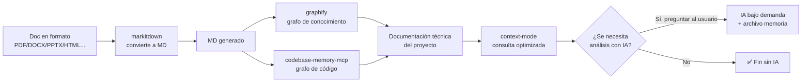
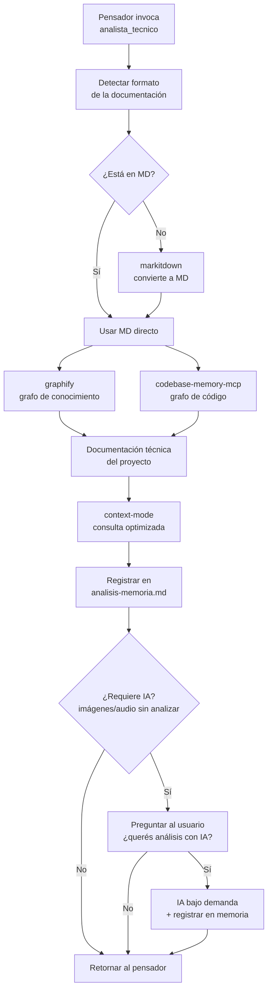
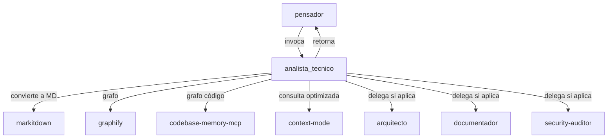

# 🧠 Ecosistema de Documentación Técnica sin IA de Entrada

> **Plan de integración** — Agents_IA_TECH
> **Fecha**: 2026-09-12
> **Estado**: Propuesto / Aprobado para implementación

---

## 🎯 Objetivo

Integrar un **pipeline de herramientas** que generen la documentación técnica de los proyectos **sin usar IA de entrada** (solo herramientas Python y MCP), dejando la IA **solo bajo demanda** y con un **archivo de memoria** para saber qué ya se analizó.

**Principio rector**: *"Al combinar soluciones que no usan IA de entrada ganamos velocidad y eficiencia. El uso de la IA debe ser posterior al uso de las herramientas Python y MCP, y siempre bajo demanda."*

---

## 🧩 Las 4 herramientas del ecosistema

| Herramienta | Tipo | Rol en el pipeline | ¿Usa IA? | Licencia |
|-------------|------|--------------------|:--------:|----------|
| **`markitdown`** (Microsoft) | Python + MCP | **Paso 1**: convierte cualquier formato (PDF, DOCX, PPTX, XLSX, HTML, etc.) a **Markdown**. 100% offline | ❌ No | MIT |
| **`graphify`** | CLI (ya en kit) | **Paso 2**: crea el grafo de conocimiento del proyecto (código + docs + PDFs) | ❌ No | (verificar) |
| **`codebase-memory-mcp`** | MCP | **Paso 2**: grafo de conocimiento del código (bisturí quirúrgico) | ❌ No | (verificar) |
| **`context-mode`** | MCP | **Paso 3**: optimiza la ventana de contexto al consultar la doc generada | ❌ No | ELv2 |

---

## 🔄 El pipeline (sin IA de entrada)



### Explicación del flujo

1. **`markitdown`** — Si la documentación del proyecto no está en Markdown (está en PDF, Word, Excel, PowerPoint, HTML, etc.), se convierte primero a MD. Es 100% offline y sin IA.
2. **`graphify`** — Construye el grafo de conocimiento del proyecto (código + documentación + PDFs) para navegar las relaciones.
3. **`codebase-memory-mcp`** — Construye el grafo de conocimiento del código (bisturí quirúrgico para código).
4. **`context-mode`** — Optimiza la ventana de contexto al consultar la documentación generada (indexación FTS5 + BM25).
5. **IA bajo demanda** — Solo si las herramientas sin IA no pudieron analizar algo (ej: imágenes sin OCR, audio sin transcripción), se **pregunta al usuario** si quiere ese análisis con IA.

---

## 📝 El archivo de memoria

Un archivo tipo **`Documentacion/<AppName>/analisis-memoria.md`** que registra:

- Qué documentación ya fue **convertida** a MD (por `markitdown`).
- Qué documentación ya fue **indexada/graficada** (por `graphify` / `codebase-memory-mcp`).
- Qué documentación **requiere IA** (porque las herramientas sin IA no pudieron analizarla) y **si ya fue analizada o no**.
- Evita re-analizar lo ya analizado (ahorro de tiempo y tokens).

---

## 🤖 Nuevo agente: `analista_tecnico`

### Rol

El **`analista_tecnico`** es el agente que orquesta el pipeline de documentación técnica sin IA de entrada. Su principal trabajo es **documentar proyectos** (nuevos o sin documentación), generando ideas nuevas y manteniendo todo ordenado bajo **SSD (Spec-Driven Development)**.

### Características clave

| Característica | Detalle |
|----------------|---------|
| **Invocable por el Pensador** | El `pensador` lo invoca cuando detecta un proyecto nuevo, sin documentación, o que necesita análisis técnico |
| **Retorna al Pensador** | Al terminar su trabajo, **retorna al `pensador`** para que continúe el ciclo (Plan → Documentar → Implementar) |
| **Nombre** | `analista_tecnico` (en minúsculas, con guion bajo, como los demás agentes del kit) |
| **Respeta la estructura SSD** | La documentación que genera queda ordenada bajo el estándar SSD ya establecido en el kit |
| **Llama a otros agentes** | Si hay un agente que ya hace mejor una tarea específica, **lo llama** en lugar de duplicar especificaciones (no duplica trabajo) |
| **Normas establecidas** | Trabaja con las normas y estructura técnica ya definidas en el kit |
| **Sin IA de entrada** | El pipeline base corre sin IA; la IA solo bajo demanda y preguntando al usuario |

### Responsabilidades

| Responsabilidad | Detalle |
|-----------------|---------|
| **Detectar formato** | Al recibir un proyecto, verificar si la doc está en MD o en otro formato |
| **Convertir a MD** | Si no está en MD → ejecutar `markitdown` para generar el MD |
| **Construir grafo** | Ejecutar `graphify` + `codebase-memory-mcp` para crear la documentación técnica |
| **Optimizar consulta** | Usar `context-mode` para consultar la doc sin gastar contexto |
| **Registrar en memoria** | Actualizar el archivo de memoria (qué se convirtió, indexó, analizó) |
| **Preguntar por IA** | Si hay doc que requiere IA (imágenes, audio), **preguntar al usuario** si quiere ese análisis |
| **Delegar a especialistas** | Si la documentación requiere arquitectura, specs, seguridad, etc. → llamar a `arquitecto`, `documentador`, `security-auditor` |
| **Retornar al Pensador** | Al terminar, devolver el control al `pensador` |

### 🔄 Flujo del `analista_tecnico`

El ciclo de trabajo del `analista_tecnico` al recibir un proyecto:



### Integración en la arquitectura existente



---

## 📋 Fases del plan

> **💡 Diagramas como entregables reutilizables**: Los **3 diagramas Mermaid** de este documento (pipeline, flujo del `analista_tecnico`, integración en arquitectura) son **parte del diseño aprobado**. Los agentes de la fase documental deben **reutilizarlos tal cual** (copiarlos a sus specs/ADRs/guías) y **no rediseñarlos desde cero**. Esto evita trabajo duplicado y mantiene consistencia.

### Fase documental

| Orden | Agente | Acción | Diagramas a reutilizar |
|-------|--------|--------|------------------------|
| 1º | `arquitecto` | Definir la arquitectura del pipeline (orden de herramientas, archivo de memoria, rol del `analista_tecnico`) + ADR | **Pipeline** + **Integración en arquitectura** |
| 2º | `documentador` | Crear guías en `MCPs/` para `markitdown`, `codebase-memory-mcp`; actualizar `referencias.md`, `memoria-proyecto.md`, `roadmap.md`, `00-indice.md`, `pendientes-implementacion.md` | **Pipeline** + **Flujo del `analista_tecnico`** |
| 3º | `security-auditor` | Revisión de seguridad de uso (markitdown, codebase-memory-mcp) | **Pipeline** (para evaluar puntos de entrada de datos) |

### Fase implementación

| Orden | Agente | Acción | Diagramas a reutilizar |
|-------|--------|--------|------------------------|
| 4º | `plataformador` | Instalar `markitdown` + `markitdown-mcp`, `codebase-memory-mcp`, configurar `.vscode/mcp.json`, hooks | **Pipeline** |
| 5º | `upgrade_framework` | Registrar `markitdown`, `codebase-memory-mcp` en `dependencias-manifest.yml` | — |
| 6º | `pensador` + documentales | Crear el nuevo agente `analista_tecnico` (spec + `.agent.md`), ajustar specs de agentes para el pipeline | **Flujo del `analista_tecnico`** + **Integración en arquitectura** |
| 7º | `gitflow` | Commits convencionales | — |

> **⚠️ Mantenimiento de `scripts/validar-mcps.ps1`**: Este script **debe actualizarse cada vez que se agregue o quite una herramienta** del ecosistema. Al agregar/quitar un MCP: (1) actualizar el array `$mcps`, (2) actualizar el `ValidateSet` del parámetro `-MCP`, (3) actualizar `VersionEsperada`, (4) actualizar `dependencias-manifest.yml`, (5) actualizar `Documentacion/<AppName>/reglas-transversales-agentes.md`. Ver el encabezado del script para el checklist completo.

### Fase implementación

| Orden | Agente | Acción |
|-------|--------|--------|
| 4º | `plataformador` | Instalar `markitdown` + `markitdown-mcp`, `codebase-memory-mcp`, configurar `.vscode/mcp.json`, hooks |
| 5º | `upgrade_framework` | Registrar `markitdown`, `codebase-memory-mcp` en `dependencias-manifest.yml` |
| 6º | `pensador` + documentales | Crear el nuevo agente `analista_tecnico` (spec + `.agent.md`), ajustar specs de agentes para el pipeline |
| 7º | `gitflow` | Commits convencionales |

---

## ✅ Decisiones confirmadas

| Punto | Decisión |
|-------|----------|
| Nombre del nuevo agente | **`analista_tecnico`** |
| Archivo de memoria | `Documentacion/<AppName>/analisis-memoria.md` |
| Incluir `codebase-memory-mcp` | ✅ Sí |
| Reforzar `graphify` en el pipeline | ✅ Sí |
| Invocable por el Pensador | ✅ Sí |
| Retorna al Pensador al terminar | ✅ Sí |
| Respeta estructura SSD | ✅ Sí |
| Llama a otros agentes (no duplica) | ✅ Sí |

---

## 🧭 Reglas transversales (todos los agentes)

> **Regla del usuario (2026-09-12)**: Todos los agentes del kit deben consultar los MCPs como herramienta primaria, no solo `analista_tecnico` y `plataformador`. Las reglas transversales se aplican **SIEMPRE** al crear o modificar agentes.

**Todos los agentes** (pensador, arquitecto, documentador, security-auditor, api-developer, frontend-developer, devops, qa-senior, gitflow, solucionador, plataformador, upgrade_framework, analista_tecnico) deben:

1. **Consultar los MCPs** como herramienta primaria antes de leer archivos directos (context-mode, codebase-memory-mcp, markitdown).
2. **Seguir la estructura estándar** de agente (frontmatter, introducción, skills, enfoque, MCPs, idioma, constraints).
3. **Sincronizar entre arneses** — `.github/agents/` y `.opencode/agents/` en paralelo.
4. **Respetar la orquestación y delegación** — cada agente hace UNA cosa; los orquestadores hacen cumplir las reglas a los agentes debajo.
5. **Persistir el comportamiento** — las decisiones transversales quedan en archivos.

**Fuente de verdad**: `Documentacion/<AppName>/reglas-transversales-agentes.md`

---

## 🔌 Estado de los MCPs en OpenCode (2026-09-17) — **IMPLEMENTADO**

> **Estado actual**: Los 3 MCPs están **configurados y activos en OpenCode** (sección `mcp` agregada a `opencode.json`). Los agentes de OpenCode **pueden invocarlos realmente** tras reiniciar OpenCode.

### Estado actual (2026-09-17)

| Aspecto | Estado |
|---------|--------|
| Binarios instalados | ✅ Sí (los 3) |
| Configurado en VS Code (`.vscode/mcp.json`) | ✅ Sí |
| Configurado en OpenCode (`opencode.json`) | ✅ **Implementado** |
| Índice de `codebase-memory` para este proyecto | ✅ Sí (Agents_IA_TECH: 13.216 nodos, 64.097 edges, 39 MB) |
| Índice de `codebase-memory` para Boleteria Cardenales | ⚠️ Parcial (worker crash en archivo específico, reintentar) |
| Índice de `context-mode` (Agents_IA_TECH) | ✅ Indexado (Documentacion/ + Agents_IA_TECH/) |
| Índice de `context-mode` (Boleteria Cardenales) | ✅ Indexado (85 archivos, 163 secciones) |
| Agentes lo referencian en prompts | ✅ Sí |
| Agentes pueden usarlo en OpenCode | ✅ **Sí (tras reiniciar OpenCode)** |

### Binarios instalados

| MCP | Ruta del binario |
|-----|------------------|
| `context-mode` | `C:/Users/tomas/AppData/Roaming/npm/context-mode.cmd` |
| `codebase-memory-mcp` | `C:/Users/tomas/.local/bin/codebase-memory-mcp.exe` (v0.9.0) |
| `markitdown` | `C:/Python314/Scripts/markitdown-mcp.exe` |

### Cómo activarlos en OpenCode (✅ YA HECHO)

La sección `mcp` ya está agregada al `opencode.json` del proyecto (formato validado contra el schema de opencode):

```json
"mcp": {
  "context-mode": {
    "type": "local",
    "command": ["C:/Users/tomas/AppData/Roaming/npm/context-mode.cmd"],
    "enabled": true
  },
  "codebase-memory-mcp": {
    "type": "local",
    "command": ["C:/Users/tomas/.local/bin/codebase-memory-mcp.exe"],
    "enabled": true
  },
  "markitdown": {
    "type": "local",
    "command": ["C:/Python314/Scripts/markitdown-mcp.exe"],
    "enabled": true
  }
}
```

> **⚠️ Reinicio requerido**: OpenCode carga la configuración **una sola vez al iniciar**. Después de editar `opencode.json`, hay que **cerrar y reabrir OpenCode** para que los MCPs se carguen.

### Binarios instalados

| MCP | Ruta del binario |
|-----|------------------|
| `context-mode` | `C:/Users/tomas/AppData/Roaming/npm/context-mode.cmd` |
| `codebase-memory-mcp` | `C:/Users/tomas/.local/bin/codebase-memory-mcp.exe` (v0.9.0) |
| `markitdown` | `C:/Python314/Scripts/markitdown-mcp.exe` |

### Cómo activarlos en OpenCode

Agregar la sección `mcp` al `opencode.json` del proyecto (formato validado contra el schema de opencode):

```json
"mcp": {
  "context-mode": {
    "type": "local",
    "command": ["C:/Users/tomas/AppData/Roaming/npm/context-mode.cmd"],
    "enabled": true
  },
  "codebase-memory-mcp": {
    "type": "local",
    "command": ["C:/Users/tomas/.local/bin/codebase-memory-mcp.exe"],
    "enabled": true
  },
  "markitdown": {
    "type": "local",
    "command": ["C:/Python314/Scripts/markitdown-mcp.exe"],
    "enabled": true
  }
}
```

> **⚠️ Reinicio requerido**: OpenCode carga la configuración **una sola vez al iniciar**. Después de editar `opencode.json`, hay que **cerrar y reabrir OpenCode** para que los MCPs se carguen.

---

## 📂 Dónde se guardan los índices

| MCP | Ubicación del índice | Nota |
|-----|----------------------|------|
| `codebase-memory-mcp` | `C:\Users\tomas\.cache\codebase-memory-mcp\<nombre-proyecto>.db` | Un `.db` por proyecto. Ej: `C-Proyectos-Agents_IA_TECH.db` (39 MB, 13.216 nodos) |
| `context-mode` | `C:\Users\tomas\AppData\Roaming\opencode\context-mode\content` | Base FTS5 por proyecto (archivos `.db` por source) |
| `markitdown` | No guarda índices | Solo convierte formatos a Markdown |

---

## 🛠️ Comandos manuales (para replicar las funciones a mano)

> **Regla práctica**: **Siempre hay que indexar el CÓDIGO** (no solo la documentación). El código es la fuente de verdad; la doc es complemento.

### `codebase-memory-mcp` — grafo de conocimiento del código

```powershell
# Ver proyectos ya indexados
codebase-memory-mcp cli list_projects

# Indexar un proyecto (el código fuente)
codebase-memory-mcp cli index_repository --path "C:/Proyectos/Boleteria Cardenales"

# Estado del índice de un proyecto
codebase-memory-mcp cli index_status --project "<nombre-de-list_projects>"

# Buscar en el grafo
codebase-memory-mcp cli search_graph '{"query":"<consulta>"}'

# Ver arquitectura del proyecto
codebase-memory-mcp cli get_architecture '{"project":"<nombre>"}'

# Eliminar un proyecto del índice
codebase-memory-mcp cli delete_project '{"project":"<nombre>"}'
```

### `context-mode` — indexación FTS5 + BM25 (consulta optimizada)

```powershell
# Indexar un directorio (código y/o documentación)
context-mode index "C:/Proyectos/Boleteria Cardenales"

# Indexar solo la documentación
context-mode index "C:/Proyectos/Boleteria Cardenales/Documentacion"

# Buscar en la base de conocimiento
context-mode search "consulta..."

# Diagnóstico del estado (storage, hooks, FTS5)
context-mode doctor
```

### `markitdown` — convertir formatos a Markdown

```powershell
# Convertir un archivo (PDF, DOCX, PPTX, XLSX, HTML...) a Markdown
markitdown "archivo.pdf" > "archivo.md"
```

---

## 🤖 Script automatizado: `plataformador-bootstrap.ps1`

El script `scripts/plataformador-bootstrap.ps1` ahora incluye **todo el flujo automatizado**:

### Qué hace el script (pasos principales)

1. **Estructura base**: Crea `Documentacion/`, `00-indice.md`, `pendientes-implementacion.md`, `memoria-proyecto.md`, etc.
2. **VS Code**: Configura `.vscode/settings.json`, `.vscode/mcp.json`, `.github/hooks/context-mode.json`
3. **OpenCode**: Agrega sección `mcp` a `opencode.json` (3 servidores: context-mode, codebase-memory-mcp, markitdown)
4. **Indexación código**: Ejecuta `codebase-memory-mcp cli index_repository` para el proyecto
5. **Indexación docs**: Ejecuta `context-mode index` sobre `Documentacion/` y `Documentacion/Agents_IA_TECH/`
6. **Verificación**: Comprueba que todos los MCPs responden y los índices existen
7. **Comandos manuales**: Muestra en consola los comandos de verificación para usar en terminal

### Parámetros útiles

| Parámetro | Uso |
|-----------|-----|
| `-SkipInstall` | Omite instalación de dependencias (npm, pip, MCPs) |
| `-NoRestart` | No reinicia VS Code al final |
| `-DryRun` | Simula sin hacer cambios |
| `-Force` | Sobrescribe archivos existentes |
| `-SkipIndexing` | Omite indexación de código y documentación |
| `-VerifyOnly` | **Solo verifica** MCPs e índices (no modifica nada) |

### Ejemplos de uso

```powershell
# Ejecución completa (instala, configura, indexa, verifica)
.\scripts\plataformador-bootstrap.ps1

# Solo verificar estado actual (rápido, sin cambios)
.\scripts\plataformador-bootstrap.ps1 -VerifyOnly

# Configurar sin reinstalar dependencias ni reiniciar VS Code
.\scripts\plataformador-bootstrap.ps1 -SkipInstall -NoRestart

# Solo configurar OpenCode y indexar, sin tocar VS Code
.\scripts\plataformador-bootstrap.ps1 -SkipInstall -NoRestart -SkipIndexing
```

---

## ✅ Checklist para activar un MCP en un proyecto nuevo

1. **Agregar la sección `mcp`** al `opencode.json` del proyecto (ver arriba).
2. **Indexar el código** con `codebase-memory-mcp cli index_repository` (siempre el código primero).
3. **Indexar la documentación** con `context-mode index "Documentacion"`.
4. **Reiniciar OpenCode** para que cargue los MCPs.
5. **Verificar** que las herramientas (`ctx_search`, `search_graph`, `convert_to_markdown`) aparezcan disponibles.
6. **Opcional**: Ejecutar `.\scripts\plataformador-bootstrap.ps1 -VerifyOnly` para confirmar todo.
