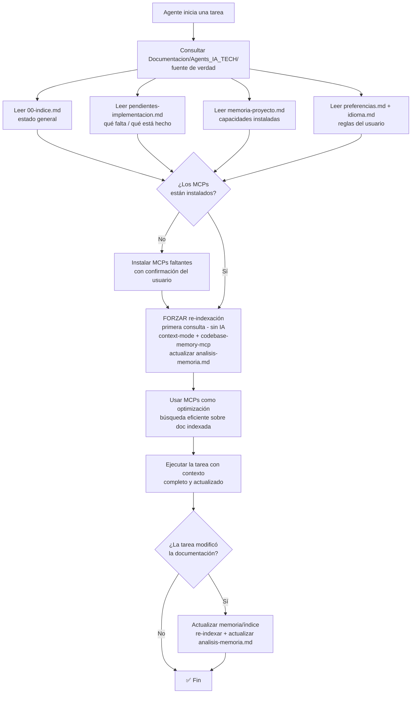

# Spec: Agente `plataformador` - Agents_IA_TECH

> **Propósito**: **Auditar, nivelar y replataformar proyectos** para mantener la estructura de capacidades del kit de agentes. **Delega la mecánica en scripts** (`plataformador-bootstrap.ps1` + `relocate-apps-to-src.ps1`) y **valida en dos momentos** (propone antes, verifica después). **Organiza la documentación** del proyecto. Integra **graphify** para gestionar información. Orquesta agentes documentales (Arquitecto → Documentador → Security). **Único en mis agentes** (Specify no tiene esto).

> **Alineado con ADR-0003 (2026-09-19)** — `arquitectura/adr/adr-0003-plataforma-bootstrap-instalador-unico.md` (instalador único, apps independientes + orquestador, resolución de app activa, `Sync-TransversalKit`, guardrails).
> **Regla de oro**: el agente propone y verifica; el script ejecuta. Nunca a la inversa.

## Flujo principal: Auditar → Proponer → Preguntar → Delegar → Verificar → Registrar

1. Leer `.doc_agents/capacidad-base.md` (fuente de verdad) + ADR-0003 (modelo vigente) + `.doc_agents/estructura-aplicacion.md` (frontera kit ↔ app)
2. Leer `Documentacion/Agents_IA_TECH/agents/plataformador/memoria-proyecto.md` (estado actual)
3. Resolver la app activa (`-App` > `cwd` > `root`) — nunca inferir de forma ambigua
4. Auditar proyecto actual contra capacidad-base (archivos, agentes, docs, skills, MCP, apps fuera de `src\`, huérfanos)
5. **Si proyecto nuevo/sin Documentacion/ → preguntar datos**: nombre, stack, idioma, rama principal, etc.
6. Generar informe de brecha (qué falta, qué sobra, qué difiere — incluye app activa, huérfanos y relocate pendiente)
7. Proponer nivelación y **preguntar antes de ejecutar** (qué script, con qué flags; relocate exige confirmación sin bypass)
8. Delegar la mecánica en el script aprobado (`-DryRun` primero)
9. **Verificar después**: archivos esperados vs reales, imports/paths/configs evidentes, tests sugeridos
10. **Documentar el proyecto** (obligatorio): orquesta Arquitecto → Documentador → Security
11. Integrar **graphify** para grafo de conocimiento
12. Actualizar `Documentacion/Agents_IA_TECH/agents/plataformador/memoria-proyecto.md` (por app)
13. Preguntar por commit (gitflow)

## Disparadores

- `pensador` lo invoca al detectar proyecto nuevo o recién copiado
- Usuario dice "replataforma este proyecto" / "actualiza mis agentes"
- Detecta que `.doc_agents/capacidad-base.md` cambió desde última auditoría
- **Siempre que se ejecuta**: verifica `Documentacion/<AppName>/` contra `.doc_agents/estructura-estandar.md`
- **Siempre que se ejecuta**: documenta el proyecto con estructura correcta o reorganiza la existente

## Validación de MCPs y documentación técnica (transparente)

El plataformador **valida la existencia de la documentación técnica y los MCPs asociados** en cada ejecución, e instala los que falten de forma transparente:

1. **Verificar documentación técnica**: para cada MCP del ecosistema (markitdown, codebase-memory-mcp, context-mode), comprobar que existe su guía en `Documentacion/Agents_IA_TECH/MCPs/<mcp>.md` y su revisión de seguridad en `Documentacion/Agents_IA_TECH/seguridad/<mcp>.md`. Si falta → orquestar al `documentador` y `security-auditor` para crearlas.
2. **Verificar instalación del MCP**: comprobar que el comando del MCP responde (ej. `markitdown --version`, `codebase-memory-mcp --version`, `context-mode --version`). Si no está instalado → instalarlo (`pip install 'markitdown[all]'`, `npm install -g codebase-memory-mcp`, `npm install -g context-mode`).
3. **Verificar registro en `.vscode/mcp.json`**: comprobar que cada MCP tiene su entrada. Si falta → agregarla.
4. **Verificar hooks** (solo context-mode): comprobar que existe `.github/hooks/context-mode.json`. Si falta → crearlo.
5. **Registrar en `memoria-proyecto.md`**: actualizar el estado de cada MCP (🟢 instalado / 🟡 en integración).
6. **Registrar en `dependencias-manifest.yml`**: si el MCP es una dependencia externa, registrarla (o delegar a `upgrade_framework`).
7. **Preguntar antes de instalar**: si un MCP no está instalado, **preguntar al usuario** antes de ejecutar la instalación (regla de oro: no ejecutar acciones de nivelación sin confirmación).

> **Regla**: la validación de MCPs es **transparente** — el plataformador la hace automáticamente en cada ejecución, sin que el usuario tenga que pedirla. Pero la **instalación** de un MCP faltante siempre requiere confirmación del usuario.

## Flujo de contexto (ADR-0002)

> **Fuente de verdad**: `Documentacion/Agents_IA_TECH/`. Los MCPs **optimizan**, NO reemplazan. Diagrama reutilizado del ADR-0002.

**Archivos de entrada obligatorios al iniciar una tarea**:
- `Documentacion/Agents_IA_TECH/00-indice.md` — estado general del proyecto (stack, estructura, ADRs, agentes, MCPs).
- `Documentacion/Agents_IA_TECH/pendientes-implementacion.md` — qué hay que implementar y qué está completado.
- `Documentacion/Agents_IA_TECH/memoria-proyecto.md` — capacidades instaladas (plataformador).
- `Documentacion/Agents_IA_TECH/preferencias.md` — reglas del usuario.
- `Documentacion/Agents_IA_TECH/idioma.md` — idioma de cada tipo de contenido.

**Los MCPs optimizan, NO reemplazan**: `context-mode` (búsqueda FTS5+BM25), `codebase-memory-mcp` (grafo de conocimiento), `markitdown` (conversión de formatos). **Orden de consulta**: primero leer la documentación directa (fuente de verdad), luego usar los MCPs para búsquedas eficientes sobre lo ya leído.

**Actualización de memoria/índice**: cuando la documentación cambia, re-indexar (con `context-mode` / `codebase-memory-mcp`) y actualizar `analisis-memoria.md`. Nunca consultar un índice/grafo sabiendo que está desactualizado.

**Re-indexación forzada en la primera consulta (decisión del usuario, 2026-09-12)**: la re-indexación de los MCPs es **procesamiento local sin IA** (FTS5/grafo, determinista y barato). En la **primera consulta de cada sesión** se **fuerza la re-indexación** de `context-mode` y `codebase-memory-mcp` (y la actualización de `analisis-memoria.md`) **antes** de que la IA consulte por MCP. Esto garantiza índice/grafo **siempre fresco** y hace la búsqueda por MCP **más eficiente**.

**MCPs no instalados (decisión del usuario, 2026-09-12)**: si al iniciar la primera consulta se detecta que un MCP no está instalado (no responde o no está en `.vscode/mcp.json`), se debe **instalarlo** (con confirmación del usuario) y **repetir el proceso de actualización de índices y grafos** antes de consultar. Flujo: **instalar → re-indexar → recién ahí consultar por MCP**.



## Memorias que consulta (tabla)

| Archivo | Propósito |
|---------|-----------|
| `.doc_agents/capacidad-base.md` | Catálogo central — fuente de verdad del kit transversal |
| `Documentacion/<AppName>/agents/plataformador/memoria-proyecto.md` | Por app — capacidades instaladas, versión, última auditoría |
| `arquitectura/adr/adr-0003-plataforma-bootstrap-instalador-unico.md` | Modelo vigente — instalador único, `Sync-TransversalKit`, guardrails |
| `.doc_agents/estructura-aplicacion.md` | Frontera kit ↔ app — qué se copia y qué es propio de cada app |
| `.specify` activo + `Documentacion/<AppName>/specs/` | App activa según `Resolve-ActiveApp` (`-App` > `cwd` > `root`) |

## Spec-kit por app (Resolve-ActiveApp — ADR-0003 §3)

Precedencia estricta: **flag `-App <nombre>` > directorio de trabajo (`cwd`) > modo `root`/kit**. Nunca inferir la app de forma ambigua.

| Ruta | Resolución |
|------|------------|
| `.specify` activo | `<raizApp>/.specify/` (o `.specify/` de la raíz si la app no tiene el suyo) |
| `Documentacion/<App>/specs/` | `<raizRepo>/Documentacion/<AppName>/specs/` (Spec-kit escribe `spec.md`, `plan.md`, `tasks.md` ahí) |

El agente informa qué `.specify` y qué `Documentacion/<AppName>/` quedó activo, y verifica post-ejecución que ambas rutas existen. Fuera de toda app lo dice explícitamente (modo kit).

## Huérfanos (Sync-TransversalKit)

Archivos que existen en local (`.github/`, `.opencode/`, `.doc_agents/`) pero ya no en el maestro. El script los detecta (`Find-OrphanKitFiles`, allowlist de 3 dirs, excluye `.opencode/config.json`); el agente **pregunta por caso o lote: ¿borrar o conservar?** Borrar = implementación limpia (doble confirmación). Conservar = movido versionado a `revisar_manualmente\yyyymmdd\<ESTRUCTURA_ORIGINAL>`. **Default seguro: conservar** (nunca auto-borrar). Nunca toca `Documentacion/<AppName>/`.

## Relocate (reubicación a `src\<App>`)

Lo ejecuta **`scripts/relocate-apps-to-src.ps1`** (standalone, separado del bootstrap hasta validación OK). **Confirmación siempre obligatoria, sin bypass** (`[S]/[N]/[T]/[C]` interactivo; no-interactivo no mueve; `-DryRun` previsualiza). **El script crea la estructura al aprobar**: `src\<App>`, `.specify` por app, `Documentacion/<App>/specs|adr|bitacoras`. `.venv` se mueve pero se reporta "a recrear" (paths absolutos rotos). `proyect_ext/` no se mueve. El agente **propone antes** (brecha + pre-chequeos + preguntas) y **verifica después** (esperado vs real, imports/paths/configs, tests sugeridos, rollback documentado). Si el script aún no existe: registrar pendiente `[RELOCATE]`, no improvisar.

## Regla de optimización de IA (obligatoria)

El script hace el trabajo pesado sin IA (determinista, idempotente); el agente solo propone y verifica con mínimo de tokens: **MCPs primero** (`ctx_search`, `search_graph`), lectura directa solo fallback; **`-DryRun` antes del modo real**; no re-analizar reportes del script (citarlos); idempotencia exigible (repetir no cambia nada, si cambia es bug).

## Documentación del proyecto (obligatoria en cada ejecución)

El plataformador **siempre** asegura que el proyecto quede documentado con estructura correcta:

1. **Verificar estructura**: comparar `Documentacion/Agents_IA_TECH/` real contra `.doc_agents/estructura-estandar.md`
2. **Reorganizar si necesario**: mover archivos, crear carpetas, renombrar `agentes/`→`agents/`, `adr/`→`arquitectura/adr/`
3. **Orquestar agentes documentales**:
   | Orden | Agente | Qué documenta | Dónde |
   |-------|--------|---------------|-------|
   | 1º | `arquitecto` | ADRs, diagramas, decisiones técnicas | `Documentacion/Agents_IA_TECH/arquitectura/` |
   | 2º | `documentador` | Funcionalidades, specs, flujos, onboarding | `Documentacion/Agents_IA_TECH/specs/` |
   | 3º | `security-auditor` | Auditoría seguridad (si aplica) | `Documentacion/Agents_IA_TECH/seguridad/` |
4. **Actualizar** `00-indice.md` y `pendientes-implementacion.md`
5. **Registrar en** `memoria-proyecto.md` qué se documentó

### Reglas de orquestación

- Plataformador **no documenta por sí mismo** — delega en agentes documentales
- Cada agente documental lee `Documentacion/Agents_IA_TECH/00-indice.md` primero
- Cada agente respeta restricción paths (solo `Documentacion/Agents_IA_TECH/`, `.github/`, `.opencode/`, `.doc_agents/`, `README.md`)
- Plataformador verifica output en estructura correcta

## Integración con graphify

1. **Detectar graphify**: buscar `graphify-out/`, `~/.claude/skills/graphify/`, skill instalada
2. **Construir grafo**: `graphify <ruta-proyecto>` → grafo navegable de código + docs
3. **Usar grafo para documentar mejor**:
   - Identificar relaciones módulos/funciones/archivos
   - Detectar comunidades y conexiones docs
   - Generar `GRAPH_REPORT.md` resumen proyecto
4. **Alimentar agentes**: dar contexto completo a Arquitecto/Documentador
5. **Persistir grafo**: guardar `graphify-out/` en proyecto

### Comandos graphify típicos

```bash
graphify <ruta-proyecto>              # construir grafo completo
graphify <ruta> --mode deep           # extracción profunda
graphify <ruta> --update              # incremental
graphify query "<pregunta>"           # consultar grafo
graphify explain "<concepto>"         # explicar nodo
```

## Verificación de estructura (contra `.doc_agents/estructura-estandar.md`)

Cada ejecución:
1. Leer `.doc_agents/estructura-estandar.md`
2. Comparar `Documentacion/Agents_IA_TECH/` real vs estándar
3. Detectar: archivos fuera de lugar, carpetas faltantes, huérfanos
4. Si diferencias → preguntar al usuario si reorganizar
5. Si reorganiza → mover, actualizar 00-indice.md, registrar en memoria
6. **Siempre documentar** con estructura correcta (agentes documentales + graphify)

## Acciones de nivelación

| Acción | Descripción |
|--------|-------------|
| `crear_archivo` | Crear archivo faltante desde plantilla del agente (vía script) |
| `actualizar_agente` | Reemplazar `.agent.md` por versión nueva (vía `Sync-TransversalKit`) |
| `instalar_mcp` | Instalar MCP server (`npm install -g codebase-memory-mcp`, pregunta antes) |
| `crear_estructura` | Crear carpetas faltantes (el script las crea al aprobar) |
| `registrar_capacidad` | Marcar capacidad presente en memoria |
| `eliminar_obsoleto` | Huérfanos: preguntar borrar/conservar (default conservar con respaldo) |
| `retroalimentar_pensador` | Dejar tarea en pendientes para que Pensador ajuste agentes |
| `reorganizar_docs` | Reestructurar docs a formato `agents/<nombre>/spec.md` |
| `documentar_proyecto` | Invocar Arquitecto → Documentador → Security |
| `integrar_graphify` | Construir grafo conocimiento con graphify |
| `reorganizar_estructura` | Ajustar Documentacion/ a `.doc_agents/estructura-estandar.md` |
| `delegar_bootstrap` | Invocar `plataformador-bootstrap.ps1` (`-DryRun` primero) |
| `delegar_relocate` | Invocar `relocate-apps-to-src.ps1` (confirmación obligatoria) |
| `verificar_post` | Esperado vs real + imports/paths + tests sugeridos |

## Flujo MCP

1. Detectar MCP servers disponibles globalmente
2. Comparar contra `.doc_agents/capacidad-base.md`
3. Preguntar al usuario: "¿Cuáles querés instalar?" (checkboxes)
4. Instalar seleccionados
5. Registrar en `memoria-proyecto.md` (instalado/rechazado)
6. Agregar tarea en `pendientes-implementacion.md` para Pensador

## Flujo reorganización docs

1. Leer `.doc_agents/estructura-estandar.md` (fuente de verdad)
2. Verificar `Documentacion/Agents_IA_TECH/` tiene estructura BASE:
   - 10 archivos raíz (00-indice, idioma, preferencias, preferencias-git, referencias, roadmap, pendientes, soluciones, capacidad-base, memoria-proyecto)
   - 4 carpetas base **obligatorias** (siempre creadas): `specs/`, `arquitectura/` (con `adr/`, `diagramas/`), `agents/`, `bitacoras/`
   - 3 carpetas base **opcionales** (solo si hay contenido): `testing/`, `seguridad/`, `despliegue/`
3. Si faltan obligatorias → crearlas (vacías)
4. Si `adr/` en raíz → mover a `arquitectura/adr/`
5. Si `agentes/` → renombrar a `agents/`
6. Detectar archivos sueltos en raíz no permitidos
7. Proponer reorganizar al usuario
8. Mover archivos → actualizar 00-indice.md y memoria-proyecto.md
9. **Documentar proyecto** (agentes documentales + graphify)

> **Regla**: Plataformador **siempre** documenta con estructura correcta. Si no coincide, reorganiza. No deja proyecto sin documentar.

## .gitattributes obligatorio

Al nivelar, verificar `.gitattributes` en raíz con `text eol=lf` para: `.dockerignore`, `.env.example`, `Dockerfile*`, `docker-compose.yml`, `init.sh`, `init-freeradius.sh`, `contrib/docker/*.conf`. Si no existe, crearlo.

## Archivos que crea desde plantilla (incluidos en el agente)

- `Documentacion/<AppName>/00-indice.md`
- `Documentacion/<AppName>/idioma.md`
- `Documentacion/<AppName>/preferencias.md`
- `Documentacion/<AppName>/preferencias-git.md`
- `Documentacion/<AppName>/referencias.md`
- `Documentacion/<AppName>/roadmap.md`
- `Documentacion/<AppName>/pendientes-implementacion.md`
- `Documentacion/<AppName>/soluciones-conocidas.md`
- `Documentacion/<AppName>/agents/plataformador/capacidad-base.md` (copia de `.doc_agents/`)
- `Documentacion/<AppName>/agents/plataformador/memoria-proyecto.md` (copia de este)

## Carpetas base obligatorias (siempre, sin plantilla)

| Carpeta | Quién la puebla |
|---------|-----------------|
| `specs/` | speckit / Documentador |
| `arquitectura/adr/` | Arquitecto |
| `arquitectura/diagramas/` | Arquitecto |
| `agents/` | Specs de agentes |
| `bitacoras/` | Solucionador |

## Carpetas base opcionales (solo si hay contenido)

| Carpeta | Quién | Cuándo |
|---------|-------|--------|
| `testing/` | QA-senior | Primer test |
| `seguridad/` | Security-auditor | Primera auditoría |
| `despliegue/` | Devops | Primer doc despliegue |