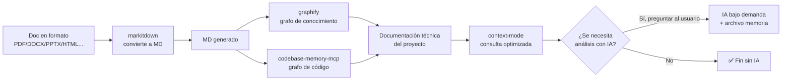
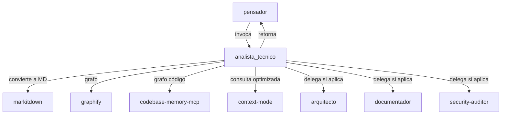

# ADR-0001: Ecosistema de Documentación Técnica sin IA de Entrada

> **Estado**: Aceptado
> **Fecha**: 2026-09-12
> **Decisión**: Pipeline de 4 herramientas + agente `analista_tecnico` + archivo de memoria
> **Autor**: `arquitecto` (Fase Documental — paso 1º)
> **Fuente del plan**: `Documentacion/Agents_IA_TECH/README-ECOSISTEMA-DOCUMENTACION.md` (plan aprobado)

---

## Contexto y problema

Los proyectos del kit `Agents_IA_TECH` necesitan documentación técnica de calidad. Hoy, la generación de esa documentación depende en gran medida de la IA de entrada (el agente lee el código y lo interpreta), lo cual:

- **Consume tokens y tiempo** en cada análisis, incluso cuando el contenido ya fue analizado antes.
- **No es reproducible** — cada análisis depende del contexto de la sesión.
- **No aprovecha herramientas offline** (Python + MCP) que ya existen o son fáciles de integrar y que pueden hacer el trabajo pesado de conversión e indexación sin IA.

**Problema concreto**: no existe un pipeline definido que convierta la documentación a Markdown, construya grafos de conocimiento y optimice la consulta, dejando la IA **solo bajo demanda** y con un **archivo de memoria** que evite re-analizar lo ya analizado.

**Principio rector** (del plan aprobado):
> *"Al combinar soluciones que no usan IA de entrada ganamos velocidad y eficiencia. El uso de la IA debe ser posterior al uso de las herramientas Python y MCP, y siempre bajo demanda."*

---

## Decisión

Adoptar un **pipeline de documentación técnica sin IA de entrada** compuesto por **4 herramientas** (Python + MCP + CLI), orquestado por un **nuevo agente `analista_tecnico`**, con un **archivo de memoria** `analisis-memoria.md` como registro de qué se convirtió, indexó y analizó.

### Las 4 herramientas del pipeline

| # | Herramienta | Tipo | Rol en el pipeline | ¿Usa IA? | Licencia |
|---|-------------|------|--------------------|:--------:|----------|
| 1 | **`markitdown`** (Microsoft) | Python + MCP | Convierte cualquier formato (PDF, DOCX, PPTX, XLSX, HTML, etc.) a **Markdown**. 100% offline | ❌ No | MIT |
| 2 | **`graphify`** | CLI (ya en kit) | Crea el grafo de conocimiento del proyecto (código + docs + PDFs) | ❌ No | (verificar) |
| 3 | **`codebase-memory-mcp`** | MCP | Grafo de conocimiento del código (bisturí quirúrgico) | ❌ No | (verificar) |
| 4 | **`context-mode`** | MCP | Optimiza la ventana de contexto al consultar la doc generada | ❌ No | ELv2 |

### El pipeline (sin IA de entrada)

> **Diagrama reutilizado tal cual** del plan aprobado (`README-ECOSISTEMA-DOCUMENTACION.md`).

### El agente `analista_tecnico`

Nuevo agente que **orquesta el pipeline**. Es invocado por el `pensador` cuando detecta un proyecto nuevo, sin documentación, o que necesita análisis técnico. Al terminar, **retorna al `pensador`** para continuar el ciclo (Plan → Documentar → Implementar).

**Responsabilidades clave**:
- Detectar el formato de la documentación (¿MD o no?).
- Convertir a MD con `markitdown` si no está en MD.
- Construir el grafo con `graphify` + `codebase-memory-mcp`.
- Optimizar la consulta con `context-mode`.
- Registrar en `analisis-memoria.md` qué se convirtió, indexó y analizó.
- Preguntar al usuario si hay documentación que requiere IA (imágenes, audio).
- Delegar a especialistas (`arquitecto`, `documentador`, `security-auditor`) si aplica.
- Retornar al `pensador`.

### Integración en la arquitectura existente

> **Diagrama reutilizado tal cual** del plan aprobado (`README-ECOSISTEMA-DOCUMENTACION.md`).

### El archivo de memoria

`Documentacion/<AppName>/analisis-memoria.md` registra:
- Qué documentación ya fue **convertida** a MD (por `markitdown`).
- Qué documentación ya fue **indexada/graficada** (por `graphify` / `codebase-memory-mcp`).
- Qué documentación **requiere IA** (porque las herramientas sin IA no pudieron analizarla) y **si ya fue analizada o no**.
- Evita re-analizar lo ya analizado (ahorro de tiempo y tokens).

---

## Consecuencias

### Positivas

- **Velocidad y eficiencia**: el trabajo pesado (conversión, indexación, grafo) lo hacen herramientas offline sin consumir tokens de IA.
- **Reproducibilidad**: el pipeline es determinista y repetible; el archivo de memoria evita re-análisis.
- **IA bajo demanda**: la IA solo se usa cuando las herramientas sin IA no pueden analizar algo (imágenes sin OCR, audio sin transcripción) y **siempre preguntando al usuario**.
- **Aprovecha herramientas existentes**: `graphify` ya está en el kit; `context-mode` ya está en integración.
- **Separación de responsabilidades**: el `analista_tecnico` orquesta y delega a especialistas, no duplica trabajo.

### Negativas / Trade-offs

- **Nuevo agente a mantener**: `analista_tecnico` agrega un agente más al kit (spec + `.agent.md` + ajuste de specs de otros agentes).
- **Dependencias nuevas**: `markitdown` y `codebase-memory-mcp` deben instalarse y registrarse en `dependencias-manifest.yml`.
- **Licencias a verificar**: `graphify` y `codebase-memory-mcp` tienen licencia "(verificar)"; `context-mode` es ELv2 (source-available, no MIT) — requiere revisión de compatibilidad.
- **Complejidad de integración**: configurar `.vscode/mcp.json`, hooks y la orquestación entre `pensador` ↔ `analista_tecnico`.
- **Límites de las herramientas sin IA**: no cubren imágenes sin OCR ni audio sin transcripción — en esos casos se depende de IA bajo demanda.

---

## Guardrails (restricciones que el código/agentes deben cumplir)

> Definidos por el `arquitecto` para la fase de implementación. Todo agente que implemente este ADR debe respetarlos.

1. **Sin IA de entrada por defecto**: el pipeline base (markitdown → graphify/codebase-memory-mcp → context-mode) debe correr **sin IA**. La IA solo se usa **bajo demanda** y **preguntando al usuario**.
2. **Archivo de memoria obligatorio**: todo análisis debe registrarse en `Documentacion/<AppName>/analisis-memoria.md`. **Nunca re-analizar** lo que ya está registrado como convertido/indexado/analizado.
3. **Orden de herramientas**: respetar el orden del pipeline: (1) `markitdown` si no está en MD, (2) `graphify` + `codebase-memory-mcp`, (3) `context-mode` para consulta optimizada.
4. **Delegación, no duplicación**: el `analista_tecnico` **no duplica** trabajo de otros agentes. Si una tarea la hace mejor otro agente (`arquitecto`, `documentador`, `security-auditor`), lo **invoca**.
5. **Retorno al `pensador`**: el `analista_tecnico` **siempre retorna al `pensador`** al terminar, para continuar el ciclo SSD.
6. **Respeto de la estructura SSD**: la documentación generada debe quedar ordenada bajo el estándar SSD ya establecido en el kit.
7. **Reutilizar diagramas**: los 3 diagramas Mermaid del plan aprobado son **entregables reutilizables** — copiarlos tal cual, **no rediseñarlos**.
8. **Licencias**: verificar y documentar la licencia de `graphify` y `codebase-memory-mcp` antes de integrarlos; respetar ELv2 de `context-mode`.
9. **Paths**: el `analista_tecnico` (agente documental) solo escribe en `Documentacion/<AppName>/`, `.github/`, `.opencode/`, `.doc_agents/`, `README.md`. **Nunca toca código fuente**.
10. **Validación de MCPs**: al iniciar sesión, los agentes validan si la documentación técnica y los MCPs asociados existen; si falta alguno, lo instalan o lo reportan de forma transparente.

---

## Spec linking (trazabilidad)

| Artefacto | Relación con este ADR |
|-----------|----------------------|
| `Documentacion/Agents_IA_TECH/README-ECOSISTEMA-DOCUMENTACION.md` | **Fuente del plan aprobado**. Este ADR formaliza su arquitectura. Diagramas reutilizados: **Pipeline** + **Integración en arquitectura**. |
| `Documentacion/Agents_IA_TECH/00-indice.md` | Registra este ADR en la sección "ADRs activos" y el agente `analista_tecnico` en la tabla de agentes. |
| `Documentacion/Agents_IA_TECH/pendientes-implementacion.md` | Contiene las tareas de implementación derivadas de este ADR. |
| `Documentacion/Agents_IA_TECH/agents/pensador/spec.md` | El `pensador` invoca al `analista_tecnico` (orquestación del pipeline). |
| `Documentacion/Agents_IA_TECH/agents/analista_tecnico/spec.md` | **Spec del nuevo agente** (a crear en fase de implementación) que orquesta el pipeline. |
| `Documentacion/Agents_IA_TECH/MCPs/markitdown.md` | Guía de integración de `markitdown` (a crear por el `documentador`). |
| `Documentacion/Agents_IA_TECH/MCPs/codebase-memory-mcp.md` | Guía de integración de `codebase-memory-mcp` (a crear por el `documentador`). |
| `Documentacion/Agents_IA_TECH/MCPs/context-mode.md` | Guía de integración de `context-mode` (ya creada). |
| `Documentacion/Agents_IA_TECH/seguridad/context-mode.md` | Revisión de seguridad de `context-mode` (ya creada). |
| `Documentacion/Agents_IA_TECH/analisis-memoria.md` | **Archivo de memoria** del pipeline (a crear en fase de implementación). |

---

## Plan de implementación por fases

### Fase documental (siguiente paso: `documentador`)

| Orden | Agente | Acción |
|-------|--------|--------|
| 1º | `arquitecto` | ✅ **Este ADR** (arquitectura del pipeline + guardrails + spec linking) |
| 2º | `documentador` | Crear guías en `MCPs/` para `markitdown`, `codebase-memory-mcp`; actualizar `referencias.md`, `memoria-proyecto.md`, `roadmap.md`, `00-indice.md`, `pendientes-implementacion.md`. Reutilizar diagramas **Pipeline** + **Flujo del `analista_tecnico`**. |
| 3º | `security-auditor` | Revisión de seguridad de uso (markitdown, codebase-memory-mcp). Reutilizar diagrama **Pipeline**. |

### Fase implementación

| Orden | Agente | Acción |
|-------|--------|--------|
| 4º | `plataformador` | Instalar `markitdown` + `markitdown-mcp`, `codebase-memory-mcp`, configurar `.vscode/mcp.json`, hooks. |
| 5º | `upgrade_framework` | Registrar `markitdown`, `codebase-memory-mcp` en `dependencias-manifest.yml`. |
| 6º | `pensador` + documentales | Crear el nuevo agente `analista_tecnico` (spec + `.agent.md`), ajustar specs de agentes para el pipeline. |
| 7º | `gitflow` | Commits convencionales. |

---

## Referencias

- `Documentacion/Agents_IA_TECH/README-ECOSISTEMA-DOCUMENTACION.md` — Plan aprobado del ecosistema (fuente de este ADR).
- `Documentacion/Agents_IA_TECH/00-indice.md` — Índice del proyecto.
- `Documentacion/Agents_IA_TECH/pendientes-implementacion.md` — Puente docs ↔ código.
