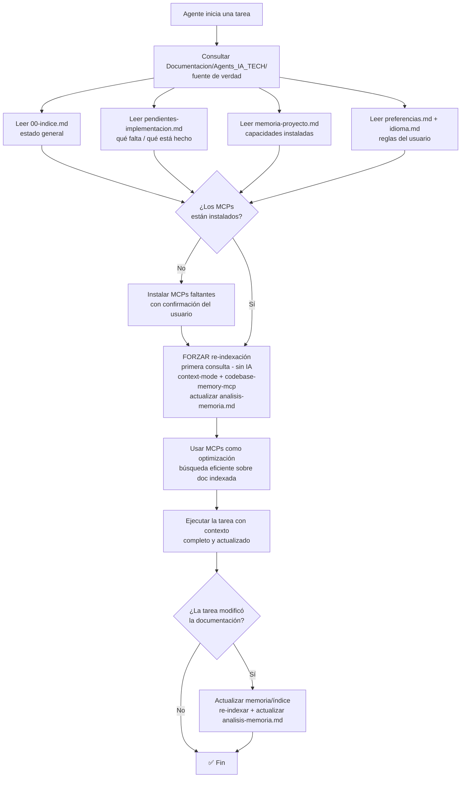

# ADR-0002: Flujos del Kit — Contexto (consultar `Documentacion/`) y Actualización Automática de Herramientas Externas

> **Estado**: Aceptado
> **Fecha**: 2026-09-12
> **Decisión**: Definir dos flujos que faltan para que el kit funcione de forma coherente: (1) **flujo de contexto** (todos los agentes consultan `Documentacion/Agents_IA_TECH/` como fuente de verdad, con los MCPs como optimización y actualización de memoria/índice) y (2) **flujo de actualización automática de herramientas externas** (el agente `upgrade_framework` sabe exactamente qué hacer al agregar/quitar herramientas).
> **Autor**: `arquitecto` (Fase Documental — paso 1º)
> **Fuente del plan**: Plan aprobado por el usuario (2026-09-12) — alinear flujos del kit

---

## Contexto y problema

El kit `Agents_IA_TECH` tiene una documentación técnica centralizada en `Documentacion/Agents_IA_TECH/` (00-indice.md, pendientes-implementacion.md, memoria-proyecto.md, specs, ADRs, etc.). Sin embargo, se detectaron **dos flujos que faltan** y que impiden que el kit funcione de forma coherente:

### 1. Falta el flujo de contexto

Los agentes **no consultaban de forma sistemática** la documentación técnica del proyecto para saber en qué punto de la solución estamos. Esto provoca:

- **Pérdida de contexto entre sesiones**: cada agente arranca "de cero" sin saber qué se decidió, qué se implementó y qué falta.
- **Trabajo duplicado o contradictorio**: sin una fuente de verdad consultada, dos agentes pueden tomar decisiones incompatibles.
- **Dependencia excesiva de la memoria de la sesión**: el contexto vive solo en la conversación, no en un artefacto persistente.

Además, hoy se implementaron **MCPs** (`context-mode`, `codebase-memory-mcp`, `markitdown`) que **optimizan** la consulta de documentación (búsqueda eficiente FTS5+BM25, grafo de conocimiento, conversión de formatos). Pero hay un riesgo de confusión: **los MCPs NO reemplazan la consulta directa de `Documentacion/`**. Son herramientas de optimización, no la fuente de verdad.

**Problema adicional**: los MCPs **no siempre están actualizados**. Indexan/grafican en el momento, pero si la documentación cambia, el índice/grafo queda desactualizado. Por eso el flujo de contexto debe incluir la **actualización de memoria/índice** cuando cambia la documentación.

### 2. Falta el flujo de actualización automática de herramientas externas

Al agregar/quitar herramientas externas (como pasó hoy con `graphify` y los MCPs), el agente `upgrade_framework` **no sabía exactamente qué hacer**. El flujo concreto de qué copiar, dónde, y cómo registrar la herramienta no estaba definido de forma explícita y accionable.

**Problema concreto**: el `upgrade_framework` tiene una spec con responsabilidades y un flujo de trabajo, pero **no existe un procedimiento estándar y accionable** para el caso específico de "agregar/quitar una herramienta externa" (MCP, CLI, skill, etc.). Esto genera ambigüedad y decisiones ad-hoc en cada integración.

**Principio rector** (del plan aprobado):
> *"El flujo concreto de actualización de herramientas externas se define al momento de la implementación, pero el ADR debe definir el objetivo y los principios."*

---

## Decisión

Adoptar **dos flujos** que se documentan formalmente en este ADR:

### Flujo 1: Flujo de contexto (consultar `Documentacion/` + MCPs como optimización + actualización de memoria/índice)

**Todos los agentes del kit** deben consultar `Documentacion/Agents_IA_TECH/` al iniciar una tarea para saber en qué punto de la solución estamos. La **fuente de verdad** es la carpeta `Documentacion/`.

**Archivos de entrada obligatorios** al iniciar una tarea:
- `Documentacion/Agents_IA_TECH/00-indice.md` — estado general del proyecto (stack, estructura, ADRs, agentes, MCPs).
- `Documentacion/Agents_IA_TECH/pendientes-implementacion.md` — qué hay que implementar y qué está completado.
- `Documentacion/Agents_IA_TECH/memoria-proyecto.md` — capacidades instaladas (plataformador).
- `Documentacion/Agents_IA_TECH/preferencias.md` — reglas del usuario.
- `Documentacion/Agents_IA_TECH/idioma.md` — idioma de cada tipo de contenido.

**Los MCPs optimizan, NO reemplazan**:
- `context-mode` — búsqueda eficiente (FTS5+BM25) sobre la documentación indexada.
- `codebase-memory-mcp` — grafo de conocimiento del código.
- `markitdown` — conversión de formatos a Markdown.

**Actualización de memoria/índice**: cuando la documentación cambia, el índice/grafo de los MCPs queda desactualizado. Por eso el flujo incluye un paso de **actualización de memoria/índice** (re-indexar con `context-mode` / `codebase-memory-mcp` y actualizar `analisis-memoria.md`) cada vez que se modifica la documentación.

**Re-indexación forzada en la primera consulta (decisión del usuario, 2026-09-12)**: la re-indexación de los MCPs es **procesamiento local sin IA** (FTS5/grafo, determinista y barato). Por lo tanto, en la **primera consulta de cada sesión** se **fuerza la re-indexación** de `context-mode` y `codebase-memory-mcp` (y la actualización de `analisis-memoria.md`) **antes** de que la IA consulte por MCP. Esto garantiza que el índice/grafo esté **siempre fresco** y elimina el riesgo de consultar datos desactualizados. La IA recién consulta por MCP **después** de la re-indexación forzada, lo que hace la búsqueda **más eficiente** (índice actualizado = resultados precisos).

**MCPs no instalados (decisión del usuario, 2026-09-12)**: si al iniciar la primera consulta se detecta que un MCP no está instalado (no responde o no está en `.vscode/mcp.json`), se debe **instalarlo** (con confirmación del usuario) y **repetir el proceso de actualización de índices y grafos** antes de consultar. El flujo es: **instalar → re-indexar → recién ahí consultar por MCP**.

### Flujo 2: Flujo de actualización automática de herramientas externas

El agente `upgrade_framework` debe saber **exactamente qué hacer** al agregar/quitar herramientas externas (MCP, CLI, skill, proyecto comunitario). El **objetivo** es que la integración de una herramienta externa sea **determinista, repetible y registrada**, sin decisiones ad-hoc.

**El flujo concreto** (pasos exactos de qué copiar, dónde, y cómo registrar) **se define al momento de la implementación** por el `upgrade_framework`. Este ADR define el **objetivo y los principios** que ese flujo debe cumplir.

---

## Consecuencias

### Positivas

- **Contexto persistente y compartido**: todos los agentes parten de la misma fuente de verdad (`Documentacion/`), reduciendo trabajo duplicado y decisiones contradictorias.
- **Los MCPs se usan donde aportan**: como optimización de búsqueda, no como reemplazo de la fuente de verdad — se evita la confusión conceptual.
- **Índice/grafo siempre fresco**: la actualización de memoria/índice al cambiar la documentación evita consultas sobre datos desactualizados.
- **Integración de herramientas determinista**: `upgrade_framework` deja de improvisar; el flujo de actualización es repetible y registrado.
- **Separación clara de responsabilidades**: el flujo de contexto es transversal (todos los agentes), el flujo de actualización es del `upgrade_framework`.

### Negativas / Trade-offs

- **Coste de consulta inicial**: cada agente debe leer la documentación al iniciar (mínimo `00-indice.md` + `pendientes-implementacion.md`), lo que agrega pasos al inicio de cada tarea.
- **Mantenimiento de la actualización de memoria/índice**: re-indexar al cambiar la documentación agrega un paso de mantenimiento que debe respetarse (riesgo de olvidarlo).
- **El flujo concreto de actualización de herramientas queda pendiente**: este ADR define objetivo y principios, pero el detalle accionable se define en implementación — hay un riesgo de ambigüedad hasta que se concrete.
- **Disciplina requerida**: el flujo de contexto depende de que todos los agentes lo respeten; sin disciplina, vuelve el problema original.

---

## Guardrails (restricciones que el código/agentes deben cumplir)

> Definidos por el `arquitecto` para la fase de implementación. Todo agente que implemente este ADR debe respetarlos.

### Flujo de contexto

1. **`Documentacion/` es la fuente de verdad**: todos los agentes consultan `Documentacion/Agents_IA_TECH/` (al menos `00-indice.md` y `pendientes-implementacion.md`) al iniciar una tarea. **Nunca** se asume el contexto solo desde la memoria de la sesión.
2. **Los MCPs optimizan, no reemplazan**: `context-mode`, `codebase-memory-mcp` y `markitdown` son herramientas de **optimización** de la consulta. **Nunca** sustituyen la lectura directa de `Documentacion/`.
3. **Actualización de memoria/índice obligatoria**: cuando cambia la documentación, se debe **re-indexar** (con `context-mode` / `codebase-memory-mcp`) y **actualizar** `analisis-memoria.md`. **Nunca** consultar un índice/grafo sabiendo que está desactualizado.
4. **Re-indexación forzada en la primera consulta**: en la **primera consulta de cada sesión** se **fuerza la re-indexación** de los MCPs (procesamiento local **sin IA**) antes de que la IA consulte por MCP. Garantiza índice/grafo siempre fresco.
5. **MCPs no instalados → instalar y re-indexar**: si un MCP no está instalado, **instalarlo** (con confirmación del usuario) y **repetir la re-indexación** antes de consultar. Flujo: **instalar → re-indexar → consultar**.
6. **Orden de consulta**: primero leer la documentación directa (fuente de verdad), luego usar los MCPs para búsquedas eficientes sobre lo ya leído.
5. **Paths**: los agentes documentales solo escriben en `Documentacion/Agents_IA_TECH/`, `.github/`, `.opencode/`, `.doc_agents/`, `README.md`. **Nunca tocan código fuente**.

### Flujo de actualización automática de herramientas externas

7. **Determinismo**: el flujo de agregar/quitar una herramienta externa debe ser **repetible** — los mismos pasos producen el mismo resultado.
8. **Registro obligatorio**: toda herramienta externa agregada/quitarse debe registrarse en `dependencias-manifest.yml` y en `memoria-proyecto.md` (versión, licencia, rol, instalación).
9. **IA solo para análisis de impacto**: `upgrade_framework` usa IA **únicamente** para analizar cómo los cambios afectan la integración existente. **Nunca** repite flujos completos de análisis.
10. **Integración dirigida, no merge genérico**: se copia **solo lo necesario** (agentes, skills, scripts, config) a las rutas correctas, **nunca** todo el proyecto externo.
11. **No sobrescribir personalizaciones**: al integrar, se respetan las personalizaciones existentes del usuario en `Agents_IA_TECH/` (merges inteligentes, no sobrescritura).
12. **Paths**: `upgrade_framework` **nunca** modifica `src/`, `tests/` ni código fuente de aplicaciones — solo documentación, configuración y componentes de agentes.

---

## Spec linking (trazabilidad)

| Artefacto | Relación con este ADR |
|-----------|----------------------|
| `Documentacion/Agents_IA_TECH/00-indice.md` | Registra este ADR en la sección "ADRs activos". |
| `Documentacion/Agents_IA_TECH/pendientes-implementacion.md` | Contiene la tarea `[FLUJOS]` de la que deriva este ADR y las tareas de implementación de ambos flujos. |
| `Documentacion/Agents_IA_TECH/preferencias.md` | Reglas del usuario que este ADR respeta (persistencia, ciclo plan→doc→impl, flujos aprobados a documentación). |
| `Documentacion/Agents_IA_TECH/idioma.md` | Idioma de la documentación (español latino neutro). |
| `Documentacion/Agents_IA_TECH/arquitectura/adr/adr-0001-ecosistema-documentacion-sin-ia.md` | ADR previo que define el pipeline de herramientas sin IA; este ADR define cómo se **consultan** esas herramientas (flujo de contexto) y cómo se **actualizan** (flujo de herramientas). |
| `Documentacion/Agents_IA_TECH/agents/upgrade_framework/spec.md` | **Spec del agente** que implementa el flujo de actualización automática de herramientas externas. |
| `Documentacion/Agents_IA_TECH/agents/pensador/spec.md` | El `pensador` orquesta el ciclo y valida MCPs/documentación; debe respetar el flujo de contexto. |
| `Documentacion/Agents_IA_TECH/agents/plataformador/spec.md` | El `plataformador` implementa el flujo de contexto (consultar `Documentacion/` + validar MCPs + actualizar memoria/índice). |
| `Documentacion/Agents_IA_TECH/agents/analista_tecnico/spec.md` | Orquesta el pipeline de documentación sin IA; sus salidas alimentan el flujo de contexto. |
| `Documentacion/Agents_IA_TECH/MCPs/context-mode.md` | Guía de `context-mode` (optimización de consulta + re-indexación). |
| `Documentacion/Agents_IA_TECH/MCPs/codebase-memory-mcp.md` | Guía de `codebase-memory-mcp` (grafo de conocimiento + re-indexación). |
| `Documentacion/Agents_IA_TECH/MCPs/markitdown.md` | Guía de `markitdown` (conversión de formatos). |
| `Documentacion/Agents_IA_TECH/analisis-memoria.md` | Archivo de memoria del pipeline; se actualiza al cambiar la documentación. |
| `dependencias-manifest.yml` | Manifest de herramientas externas; se actualiza al agregar/quitar herramientas. |

---

## Diagrama Mermaid — Flujo de contexto

> Diagrama del flujo de contexto: consultar `Documentacion/` (fuente de verdad) + MCPs como optimización + actualización de memoria/índice cuando cambia la documentación.

---

## Plan de implementación por fases

### Fase documental (siguiente paso: `documentador`)

| Orden | Agente | Acción |
|-------|--------|--------|
| 1º | `arquitecto` | ✅ **Este ADR** (flujo de contexto + flujo de actualización de herramientas + guardrails + spec linking + diagrama Mermaid). |
| 2º | `documentador` | Documentar el flujo de contexto en las specs de los agentes (`pensador`, `plataformador`, `analista_tecnico`, y todos los agentes). Reutilizar el diagrama **Flujo de contexto**. |
| 3º | `security-auditor` | Revisar implicaciones de seguridad (si aplica). |

### Fase implementación

| Orden | Agente | Acción |
|-------|--------|--------|
| 4º | `upgrade_framework` | Definir e implementar el **flujo concreto** de actualización automática de herramientas externas (agregar/quitar/actualizar por carpeta), cumpliendo los principios y guardrails de este ADR. |
| 5º | `plataformador` | Implementar el **flujo de contexto** (consultar `Documentacion/` + validar MCPs + actualizar memoria/índice). |
| 6º | `gitflow` | Commits convencionales. |

---

## Referencias

- `Documentacion/Agents_IA_TECH/00-indice.md` — Índice del proyecto.
- `Documentacion/Agents_IA_TECH/pendientes-implementacion.md` — Puente docs ↔ código (tarea `[FLUJOS]`).
- `Documentacion/Agents_IA_TECH/preferencias.md` — Reglas del usuario.
- `Documentacion/Agents_IA_TECH/idioma.md` — Configuración de idioma.
- `Documentacion/Agents_IA_TECH/arquitectura/adr/adr-0001-ecosistema-documentacion-sin-ia.md` — ADR previo del ecosistema de documentación sin IA.
- `Documentacion/Agents_IA_TECH/agents/upgrade_framework/spec.md` — Spec del agente que implementa el flujo de actualización de herramientas.
