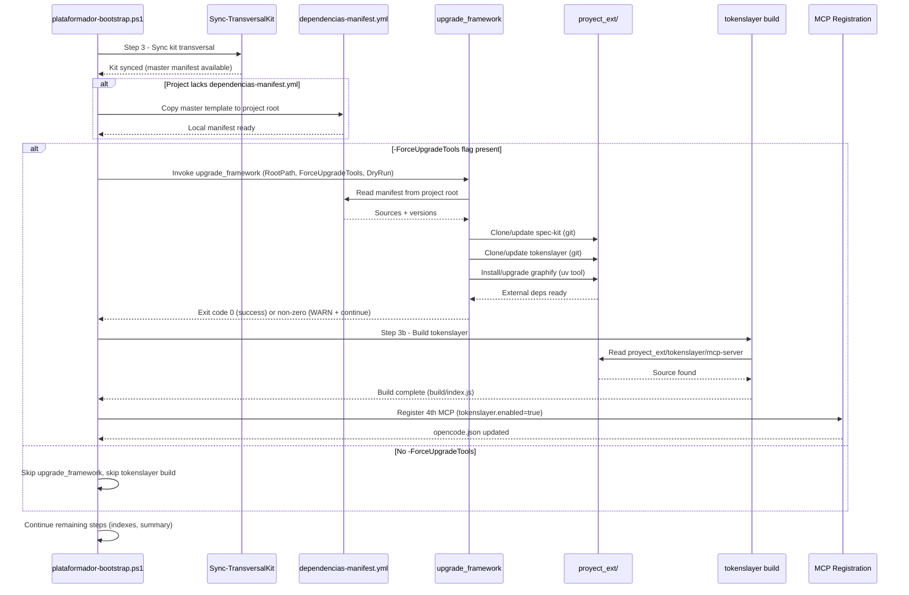

# ADR-0007: Bootstrap delega sincronización de dependencias externas en upgrade_framework

> **Estado**: Aceptado
> **Fecha**: 2026-09-25
> **Decisión**: El script `plataformador-bootstrap.ps1` delega el 100% de la sincronización de `dependencias-manifest.yml` → `proyect_ext/` al agente `upgrade_framework`, invocado **antes** del build de tokenslayer (Step 3b), gated por `-ForceUpgradeTools`, con semántica **fail-open** obligatoria. El bootstrap **nunca** clona `proyect_ext/` directamente.
> **Autor**: `arquitecto` (Fase Analyze — spec #011)
> **Fuente del plan**: Spec `011-bootstrap-invokes-upgrade-framework` (`spec.md`, `plan.md`, `tasks.md`)

---

## Contexto y problema

El bootstrap actual (`scripts/plataformador-bootstrap.ps1`) intenta compilar `tokenslayer` en `proyect_ext/tokenslayer/mcp-server` (Step 3b) pero **no clona el repositorio** — el clonado se hacía manualmente en el kit maestro. Los proyectos consumidores (ej. `trading_bot`) carecen de:
- `dependencias-manifest.yml` (manifest de dependencias externas)
- Directorio `proyect_ext/`

El agente `upgrade_framework` **ya existe** y gestiona `dependencias-manifest.yml` + clonado/actualización de `proyect_ext/` (spec-kit, tokenslayer, graphify via `uv tool install`). Este ADR define la integración donde el bootstrap delega **todo** el sync externo a `upgrade_framework` antes del paso de build de tokenslayer.

**Tensión de diseño central**: el bootstrap es el "instalador único" del kit (ADR-0003) pero no debe saber *cómo* clonar/actualizar cada dependencia externa — eso es responsabilidad del agente especializado `upgrade_framework`. El bootstrap solo orquesta: "¿hay flag? → invoca upgrade_framework → continúa".

---

## Decisión

**Delegación total** de la sincronización de dependencias externas a `upgrade_framework`:

### D1 — Invocación en Step 3 (antes de tokenslayer build)
- Ubicación: dentro del bloque `if ($ForceUpgradeTools)` **antes** de la sección de build de tokenslayer (Step 3b).
- Parámetros pasados: `-RootPath $resolvedRoot -ForceUpgradeTools:$ForceUpgradeTools -DryRun:$DryRun`.

### D2 — Fail-open obligatorio (RF-02 / RNF-01)
```powershell
try {
    $result = Invoke-UpgradeFramework @params
    if ($LASTEXITCODE -ne 0) {
        Write-Warn "upgrade_framework exited with code $LASTEXITCODE: $($result | Out-String). Continuing bootstrap."
    }
} catch {
    Write-Warn "upgrade_framework failed: $_ — continuing bootstrap (fail-open)"
}
# Bootstrap SIEMPRE continúa independientemente del resultado
```

### D3 — Copia de manifest template en primera ejecución (RF-07)
- En `Sync-TransversalKit` (o step temprano): si `$RootPath\dependencias-manifest.yml` **no existe**, copiar desde plantilla maestra `$PSScriptRoot/../dependencias-manifest.yml`.
- **Nunca** sobrescribir si ya existe (idempotencia, usuario puede haber personalizado).
- Respetar `-DryRun` (solo log, no copia).

### D4 — Sin URLs hardcodeadas en bootstrap (RF-04 / RNF-02)
- El bootstrap **nunca** contiene URLs de GitHub (`https://github.com/ajvikram/TokenSlayer`, `https://github.com/github/spec-kit`).
- Todas las fuentes se leen desde `dependencias-manifest.yml` (upgrade_framework es el único que las conoce).

### D5 — Idempotencia (RNF-03)
- Re-ejecutar bootstrap no duplica clones, no rompe estado.
- `upgrade_framework` usa `git pull` / `uv tool upgrade` en clones existentes.
- Manifest no se sobrescribe.

### D6 — Frontera kit ↔ app (RF-10)
- **PROHIBIDO** tocar `Documentacion/<AppName>/` en cualquier paso del bootstrap o upgrade_framework.
- Solo archivos de kit transversal (`.github/`, `.opencode/`, `.doc_agents/`, `.specify/memory/constitution.md`, `README.md`, `AGENTS.md`, `opencode.json`, `sync-agents.ps1`, `dependencias-manifest.yml`, `proyect_ext/`).

---

## Alternativas consideradas

| Opción | Descripción | Veredicto |
|--------|-------------|:---------:|
| **A — Bootstrap clona directamente** | `plataformador-bootstrap.ps1` hace `git clone` de tokenslayer, spec-kit, `uv tool install graphify`. | ❌ **Rechazada**: viola SRP (Single Responsibility), acopla bootstrap a fuentes externas, duplica lógica que ya existe en `upgrade_framework`. |
| **B — Bootstrap llama a upgrade_framework (ELEGIDA)** | Delegación total a agente especializado; bootstrap solo orquesta con fail-open. | ✅ **Adoptada**: loose coupling, SRP respetado, upgrade_framework evoluciona independientemente. |
| **C — Merge upgrade_framework dentro de bootstrap** | Integrar lógica de upgrade_framework como funciones internas del bootstrap. | ❌ **Rechazada**: aumenta tamaño del bootstrap (ya 2840+ líneas), rompe modularidad, dificulta testing aislado. |

Criterio de elección: **separación de responsabilidades** (bootstrap = orquestador, upgrade_framework = ejecutor de sync), **fail-open** como requisito no negociable, **idempotencia** y **ningún hardcode**.

---

## Consecuencias

### Positivas
- **Loose coupling**: bootstrap no conoce URLs, esquemas de clonado, ni detalles de `uv`/`git`/`npm`. Si cambia una fuente, solo se actualiza `dependencias-manifest.yml` y/o `upgrade_framework`.
- **Fail-open garantizado**: fallos de red, rate-limit GitHub, permisos, `uv` no instalado → `WARN` + bootstrap continúa con exit code 0.
- **Single source of truth**: `dependencias-manifest.yml` es la única fuente de URLs y versiones.
- **Idempotencia nativa**: `upgrade_framework` maneja `git pull` / `uv tool upgrade`; manifest se copia solo si no existe.
- **Proyectos consumidores "zero-config"**: `.\scripts\plataformador-bootstrap.ps1 -ForceUpgradeTools` clona todo y compila tokenslayer en una pasada.
- **Kit maestro no afectado**: `-SkipSync` (ADR-0006) sigue funcionando; este ADR no toca el sync del kit.

### Negativas / Trade-offs
- **Dependencia en runtime de upgrade_framework**: si el agente no está disponible o su CLI cambia, bootstrap emite WARN y continúa (fail-open mitiga).
- **Punto de fallo adicional**: la invocación cross-process (PowerShell → PowerShell) añade latencia (~5-10s) y superficie de error.
- **Testing dual**: hay que testear upgrade_framework aislado + integración bootstrap+upgrade_framework.

---

## Guardrails (restricciones que el código debe cumplir)

> Definidos por el `arquitecto` para la fase de implementación (`api-developer` / `devops`). Todo agente que implemente este ADR debe respetarlos.

1. **Fail-open obligatorio en toda llamada externa** (RF-02, RNF-01)
   - `try/catch` + `Write-Warn` + `continue` (nunca `exit` / `throw` sin atrapar).
   - Exit code del bootstrap **siempre 0** aunque upgrade_framework falle.

2. **No hardcodear URLs en bootstrap** (RF-04, RNF-02)
   - Cero referencias a `github.com/ajvikram/TokenSlayer`, `github.com/github/spec-kit`, `graphifyy[mcp]` en `plataformador-bootstrap.ps1`.
   - Verificación: `grep -i "github.com\|graphify" scripts/plataformador-bootstrap.ps1` debe dar 0 resultados (salvo comentarios).

3. **`-DryRun` debe propagarse y no escribir nada** (RNF-03, RF-03)
   - `Invoke-UpgradeFramework` recibe `-DryRun:$DryRun`.
   - En modo DryRun: solo logs informativos ("DryRun: would invoke upgrade_framework..."), cero side effects (no git, no uv, no npm, no fs writes).

4. **Idempotencia: re-ejecutar no duplica ni rompe** (RNF-03)
   - Manifest copy: solo si `!Test-Path`.
   - `upgrade_framework`: `git pull` / `uv tool upgrade` en existentes.
   - Tokenslayer rebuild: solo si fuentes cambiaron (incremental build).

5. **Frontera kit ↔ app: NO tocar `Documentacion/<AppName>/`** (RF-10)
   - Validación: `Get-ChildItem Documentacion/*/ -Directory | Where-Object { $_ -ne 'Agents_IA_TECH' }` → bootstrap nunca escribe ahí.
   - `.gitignore` respeta la frontera.

6. **Propagación correcta de flags**
   - `-ForceUpgradeTools` → gating de invocación completa (si `$false`, upgrade_framework NO se invoca).
   - `-DryRun` → propagado a upgrade_framework y a manifest copy.
   - `-SkipSync` (ADR-0006) → no afecta esta invocación (son flags ortogonales).

7. **Logging estructurado** (RNF-06)
   - Cada fase emite `INFO`/`WARN`/`ERROR` con formato consistente.
   - Ejemplos:
     - `INFO: Invoking upgrade_framework for external dependency sync...`
     - `WARN: upgrade_framework failed: network timeout — continuing bootstrap`
     - `OK: upgrade_framework completed successfully`
     - `INFO: DryRun: would copy manifest template to project root`

8. **Containment de proyect_ext/** (hereda ADR-0006 guardrail 6)
   - `proyect_ext/` siempre bajo `<root>/proyect_ext/`, sin rutas `..` ni externas.
   - `upgrade_framework` valida containment antes de clonar.

---

## Spec linking (trazabilidad spec ↔ plan ↔ tasks ↔ ADR)

| Spec (spec.md) | Plan (plan.md) | Tasks (tasks.md) | ADR (este archivo) |
|----------------|----------------|------------------|---------------------|
| **RF-01** — bootstrap invoca upgrade_framework antes tokenslayer build | Section 2.1 "Integration Point" | T010, T011 | D1 |
| **RF-02** — fail-open obligatorio | Section 2.3 "Fail-Open Pattern" | T012 | D2, Guardrail 1 |
| **RF-03** — gated por -ForceUpgradeTools | Section 2.1 "Gated by flag" | T011 | D1, Guardrail 6 |
| **RF-04** — upgrade_framework clona tokenslayer | Section 3.1 "CLI Requirements" | T001 | D4 (indirecto) |
| **RF-05** — upgrade_framework clona spec-kit | Section 3.1 "CLI Requirements" | T001 | D4 (indirecto) |
| **RF-06** — upgrade_framework instala graphify via uv | Section 3.1 "CLI Requirements" | T001 | D4 (indirecto) |
| **RF-07** — copia manifest template primera ejecución | Section 3.2 "Manifest Template Location" | T020, T021 | D3, Guardrail 4 |
| **RF-08** — bootstrap NO clona directamente | Section 2.1 "Delegation" | T011 (assert) | D1, Decisión B |
| **RF-09** — tokenslayer build encuentra clon | Section 2.1 "Sequence" | T030 | D1 (ordering) |
| **RF-10** — frontera kit↔app respetada | Section 6 "Risks" | T030 (verify) | D6, Guardrail 5 |
| **RNF-01** — fail-open en todo externo | Section 2.3 + Section 6 | T012, T031 | Guardrail 1 |
| **RNF-02** — no URLs hardcodeadas | Section 3 "No hardcoded URLs" | T010, T011 (code review) | Guardrail 2 |
| **RNF-03** — idempotencia | Section 6 "Risks" | T021, T031 | Guardrail 4 |
| **RNF-04** — PowerShell 7+ | Section 5 "Dependencies" | N/A (requisito base) | N/A |
| **RNF-05** — timeout 120s | Section 5 | T030 (performance) | N/A |
| **RNF-06** — logging estructurado | Section 6 | T012, T030 | Guardrail 7 |
| **AC-01** — clean project happy path | Section 5 "Scenario 1" | T030 | Validation |
| **AC-02** — idempotency re-run | Section 5 "Scenario 2" | T031 | Validation |
| **AC-03** — fail-open network failure | Section 5 "Scenario 3" | T031 | Validation |
| **AC-04** — sin flag no invoca | Section 5 "Scenario 4" | T011 (negative test) | Validation |
| **AC-05** — manifest source of truth | Section 6 "Risks" | T020, T030 | Guardrail 2 |
| **AC-06** — Documentacion/<AppName>/ no tocado | Section 6 | T030 (audit) | Guardrail 5 |

---

## Diagrama de secuencia (Mermaid)



---

## Plan de implementación por fases

### Fase documental (completada con este ADR + analyze.md)

| Orden | Agente | Acción |
|-------|--------|--------|
| 1º | `arquitecto` | ✅ **Este ADR** (decisión, alternativas, guardrails, spec linking, diagrama) + `analyze.md` consolidado. |
| 2º | `documentador` | Actualizar `00-indice.md` y `memoria-proyecto.md` con referencia a ADR-0007; documentar flags en `quickstart.md` si aplica. |
| 3º | `security-auditor` | Revisar superficie de ataque: fail-open evita DoS, manifest template no ejecutable, containment de proyect_ext/, supply-chain en -ForceUpgradeTools (solo paquetes conocidos). |

### Fase implementación (siguiente: `api-developer` / `devops` / `qa-senior`)

| Fase | Tareas (tasks.md) | Agente responsable |
|------|-------------------|-------------------|
| **A** — upgrade_framework CLI | T001 (CLI entrypoint), T002 (unit tests) | `upgrade_framework` / `devops` / `qa-senior` |
| **B** — Bootstrap integration | T010 (helper func), T011 (call in Step 3), T012 (fail-open), T013 (DryRun) | `devops` / `api-developer` |
| **C** — Manifest template | T020 (copy template), T021 (idempotent) | `devops` |
| **D** — Integration tests | T030 (clean project E2E), T031 (idempotency + fail-open) | `qa-senior` |

---

## Validación (checklist post-implementación)

| Criterio | Verificación |
|----------|--------------|
| VC-01 | `upgrade_framework` invocado con `-RootPath`, `-ForceUpgradeTools`, `-DryRun` correctos | Code review / log inspection |
| VC-02 | Invocación ocurre **antes** de tokenslayer build (Step 3b) | Code review / sequence verification |
| VC-03 | Fail-open: bootstrap continúa en cualquier error de upgrade_framework (exit code 0) | Test T031 (network failure sim) |
| VC-04 | Manifest copiado a project root en primera ejecución (idempotente) | Test T030 + T031 re-run |
| VC-05 | No URLs hardcodeadas en bootstrap (code review) | `grep` verification |
| VC-06 | `Documentacion/<AppName>/` nunca tocado (filesystem audit) | Test T030 audit |
| VC-07 | Clean consumer project: single run → manifest + proyect_ext + tokenslayer build + 4th MCP | Test T030 |
| VC-08 | Re-run → no errors, no duplicates, only updates | Test T031 idempotency |
| VC-09 | Network failure → WARN + continue, exit 0 | Test T031 fail-open |
| VC-10 | Sin `-ForceUpgradeTools` → no invocación, no tokenslayer build | Test T011 negative + manual |

---

*Documentado por `arquitecto` — Spec #011 Analyze Phase*