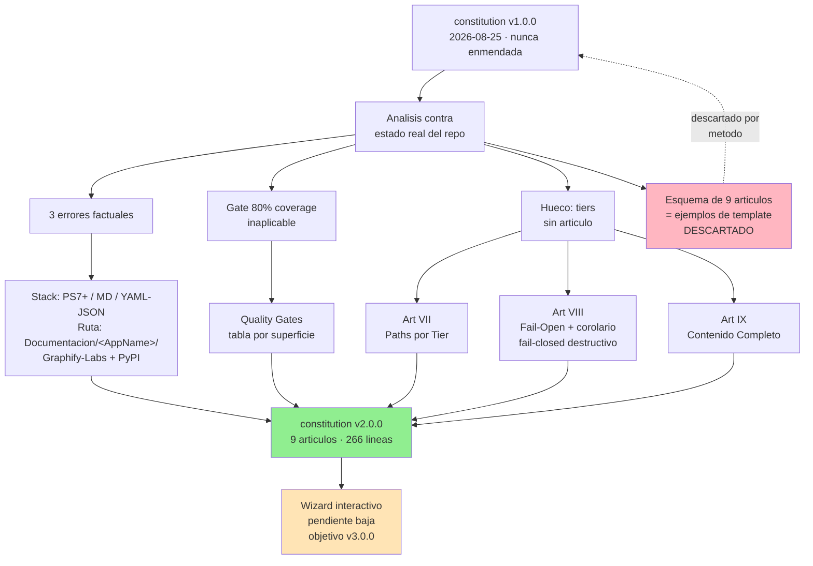

# ADR-0008: Constitution v2.0.0 — artículos de tiers, fail-open y contenido completo, con corrección de 3 errores factuales

> **Estado**: Aceptado
> **Fecha**: 2026-10-03
> **Decisión**: La constitution del kit pasa de **v1.0.0** (ratificada 2026-08-25, nunca enmendada) a **v2.0.0**. Se corrigen **3 errores factuales** que el proyecto ya había invalidado, se agregan **3 artículos nuevos** (VII Restricción de Paths por Tier, VIII Fail-Open en Integraciones Externas, IX Contenido Completo, Nunca Esqueletos) y **2 constraints nuevos** (Genericidad y ausencia de rutas absolutas, Idioma). Los Quality Gates pasan de un único gate inaplicable a una tabla proporcional a la superficie del cambio.
> **Autor**: `pensador` (iniciativa del usuario, 2026-10-03)
> **Fuente**: Análisis de `.specify/memory/constitution.md` contra el estado real del repositorio + `pendientes-implementacion.md` (`[CONSTITUTION-WIZARD]`)

---

## Contexto y problema

La constitution del kit (` .specify/memory/constitution.md`, 117 líneas) estaba ratificada el 2026-08-25 como v1.0.0 y **nunca había sido enmendada**, pese a que en ese intervalo se escribieron ADR-0004, ADR-0005 (que creó un tier nuevo de agentes) y ADR-0007.

El análisis de la v1.0.0 contra el repositorio real encontró **tres clases de defecto**:

### 1. Errores factuales (contenido que el proyecto ya invalidó)

| # | Ubicación | La v1.0.0 afirmaba | Evidencia de que está obsoleto |
|---|---|---|---|
| 1 | `Additional Constraints → Technology Stack Requirements` | "The project must use **TypeScript** for agent implementation... **Node.js 18+ is required**" | El kit es configuración: 12 `.ps1` (PowerShell) + Markdown. No hay `src/`, ni build, ni runtime TS. `AGENTS.md` lo declara: *"Este repo es un kit portable de agentes, skills y prompts. No es una aplicación: no hay `src/`, build, tests ni runtime."* |
| 2 | `Development Workflow → Agent Lifecycle` paso 1 | "Define agent specification in `Documentacion/funcionalidades/`" | Ese directorio **no existe**. La ruta real es `Documentacion/<AppName>/`, donde viven los 22 directorios de specs, 7 ADRs, 20 revisiones de seguridad y las bitácoras |
| 3 | Art.VI, manifest de dependencias de ejemplo | `url: https://github.com/tomasgraph/graphify` con destino `bin/graphify → .opencode/bin/` | La URL está **muerta (HTTP 404, verificado 2026-09-19)**. El upstream real es `https://github.com/Graphify-Labs/graphify` (PyPI `graphifyy`), y ya no se clona ni se copia a `.opencode/bin/`: se instala como paquete Python y expone un MCP server embebido (`python -m graphify.serve`, stdio). Registrado en `pendientes-implementacion.md` (`[GRAPHIFY-INSTALL]`) |

### 2. Gate de calidad inaplicable

La v1.0.0 exigía *"Minimum 80% test coverage across all agents"*. Los agentes son archivos Markdown sin ejecución: la cobertura no es medible. El único binario con tests es `tests/upgrade_framework.Tests.ps1` (Pester). Un gate que no se puede evaluar o no bloquea; lo que no bloquea se ignora en silencio, que es peor que no tenerlo.

### 3. Hueco de gobernanza: la regla más aplicada, sin artículo

La **restricción de paths por tier** (5 tiers, tabla de whitelist) es la regla que más veces aparece en el repositorio y la que más incumplimientos genera cuando un agente se equivoca de rol. Estaba definida en `AGENTS.md` y en las definiciones de los agentes, pero **no estaba en la constitution**. Un principio que no está en la constitution no es un principio: es una convención que se erosiona.

### 4. Desvío de esquema (falso positivo que se descartó)

Un Constitution Check mechanistic comparó la constitution contra un esquema de 9 artículos (`Library-First`, `CLI Interface`, `Test-First`, `Simplicity`, `Security`, `Anti-Abstraction`, `Integration-First`, ...). La investigation mostró que ese esquema proviene de los **comentarios `<!-- Example: ... -->`** de `.specify/templates/constitution-template.md` (líneas 7, 13, 18, 23, 27), que son texto ilustrativo dentro de slots `[PRINCIPLE_N_NAME]`, no un estándar del proyecto. Validar contra ejemplos de plantilla y reportarlo como violación fue un error de método.

**Consecuencia retenida**: la constitution sí estaba incompleta en contenido (los 3 errores + el hueco de tiers), pero no por tener 6 principios en vez de 9.

---

## Decisión

Publicar **constitution v2.0.0** (cambio MAJOR: se agregan principios y se redefine el modelo de quality gates).

### D1 — Corrección de los 3 errores factuales
- **Stack real**: PowerShell 7+ (`.ps1`, todos con `#requires -Version 7.0`) + Markdown + YAML/JSON. Node.js queda explícitamente relegado a *runtime de proyecto externo* (el MCP server de tokenslayer en `proyect_ext/`). Se elimina el requisito de TypeScript.
- **Ruta de documentación**: `Documentacion/funcionalidades/` → `Documentacion/<AppName>/`.
- **Grafify**: se documenta el origen verificado `Graphify-Labs/graphify` (PyPI `graphifyy`, sin pin de versión — siempre última disponible), la instalación por MCP con transporte **stdio**, y se marcan `bin/graphify` y `lib/graphify` como destinos obsoletos. Se agrega tabla de orígenes reales de las 3 herramientas del kit (spec-kit, graphify, tokenslayer) con URL, forma de instalación y licencia. El manifest registra la versión aplicada para detectar actualizaciones.

### D2 — Artículo VII: Restricción de Paths por Tier (nuevo)
Tabla de 5 tiers × whitelist de escritura. Reglas de aplicación: un documental nunca edita código (ni un comentario inline); un documental nunca toca `Documentacion/<OtraApp>/`; el `pensador` no implementa nunca; en el proyecto kit el `pensador` **sí** puede ejecutar Speckit porque sus artefactos caen en su whitelist.

Excepción explícita que evita el deadlock del ADR-0005: el tier documental extendido `Agent-SSD` existe precisamente porque Speckit necesita escribir en `src/<App>/.specify/`.

### D3 — Artículo VIII: Fail-Open en Integraciones Externas (nuevo)
`try/catch` + `Write-Warn` + `continue`, exit code 0, con cuatro consecuencias obligatorias: MCP caído se reporta degradado y no aborta; token sin resolver deja la entrada en `enabled: false` con WARN visible; `-DryRun` produce cero escrituras; el operador ve el cuadro resumen final.

**Corolario de seguridad (lo que hace que el artículo sea útil y no peligroso)**: el fail-open **nunca** aplica a operaciones destructivas. Eliminar, sobrescribir, mover fuera de la allowlist o limpiar exige **fail-closed** + confirmación obligatoria sin flag que la salte. Sin este corolario, "fail-open" degenera en "borrar y seguir".

### D4 — Artículo IX: Contenido Completo, Nunca Esqueletos (nuevo)
Formaliza la regla de `AGENTS.md` con sus 5 pasos de verificación (leer lo escrito, sin secciones con solo título, sin placeholders, tablas con filas reales, ≥3 líneas útiles por sección).

**Corolario en la dirección opuesta**: prohibido marcar una tarea como completada sin evidencia, y prohibido dar información falsa o reportar éxito sin evidencia. Un `tasks.md` que no refleja la realidad del código es un defecto. Esto es directamente la causa de las discrepancias detectadas en `tasks.md` de las specs 011, 013, 014 y `solucion-generica`.

### D5 — Constraints nuevos
- **Genericidad y ausencia de rutas absolutas**: formaliza RF-S1/RF-S2/RF-S6 de la spec `solucion-generica`. Cero dominio concreto (se usa `MiApp`/`AppFoo`), cero rutas absolutas versionadas, cero apps activas en el manifest maestro, comandos MCP como plantilla con tokens re-resueltos en runtime.
- **Idioma**: español latino neutro, prohibición explícita del voseo en ambos harnesses, identificadores y comandos en inglés.

### D6 — Quality Gates proporcionales a la superficie
Tabla de 7 gates (`.ps1` → `Parser::ParseFile` 0 errores; funciones → Pester; specs → `speckit-analyze`; agentes → sync + Skills + Idioma + PASS de `qa-senior`; seguridad → threat model + `agentshield` + `gitleaks`; rutas destructivas → allowlist + fixture señuelo; artefactos regenerables → `git check-ignore`).

### D7 — Workflow alineado con ADR-0005
El ciclo de vida incorpora el tier `Agent-SSD` y la regla de que el pipeline no auto-continúa entre fases sin validación del usuario.

---

## Alternativas consideradas

| Alternativa | Por qué se descartó |
|---|---|
| **Reescribir con el Constitution Wizard** (cuestionario interactivo de 12 bloques) | El usuario lo pidió así pero lo **dejó como pendiente de baja prioridad** por no confiar en el resultado. Se registra como pendiente `[CONSTITUTION-WIZARD]` y como objetivo de v3.0.0 |
| **Solo corregir los 3 errores, sin artículos nuevos** | Deja sin constitucionalizar la regla de tiers y el patrón fail-open, que son las dos cosas que más se incumplen |
| **Adoptar el esquema de 9 artículos de los ejemplos del template** | Es texto de ejemplo, no estándar del proyecto. Forzar esos nombres sobre principios reales del kit sería cosmetismo |
| **Dejar los Quality Gates como estaban** | Un gate inaplicable no es neutro: se ignora en silencio y erosiona la cultura de verificación |
| **MAJOR vs MINOR (2.0.0 vs 1.1.0)** | Se agregan 3 principios con carácter normativo y se redefine el modelo de gates. Es una redefining de gobernanza → MAJOR |

---

## Consecuencias

### Positivas
- La constitution vuelve a reflejar el estado real del kit: 9 artículos, 5 tiers, fail-open, contenido completo.
- Los Quality Gates pasan a ser verificables por superficie de cambio.
- Se formaliza la genericidad, que ya era criterio de la spec `solucion-generica` pero no estaba en la constitution.
- El Constitution Check deja de producir falsos positivos: el esquema de 9 artículos queda registrado como *ejemplos de plantilla*, no estándar.

### Negativas / costos
- **Divergencia temporal**: hasta que los agentes se actualicen, el Art.VII (tiers) queda como norma de constitution sin eco en las definiciones. Mitigación: `AGENTS.md` ya la define, y la constitution ahora la respalda.
- El gate "80% coverage" desaparece como gate bloqueante. Riesgo: alguien lo reintroduce como sugerencia sin aplicabilidad. Mitigación: queda escrito explícitamente que la cobertura es aspiración para código ejecutable.
- La constitution creció de 117 a 266 líneas. Costo de lectura asumido: es un documento de referencia, no se lee completo en cada sesión.

### Neutras
- El Constitution Wizard interactivo sigue pendiente, ahora con objetivo declarado de v3.0.0.

---

## Guardrails

1. **Fail-closed para destructivo**: el Art.VIII solo aplica a integraciones externas. Toda operación que borre, sobrescriba o mueva fuera de la allowlist es fail-closed y exige confirmación.
2. **Whitelist de tiers no negociable**: un agente que escribe fuera de su tier es una violación de constitution, no un bug a corregir en silencio.
3. **Sin rutas absolutas**: cualquier cambio que introduzca una ruta de usuario en un archivo versionado viola el constraint de Genericidad.
4. **Amendment con ADR**: todo cambio de principio exige ADR en `Documentacion/<AppName>/arquitectura/adr/` y entrada en su `00-index.md` (este documento es la implementación de ese guardrail para v2.0.0).
5. **Versionado semántico de la constitution**: MAJOR por redefining de principios, MINOR por principio nuevo, PATCH por aclaración.
6. **La constitution no reemplaza a las definiciones de agente**: si un agente y la constitution discrepan, gana la constitution y el agente se corrige.

---

## Spec linking

| Artefacto | Relación |
|-----------|----------|
| `.specify/memory/constitution.md` | Documento actualizado a v2.0.0 (266 líneas) |
| `.specify/templates/constitution-template.md` | Origen del esquema de 9 artículos que se descartó como estándar (líneas 7, 13, 18, 23, 27) |
| `AGENTS.md` | Fuente de los 5 tiers, la regla de contenido completo y la prohibición de TypeScript |
| `arquitectura/adr/adr-0005-agent-ssd.md` | Crea el tier documental extendido que el Art.VII excepciona |
| `arquitectura/adr/adr-0007-bootstrap-delegates-upgrade-framework.md` | Fail-open como patrón del bootstrap, ahora constitucionalizado en el Art.VIII |
| `specs/solucion-generica/spec.md` (RF-S1, RF-S2, RF-S6) | Origen del constraint de Genericidad |
| `specs/011-bootstrap-invokes-upgrade-framework/` | Las 25 mitigaciones `security-risk:` que materializan los controles del Art.VI |
| `pendientes-implementacion.md` (`[CONSTITUTION-WIZARD]`) | Wizard interactivo, prioridad baja, objetivo v3.0.0 |
| `pendientes-implementacion.md` (`[GRAPHIFY-INSTALL]`) | Evidencia del 404 de `tomasgraph/graphify` y cambio a política sin pin (siempre última versión, versión registrada en manifest) |

---

## Diagrama

---

## Plan de implementación

| # | Paso | Estado | Agente |
|---|------|--------|--------|
| 1 | Analizar v1.0.0 contra el repositorio real | **Completado** (2026-10-03) | `pensador` |
| 2 | Corregir los 3 errores factuales | **Completado** | `pensador` |
| 3 | Agregar Artículos VII, VIII, IX | **Completado** | `pensador` |
| 4 | Agregar constraints de Genericidad e Idioma | **Completado** | `pensador` |
| 5 | Reemplazar Quality Gates por tabla por superficie | **Completado** | `pensador` |
| 6 | Alinear el workflow con ADR-0005 | **Completado** | `pensador` |
| 7 | Actualizar `00-index.md` de ADRs | **Completado** | `pensador` |
| 8 | Verificar con el gate de la propia constitution (9 artículos, sin placeholders, secciones con contenido, sin pérdida de bloques previos) | **Completado** | `pensador` |
| 9 | Constitution Wizard interactivo (12 bloques) | **Pendiente** — prioridad baja | `pensador` (v3.0.0) |
| 10 | Propagar los artículos VII/VIII/IX a las definiciones de agentes en `.github/` y `.opencode/` | **Pendiente** | `documentador` + `qa-senior` |

---

*Autor: `pensador` · 2026-10-03 · ADR-0008 · Aceptado*
