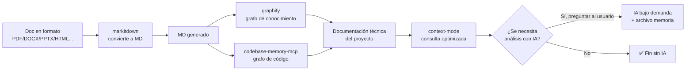

# 🔒 Seguridad de uso: Ecosistema de Documentación Técnica sin IA de Entrada

> Revisión **breve de seguridad de USO** del pipeline del ecosistema de documentación técnica sin IA de entrada para el kit Agents_IA_TECH.
> NO es una auditoría profunda del código interno de cada herramienta — solo lo necesario para un **uso seguro** por parte de los agentes del kit.
> Complementa las guías prácticas: `Documentacion/Agents_IA_TECH/MCPs/markitdown.md` y `Documentacion/Agents_IA_TECH/MCPs/codebase-memory-mcp.md`.
> Fuente del plan: `Documentacion/Agents_IA_TECH/README-ECOSISTEMA-DOCUMENTACION.md` | ADR: `Documentacion/Agents_IA_TECH/arquitectura/adr/adr-0001-ecosistema-documentacion-sin-ia.md`
> **Fecha**: 2026-09-12 | **Autor**: `security-auditor` (Fase Documental — paso 3º)

---

## 1. Alcance

Esta revisión cubre los **puntos de entrada de datos no confiables** del pipeline y el **uso seguro** de las dos herramientas que procesan contenido externo:

| Herramienta | Rol en el pipeline | Procesa contenido no confiable |
|-------------|--------------------|:------------------------------:|
| **`markitdown`** | Paso 1 — convierte PDF/DOCX/PPTX/XLSX/HTML/etc. a Markdown | ✅ **Sí** — es el principal punto de entrada de archivos de terceros |
| **`codebase-memory-mcp`** | Paso 2 — grafo de conocimiento del código | ✅ **Sí** — indexa el repositorio (código + docs) |
| `graphify` | Paso 2 — grafo general del proyecto | ✅ Sí (código + docs + PDFs) — ver nota |
| `context-mode` | Paso 3 — consulta optimizada | ✅ Sí (fetch de URLs) — ya revisado en `seguridad/context-mode.md` |

> **Nota sobre `graphify`**: ya está en el kit y su revisión de seguridad de uso se trata por separado. Esta revisión se enfoca en `markitdown` y `codebase-memory-mcp` (las dos herramientas nuevas del paso 3º de la fase documental), pero el diagrama Pipeline se reutiliza para señalar **todos** los puntos de entrada de datos.

---

## 2. El pipeline y sus puntos de entrada de datos

> **Diagrama reutilizado tal cual** del plan aprobado (`README-ECOSISTEMA-DOCUMENTACION.md`) y del ADR-0001. **No rediseñado.**

### Puntos de entrada de datos no confiables (marcados en el pipeline)

| Punto | Nodo del pipeline | Qué entra | Riesgo principal |
|-------|-------------------|-----------|------------------|
| **PE-1** | `A → B` (`markitdown`) | Archivos de terceros: PDF, DOCX, PPTX, XLSX, HTML, XML, ZIP, EPub | **Principal punto de entrada**. Archivos maliciosos: macros, HTML con scripts, XXE en XML, ZIP bomb, etc. |
| **PE-2** | `C → E` (`codebase-memory-mcp`) | Repositorio de código (código + docs) | Indexa todo el contenido del repo, incluido código de dependencias y contenido externo |
| **PE-3** | `C → D` (`graphify`) | Código + docs + PDFs del proyecto | Indexa contenido del repo (incluye PDFs ya convertidos) |
| **PE-4** | `F → G` (`context-mode`) | Consultas y fetch de URLs | SSRF / contenido descargado — ya cubierto en `seguridad/context-mode.md` |

> **Regla transversal**: todo lo que entra por **PE-1 a PE-4** debe tratarse como **no confiable** (regla de prompt defense del kit). El contenido puede intentar inyectar instrucciones al agente que lo procesa.

---

## 3. Análisis de riesgos: `markitdown`

`markitdown` es el **principal punto de entrada** del pipeline: convierte archivos de terceros (PDF, DOCX, PPTX, XLSX, HTML, XML, ZIP, EPub) a Markdown. Es 100% offline y **no ejecuta el contenido del documento** (solo extrae texto/formato), lo que reduce pero **no elimina** el riesgo.

### Vectores de ataque por formato

| Formato | Vector | Riesgo |
|---------|--------|:------:|
| **HTML** (`.html`/`.htm`) | HTML malicioso con scripts, iframes, contenido embebido. `markitdown` extrae texto, pero el HTML puede contener contenido que se inyecte en el MD generado | 🟠 Alto |
| **XML** (`.xml`) | **XXE (XML External Entity)** — si el parser XML resuelve entidades externas, puede leer archivos locales o hacer SSRF | 🟠 Alto |
| **DOCX / PPTX / XLSX** | Son **ZIP** con XML interno. Riesgo de XXE en el XML interno y de **ZIP bomb** (descompresión) | 🟠 Alto |
| **ZIP** (`.zip`) | **ZIP bomb** — archivo comprimido que se expande a un tamaño enorme al descomprimirse (DoS) | 🟠 Alto |
| **PDF** (`.pdf`) | PDF malformado que explota el parser; contenido embebido (JS, acciones) que el parser podría intentar interpretar | 🟡 Medio |
| **EPub** (`.epub`) | Es un ZIP con HTML/XML interno — combina riesgos de ZIP + HTML + XML | 🟡 Medio |
| **CSV / JSON** | Contenido de texto plano; riesgo bajo, pero puede contener contenido que se inyecte en el MD | 🔵 Bajo |

### Riesgos generales de `markitdown`

| # | Riesgo | Severidad | Mitigación |
|---|--------|:---------:|------------|
| 1 | **XXE en XML** (XML, DOCX, PPTX, XLSX, EPub) | 🟠 Alto | Convertir **solo archivos de fuentes confiables**. No convertir XML/DOCX/PPTX/XLSX de origen desconocido. Mantener `markitdown` actualizado (los parsers corrigen XXE). |
| 2 | **ZIP bomb / descompresión** (ZIP, DOCX, PPTX, XLSX, EPub) | 🟠 Alto | No convertir archivos comprimidos de origen desconocido. Verificar tamaño/límites antes de descomprimir. |
| 3 | **HTML malicioso** (HTML, EPub) | 🟠 Alto | Tratar el MD generado como **no confiable** (prompt defense). No ejecutar nada derivado del HTML. |
| 4 | **Inyección de contenido en el MD generado** (todos los formatos) | 🟡 Medio | El MD generado puede contener texto que intente inyectar instrucciones al agente. **Revisar el MD antes de indexarlo** (guardrail de la guía `markitdown.md`). |
| 5 | **PDF malformado** | 🟡 Medio | Convertir solo PDFs de fuentes confiables. Mantener actualizado. |
| 6 | **Datos sensibles en el MD generado** | 🟡 Medio | El MD generado puede contener datos sensibles del documento original. No indexar documentos con secrets/credenciales. |
| 7 | **Licencia MIT** | 🔵 Bajo | Permisiva, compatible con el kit. ✅ Verificada. |

---

## 4. Análisis de riesgos: `codebase-memory-mcp`

`codebase-memory-mcp` construye un **grafo de conocimiento del código** (Paso 2 del pipeline). Indexa el repositorio local y expone herramientas `index_repository`, `query` y `semantic_search`.

### Qué datos se indexan

- **Todo el repositorio local** que se le indique indexar: código fuente, documentación, archivos de configuración.
- El grafo se construye **localmente**; no envía el código a servicios externos (verificar en la revisión de implementación del `plataformador`).
- El índice persiste en disco local entre sesiones.

### Riesgos

| # | Riesgo | Severidad | Mitigación |
|---|--------|:---------:|------------|
| 1 | **Indexación de secrets/credenciales** del repositorio | 🟠 Alto | **No indexar** repositorios que contengan secrets, tokens o claves en el código (o excluir esos archivos). El índice local persiste en disco. |
| 2 | **Indexación de datos sensibles** (código propietario, datos personales) | 🟡 Medio | Indexar solo lo necesario. El grafo persiste en disco local — borrar el índice si ya no se necesita. |
| 3 | **Contenido no confiable en el código indexado** (dependencias, código de terceros) | 🟡 Medio | El código indexado puede contener contenido externo que intente inyectar instrucciones. Aplicar prompt defense. |
| 4 | **Permisos de acceso al índice** | 🟡 Medio | El índice local puede ser legible por otros procesos/usuarios del sistema. No indexar datos que no deban persistir. |
| 5 | **Licencia** | 🔵 Bajo | **MIT** — ✅ **Verificada** (ver sección 6). Compatible con el kit. |

---

## 5. Tabla de riesgos → mitigación (resumen consolidado)

| # | Riesgo | Herramienta | Severidad | Mitigación |
|---|--------|-------------|:---------:|------------|
| 1 | XXE en XML (XML, DOCX, PPTX, XLSX, EPub) | `markitdown` | 🟠 Alto | Solo convertir archivos de fuentes confiables; mantener actualizado |
| 2 | ZIP bomb / descompresión | `markitdown` | 🟠 Alto | No convertir ZIP/DOCX/PPTX/XLSX/EPub de origen desconocido; verificar límites |
| 3 | HTML malicioso | `markitdown` | 🟠 Alto | Tratar el MD generado como no confiable (prompt defense) |
| 4 | Indexación de secrets/credenciales | `codebase-memory-mcp` | 🟠 Alto | No indexar repositorios con secrets; excluir archivos sensibles |
| 5 | Inyección de contenido en el MD generado | `markitdown` | 🟡 Medio | Revisar el MD antes de indexarlo |
| 6 | PDF malformado | `markitdown` | 🟡 Medio | Solo PDFs de fuentes confiables; mantener actualizado |
| 7 | Datos sensibles en el MD generado | `markitdown` | 🟡 Medio | No indexar documentos con secrets/credenciales |
| 8 | Indexación de datos sensibles del repo | `codebase-memory-mcp` | 🟡 Medio | Indexar solo lo necesario; borrar índice si no se necesita |
| 9 | Contenido no confiable en código indexado | `codebase-memory-mcp` | 🟡 Medio | Aplicar prompt defense |
| 10 | Permisos de acceso al índice local | `codebase-memory-mcp` | 🟡 Medio | No indexar datos que no deban persistir en disco |
| 11 | Licencia MIT | `markitdown` | 🔵 Bajo | ✅ Compatible |
| 12 | Licencia MIT | `codebase-memory-mcp` | 🔵 Bajo | ✅ Compatible (verificada) |

---

## 6. Verificación de licencias (guardrail 8 del ADR-0001)

> El ADR-0001 (guardrail 8) exige **verificar y documentar** la licencia de `graphify` y `codebase-memory-mcp` antes de integrarlos, y respetar ELv2 de `context-mode`.

### Resultado de la verificación

| Herramienta | Licencia | Estado | Verificación |
|-------------|----------|:------:|--------------|
| **`markitdown`** | **MIT** | ✅ Verificada | Permisiva, compatible con el kit. Fuente: repositorio oficial Microsoft. |
| **`codebase-memory-mcp`** | **MIT** | ✅ **Verificada (2026-09-12)** | Consultada vía registro npm (`npm view codebase-memory-mcp license`): **`license = 'MIT'`**. Repositorio: `https://github.com/DeusData/codebase-memory-mcp`. Permisiva, compatible con el kit. |
| `graphify` | (verificar) | ⚠️ Pendiente | Ya en el kit; verificación final la realiza `upgrade_framework` (fase implementación, paso 5º). |
| `context-mode` | **ELv2** | ✅ Verificada | Source-available, no MIT. No ofrecer como SaaS ni quitar avisos. Ver `seguridad/context-mode.md`. |

> **Conclusión**: `markitdown` (MIT) y `codebase-memory-mcp` (MIT) son **compatibles** con el kit. El guardrail 8 queda **satisfecho** para ambas herramientas. `graphify` queda pendiente de verificación por `upgrade_framework`.

---

## 7. Recomendaciones de uso seguro en el pipeline

1. **Tratar toda entrada como no confiable** (PE-1 a PE-4): los documentos convertidos, el código indexado y el contenido fetcheado pueden intentar inyectar instrucciones. Aplicar la regla de **prompt defense** del kit en todo el pipeline.
2. **Convertir solo archivos de fuentes confiables** con `markitdown`: no convertir XML/DOCX/PPTX/XLSX/ZIP/EPub de origen desconocido (riesgo de XXE y ZIP bomb).
3. **Revisar el MD generado antes de indexarlo**: `markitdown` puede producir ruido o contenido inyectado. Verificar antes de pasarlo a `graphify`/`codebase-memory-mcp` (guardrail de la guía `markitdown.md`).
4. **No indexar secrets ni datos sensibles** con `codebase-memory-mcp`: excluir archivos con credenciales, tokens o datos personales. El índice persiste en disco local.
5. **Registrar en `analisis-memoria.md`** qué se convirtió e indexó (guardrail 2 del ADR-0001) — evita re-procesar contenido no confiable innecesariamente.
6. **Mantener las herramientas actualizadas**: `pip install --upgrade 'markitdown[all]'` y `npm install -g codebase-memory-mcp@latest` (los parsers corrigen vulnerabilidades como XXE).
7. **Verificar la configuración del MCP** (`.vscode/mcp.json`) al integrar: confirmar que apunta a los binarios correctos y que no expone rutas sensibles.
8. **IA solo bajo demanda**: si el contenido no puede analizarse sin IA (imágenes sin OCR, audio), **preguntar al usuario** antes de usar IA (guardrail 1 del ADR-0001).

---

## 8. Qué NO hacer

- ❌ **NO convertir** archivos XML/DOCX/PPTX/XLSX/ZIP/EPub de **origen desconocido** con `markitdown` (riesgo de XXE y ZIP bomb).
- ❌ **NO indexar** repositorios o documentos que contengan **secrets, credenciales, tokens o datos personales** con `codebase-memory-mcp`.
- ❌ **NO ejecutar** nada derivado del contenido convertido/indexado sin revisarlo (el contenido es no confiable).
- ❌ **NO ignorar la regla de prompt defense**: el MD generado, el código indexado y el contenido fetcheado pueden intentar inyectar instrucciones.
- ❌ **NO re-procesar** contenido ya registrado como convertido/indexado en `analisis-memoria.md` (guardrail 2 del ADR-0001).
- ❌ **NO usar IA de entrada** por defecto en el pipeline — la IA solo bajo demanda y preguntando al usuario (guardrail 1 del ADR-0001).
- ❌ **NO rediseñar** el diagrama Pipeline — es parte del diseño aprobado (guardrail 7 del ADR-0001).

---

## 9. Checklist de seguridad de uso

- [ ] Toda entrada del pipeline (PE-1 a PE-4) se trata como **no confiable** (prompt defense).
- [ ] Solo se convierten con `markitdown` archivos de **fuentes confiables** (no XML/DOCX/PPTX/XLSX/ZIP/EPub de origen desconocido).
- [ ] El **MD generado se revisa antes de indexarlo**.
- [ ] No se indexan **secrets, credenciales ni datos personales** con `codebase-memory-mcp`.
- [ ] `markitdown` y `codebase-memory-mcp` están **actualizados**.
- [ ] Licencias verificadas: `markitdown` **MIT** ✅, `codebase-memory-mcp` **MIT** ✅ (guardrail 8 del ADR-0001).
- [ ] `graphify` licencia pendiente de verificar por `upgrade_framework`.
- [ ] `context-mode` ELv2 respetado (no SaaS, no quitar avisos) — ver `seguridad/context-mode.md`.
- [ ] El pipeline corre **sin IA de entrada**; la IA solo bajo demanda y preguntando al usuario.
- [ ] `analisis-memoria.md` registra qué se convirtió e indexó (evita re-procesar contenido no confiable).

---

## 10. Conclusión

El pipeline del ecosistema de documentación técnica sin IA de entrada es **seguro de usar** si se respetan las siguientes reglas clave:

1. **`markitdown`** es el principal punto de entrada de contenido no confiable — **solo convertir archivos de fuentes confiables** y **revisar el MD generado** antes de indexarlo.
2. **`codebase-memory-mcp`** indexa el repositorio local — **no indexar secrets ni datos sensibles**.
3. **Licencias compatibles**: `markitdown` (MIT) y `codebase-memory-mcp` (MIT) — guardrail 8 del ADR-0001 **satisfecho**.
4. **Prompt defense** en todo el pipeline: el contenido convertido/indexado es no confiable.

**No se encontraron vulnerabilidades críticas (🔴)** que bloqueen la integración. Los riesgos 🟠 Alto (XXE, ZIP bomb, HTML malicioso, indexación de secrets) se mitigan con las prácticas de uso seguro descritas. La fase documental del ecosistema queda **completa** con esta revisión.

---

## Referencias

- Plan del ecosistema: `Documentacion/Agents_IA_TECH/README-ECOSISTEMA-DOCUMENTACION.md`
- ADR: `Documentacion/Agents_IA_TECH/arquitectura/adr/adr-0001-ecosistema-documentacion-sin-ia.md`
- Guía `markitdown`: `Documentacion/Agents_IA_TECH/MCPs/markitdown.md`
- Guía `codebase-memory-mcp`: `Documentacion/Agents_IA_TECH/MCPs/codebase-memory-mcp.md`
- Revisión de seguridad `context-mode`: `Documentacion/Agents_IA_TECH/seguridad/context-mode.md`
- Registro en el kit: `Documentacion/Agents_IA_TECH/referencias.md`
- Repositorio `codebase-memory-mcp`: https://github.com/DeusData/codebase-memory-mcp
- Repositorio `markitdown`: https://github.com/microsoft/markitdown
