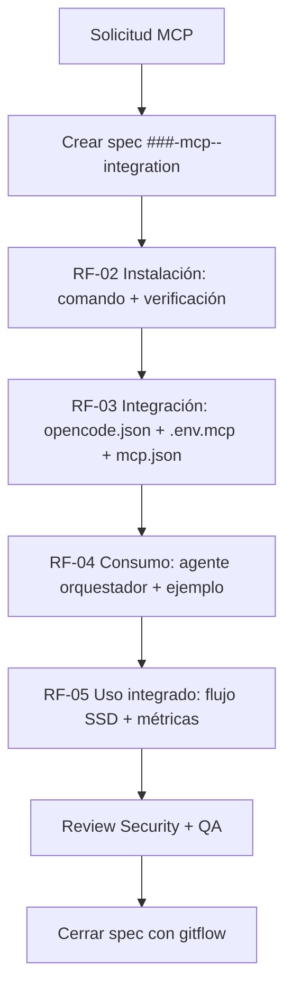

# Feature Specification: [000-mcp-integration-standard] — Estándar de integración de MCPs en el kit Agents_IA_TECH

**Origen**: Kit Agents_IA_TECH interno — Estándar de gobernanza MCP

**Feature Branch**: `000-mcp-integration-standard`

**Created**: 2026-09-28

**Status**: Draft

**Scope**: Meta-spec que define el flujo obligatorio para integrar CUALQUIER MCP externo en la solución.

---

## Problema

Cada nuevo MCP se está especificando de forma ad-hoc. No existe un estándar documentado que indique **qué** se debe crear, **en qué orden** y **con qué artefactos** para instalarlo, integrarlo, consumirlo y usarlo de forma integrada.

Esto genera:
- Duplicación de trabajo
- Specs incompletos o con enfoque de desarrollo en lugar de uso
- Inconsistencia entre `.opencode/`, `.vscode/`, `opencode.json` y el bootstrap

**Impacto**: Retrabajo, specs que no se pueden cerrar y deuda de integración.

---

## Objetivo

Definir un estándar SSD único para la integración de MCPs externos como *proyect_ext*:
1. Instalar
2. Integrar
3. Consumir
4. Usar de forma integrada

Todas las integraciones de MCPs deben seguir este estándar.

---

## Requisitos Funcionales

### RF-01 — Spec de integración por MCP

Cada MCP requiere una spec individual bajo `Documentacion/Agents_IA_TECH/specs/###-mcp-<nombre>-integration/` con los artefactos spec-kit mínimos:
- `spec.md`
- `plan.md`
- `tasks.md`
- `checklists/requirements.md`

**Criterios de aceptación**:
- La spec describe instalación, integración, consumo y uso; NO desarrolla el MCP.
- La spec referencia el estándar 000.

### RF-02 — Instalación

La spec DEBE documentar:
- Fuente de instalación (npm / pip / uv / binario)
- Comando exacto de instalación
- Prerrequisitos y verificación post-instalación

**Criterios de aceptación**:
- Comando verificable reproduceable.
- Script de verificación incluido en `quickstart.md`.

### RF-03 — Integración en el kit

La spec DEBE documentar integración en:
- `opencode.json` con patrón `{env:XXX_CMD}` y `enabled: false` en plantilla
- `.opencode/mcp.json` y `.vscode/mcp.json`
- `.env.mcp` gestionado por el bootstrap

**Criterios de aceptación**:
- Sin rutas absolutas versionadas.
- Resolución vía `Resolve-McpCommand` y `Ensure-McpEnvFile`.
- Idempotente y fail-open.

### RF-04 — Consumo por agentes

La spec DEBE documentar cómo los agentes del kit consumen el MCP:
- Agente orquestador que invoca el MCP
- Parámetros de entrada/salida
- Ejemplos de uso

**Criterios de aceptación**:
- Al menos un ejemplo de llamada real con agente.
- Documentado en `quickstart.md`.

### RF-05 — Uso integrado

La spec DEBE documentar uso integrado en flujo SSD:
- Dónde entra el MCP en Plan → Documentar → Implementar
- Impacto en calidad / observabilidad

**Criterios de aceptación**:
- Mapa de flujo con el MCP incluido.
- Criterios de éxito medibles.

### RF-06 — Gobernanza y trazabilidad

Todas las specs de MCP deben:
- Referenciar `007-mcp-token-resolution` para patrón de tokens
- Referenciar este estándar 000
- Seguir conventional commits al cerrar

**Criterios de aceptación**:
- `spec.md` incluye sección Dependencias → `000-mcp-integration-standard`.

---

## Requisitos No Funcionales

- **RNF-01**: No se desarrolla el MCP, solo se usa.
- **RNF-02**: Contenido completo, sin placeholders.
- **RNF-03**: Paridad `.github/` ↔ `.opencode/`.
- **RNF-04**: Fail-open en ausencia de herramienta.

---

## Flujo estándar de integración MCP

---

## Dependencias

- `007-mcp-token-resolution` — patrón de tokens y `.env.mcp`
- `scripts/plataformador-bootstrap.ps1` — `Ensure-OpenCodeMcp`, `Resolve-McpCommand`, `Ensure-McpEnvFile`
- `Documentacion/Agents_IA_TECH/specs/006-post-platforming-speckit/spec.md`

---

## Criterios de Éxito

- **SC-001**: Cada MCP de la lista tiene spec cerrada siguiendo este estándar.
- **SC-002**: `opencode.json` versionado sin rutas absolutas.
- **SC-003**: Bootstrap activa el MCP con `enabled: true` si está instalado.
- **SC-004**: `quickstart.md` permite validar instalación y consumo en <5 min.

---

## Lista de MCPs pendientes

1. Context7 MCP — 008
2. GitHub MCP
3. TestSprite MCP
4. Playwright MCP
5. Semgrep MCP
6. Pieces MCP
7. Perplexity MCP
8. Sentry MCP

Cada uno se implementará con spec individual siguiendo este estándar.
