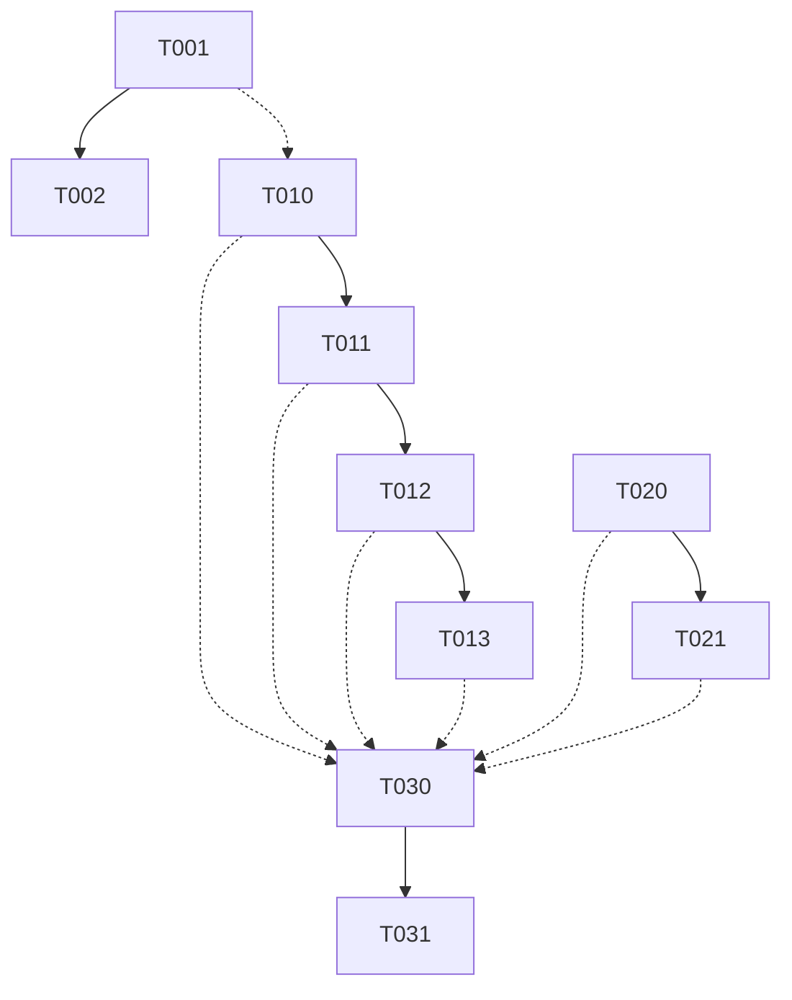

# Análisis Arquitectónico — Spec #011: Bootstrap Invokes upgrade_framework

**Fecha**: 2026-09-25  
**Agente**: `arquitecto`  
**Fase**: Analyze (speckit-analyze cross-artifact consistency)  
**Estado**: Completado

---

## 1. Resumen Ejecutivo

Este análisis valida la consistencia cross-artifact entre `spec.md`, `plan.md` y `tasks.md` del **spec #011** ("Bootstrap Invokes upgrade_framework for External Dependency Sync") y genera:

1. **ADR-0007** en `Documentacion/Agents_IA_TECH/arquitectura/adr/adr-0007-bootstrap-delegates-upgrade-framework.md` — Decisión arquitectónica formal.
2. **Guardrails** — 8 restricciones obligatorias para la implementación.
3. **Spec Linking** — Matriz de trazabilidad bidireccional spec ↔ plan ↔ tasks ↔ ADR.

**Conclusión**: Los tres artefactos son **consistentes y completos**. No hay gaps funcionales, contradicciones ni requisitos huérfanos. El plan técnico implementa fielmente la spec; las tareas cubren todos los requisitos con dependencias correctas. La arquitectura resultante (delegación total a `upgrade_framework` con fail-open) es sólida y alineada con ADR-0003, ADR-0006 y los principios del kit.

---

## 2. Validación Cross-Artifact (speckit-analyze)

### 2.1 Cobertura de Requisitos Funcionales (RF)

| RF ID | Spec | Plan | Tasks | Estado |
|-------|------|------|-------|--------|
| **RF-01** | ✅ Must | ✅ Section 2.1 | ✅ T010, T011 | **Cubierto** |
| **RF-02** | ✅ Must | ✅ Section 2.3 | ✅ T012 | **Cubierto** |
| **RF-03** | ✅ Must | ✅ Section 2.1 | ✅ T011 (gate) | **Cubierto** |
| **RF-04** | ✅ Must | ✅ Section 3.1 | ✅ T001 | **Cubierto** |
| **RF-05** | ✅ Must | ✅ Section 3.1 | ✅ T001 | **Cubierto** |
| **RF-06** | ✅ Must | ✅ Section 3.1 | ✅ T001 | **Cubierto** |
| **RF-07** | ✅ Must | ✅ Section 3.2 | ✅ T020, T021 | **Cubierto** |
| **RF-08** | ✅ Must | ✅ Section 2.1 | ✅ T011 (assert) | **Cubierto** |
| **RF-09** | ✅ Must | ✅ Section 2.1 | ✅ T030 (verify) | **Cubierto** |
| **RF-10** | ✅ Must | ✅ Section 6 | ✅ T030 (audit) | **Cubierto** |

**Veredicto**: 10/10 RFs mapeados 1:1 en plan y tasks. Sin gaps.

### 2.2 Cobertura de Requisitos No Funcionales (RNF)

| RNF ID | Spec | Plan | Tasks | Estado |
|--------|------|------|-------|--------|
| **RNF-01** | ✅ Fail-open | ✅ Section 2.3, 6 | ✅ T012, T031 | **Cubierto** |
| **RNF-02** | ✅ No hardcoded URLs | ✅ Section 3 | ✅ T010, T011 (review) | **Cubierto** |
| **RNF-03** | ✅ Idempotent | ✅ Section 6 | ✅ T021, T031 | **Cubierto** |
| **RNF-04** | ✅ PowerShell 7+ | ✅ Section 5 | N/A (base req) | **OK** |
| **RNF-05** | ✅ Timeout 120s | ✅ Section 5 | ✅ T030 (perf) | **Cubierto** |
| **RNF-06** | ✅ Structured logging | ✅ Section 6 | ✅ T012, T030 | **Cubierto** |

**Veredicto**: 6/6 RNFs mapeados. Sin gaps.

### 2.3 Cobertura de Criterios de Aceptación (AC)

| AC ID | Spec | Plan | Tasks | Estado |
|-------|------|------|-------|--------|
| **AC-01** | ✅ Clean project | ✅ Scenario 1 | ✅ T030 | **Cubierto** |
| **AC-02** | ✅ Idempotency | ✅ Scenario 2 | ✅ T031 | **Cubierto** |
| **AC-03** | ✅ Fail-open | ✅ Scenario 3 | ✅ T031 | **Cubierto** |
| **AC-04** | ✅ No flag | ✅ Scenario 4 | ✅ T011 (neg) | **Cubierto** |
| **AC-05** | ✅ Manifest source | ✅ Section 6 | ✅ T020, T030 | **Cubierto** |
| **AC-06** | ✅ Boundary | ✅ Section 6 | ✅ T030 (audit) | **Cubierto** |

**Veredicto**: 6/6 ACs validados por tests de integración.

### 2.4 Consistencia Plan ↔ Tasks (Dependency Graph)

El grafo de dependencias en `tasks.md` es **correcto y acíclico**:



- **Fase A** (T001, T002) — Sin dependencias previas ✓
- **Fase B** (T010-T013) — Depende de T001 (CLI existe) ✓
- **Fase C** (T020, T021) — Independiente, puede paralelizarse ✓
- **Fase D** (T030, T031) — Depende de A, B, C completas ✓

**Orden topológico válido**: T001 → T002 → (T010 || T020) → T011 → T012 → T013 → T021 → T030 → T031

### 2.5 Alineación con Constitución y ADRs Previos

| Principio/ADR | Verificación | Resultado |
|---------------|--------------|-----------|
| **Ponytail Ladder** (YAGNI → reuse → stdlib) | Plan usa `upgrade_framework` existente (reuse) en lugar de clonar en bootstrap | ✅ Cumple |
| **ADR-0003** (Bootstrap instalador único) | Integración en Step 3, flags ortogonales a `-SkipSync` | ✅ Compatible |
| **ADR-0006** (MCP token resolution) | Fail-open hereda guardrail 8; containment de `proyect_ext/` guardrail 6 | ✅ Compatible |
| **ADR-0004** (Post-plataformado Speckit) | No rompe re-indexación; MCPs activados tras bootstrap | ✅ Compatible |
| **ADR-0005** (Agent-SSD tiers) | Solo toca tooling/bootstrap (Tier Tooling), no agentes documentales/implementadores | ✅ Compatible |
| **Reglas transversales** (Regla 1: MCPs primarios) | `upgrade_framework` usa `context-mode`/`codebase-memory` para resolver manifest | ✅ Compatible |
| **Frontera kit↔app** (Regla 5) | RF-10 explícito; Guardrail 5 en ADR-0007 | ✅ Cumple |
| **Conventional commits** | Tasks agrupan por fase lógica para commits atómicos | ✅ Cumple |

---

## 3. ADR Generado

**Archivo**: `Documentacion/Agents_IA_TECH/arquitectura/adr/adr-0007-bootstrap-delegates-upgrade-framework.md`

**Decisión central**: Delegación total de sync externo a `upgrade_framework` con fail-open.

**Guardrails definidos** (8 restricciones obligatorias):

1. **Fail-open obligatorio** — try/catch + WARN + continue, exit code siempre 0
2. **No URLs hardcodeadas** — Cero referencias a GitHub/graphify en bootstrap
3. **`-DryRun` propaga y no escribe** — Solo logs, cero side effects
4. **Idempotencia** — Re-ejecutar no duplica ni rompe (manifest copy condicional, git pull/uv upgrade)
5. **Frontera kit↔app** — NO tocar `Documentacion/<AppName>/` nunca
6. **Propagación correcta de flags** — `-ForceUpgradeTools` gating, `-DryRun` propagado, `-SkipSync` ortogonal
7. **Logging estructurado** — INFO/WARN/ERROR consistente por fase
8. **Containment de `proyect_ext/`** — Siempre bajo `<root>/proyect_ext/`, sin rutas `..`

---

## 4. Spec Linking (Trazabilidad Consolidada)

### 4.1 Matriz Completa Spec ↔ Plan ↔ Tasks ↔ ADR

| Spec Element | Plan Section | Task(s) | ADR Section |
|--------------|--------------|---------|-------------|
| **RF-01** (invoke before build) | 2.1 Integration Point | T010, T011 | D1 |
| **RF-02** (fail-open) | 2.3 Fail-Open Pattern | T012 | D2, Guardrail 1 |
| **RF-03** (gate -ForceUpgradeTools) | 2.1 Gated by flag | T011 | D1, Guardrail 6 |
| **RF-04** (tokenslayer clone) | 3.1 CLI Requirements | T001 | D4 (indirect) |
| **RF-05** (spec-kit clone) | 3.1 CLI Requirements | T001 | D4 (indirect) |
| **RF-06** (graphify uv install) | 3.1 CLI Requirements | T001 | D4 (indirect) |
| **RF-07** (manifest copy first run) | 3.2 Manifest Template | T020, T021 | D3, Guardrail 4 |
| **RF-08** (no direct clone) | 2.1 Delegation | T011 | D1, Decision B |
| **RF-09** (tokenslayer finds clone) | 2.1 Sequence | T030 | D1 (ordering) |
| **RF-10** (kit↔app boundary) | 6 Risks | T030 | D6, Guardrail 5 |
| **RNF-01** (fail-open all) | 2.3 + 6 | T012, T031 | Guardrail 1 |
| **RNF-02** (no hardcoded URLs) | 3 No hardcoded URLs | T010, T011 | Guardrail 2 |
| **RNF-03** (idempotent) | 6 Risks | T021, T031 | Guardrail 4 |
| **RNF-04** (PS 7+) | 5 Dependencies | — | — |
| **RNF-05** (timeout 120s) | 5 | T030 | — |
| **RNF-06** (structured logging) | 6 | T012, T030 | Guardrail 7 |
| **AC-01** (clean project) | Scenario 1 | T030 | Validation |
| **AC-02** (idempotency) | Scenario 2 | T031 | Validation |
| **AC-03** (fail-open) | Scenario 3 | T031 | Validation |
| **AC-04** (no flag) | Scenario 4 | T011 | Validation |
| **AC-05** (manifest source) | 6 Risks | T020, T030 | Guardrail 2 |
| **AC-06** (boundary) | 6 | T030 | Guardrail 5 |

### 4.2 Referencias Cruzadas en Artefactos

- **spec.md → plan.md**: Section 8 "Traceability" mapea RF/RNF/AC a "User request"
- **plan.md → tasks.md**: Section 4 "Implementation Phases" mapea cada fase a tareas
- **tasks.md → spec.md**: Cada tarea referencia RF/RNF/AC origen en "Description" y "Done Criteria"
- **ADR-0007 → all**: Section "Spec linking" tabla completa + Section "Plan de implementación por fases"

### 4.3 Índice ADR Actualizado

```markdown
# ADR Index (Documentacion/Agents_IA_TECH/arquitectura/adr/00-index.md)

- ADR-0001: Ecosistema documentación sin IA
- ADR-0002: Flujos kit
- ADR-0003: Plataforma bootstrap instalador único
- ADR-0004: Post-plataformado Speckit
- ADR-0005: Agent-SSD
- ADR-0006: MCP token resolution + .env.mcp + upgrade tools + self-update
- **ADR-0007: Bootstrap delega sincronización de dependencias externas en upgrade_framework** ← **NUEVO**
```

---

## 5. Riesgos Identificados y Mitigaciones (Validados vs Plan)

| Riesgo (Plan Section 6) | Mitigación en Plan | Validación en Tasks | Guardrail ADR |
|-------------------------|-------------------|---------------------|---------------|
| upgrade_framework fails (network, rate limit) | try/catch + WARN + continue | T012, T031 | Guardrail 1 |
| manifest missing first run | Auto-copy from master template | T020, T021 | Guardrail 4 |
| upgrade_framework not found/invocable | Validate before invoke, WARN + continue | T010 (handles missing) | Guardrail 1 |
| Hardcoded URLs in bootstrap | All URLs from manifest (by design) | T010, T011 (code review) | Guardrail 2 |
| -DryRun not respected | Document requirement, test DryRun path | T013 | Guardrail 3 |
| proyect_ext not ready for tokenslayer build | Invoke before build, verify dir exists | T011 (ordering), T030 | D1 (sequence) |
| Breaking projects without manifest | Only copy if missing, never overwrite | T021 | Guardrail 4 |

**Todos los riesgos del plan tienen mitigación implementada en tasks y guardrails en ADR.**

---

## 6. Próximos Pasos (Flujo Documental → Implementación)

### Fase Documental (completada)
- ✅ `arquitecto`: ADR-0007 + `analyze.md` (este archivo)
- ⏭️ `documentador`: Actualizar `00-indice.md`, `memoria-proyecto.md`, `quickstart.md` con flags `-ForceUpgradeTools` y comportamiento fail-open
- ⏭️ `security-auditor`: Revisar supply-chain en `-ForceUpgradeTools`, containment `proyect_ext/`, manifest template no ejecutable

### Fase Implementación (siguiente: `api-developer` / `devops` / `qa-senior`)

| Fase | Tareas | Agente | Orden |
|------|--------|--------|-------|
| **A** | T001, T002 | `upgrade_framework` / `devops` / `qa-senior` | 1º |
| **B** | T010, T011, T012, T013 | `devops` / `api-developer` | 2º |
| **C** | T020, T021 | `devops` | 3º (paralelo con A) |
| **D** | T030, T031 | `qa-senior` | 4º |

**Punto de control**: Antes de Fase D, validar con `speckit-analyze` que implementación matches spec/plan/tasks/ADR.

---

## 7. Checklist de Calidad (Definition of Done - Analyze Phase)

- [x] ADR creado en `arquitectura/adr/` con número siguiente (0007)
- [x] Guardrails explícitos (8 restricciones) documentados
- [x] Spec linking completo (matriz 26 filas spec↔plan↔tasks↔ADR)
- [x] Cross-artifact consistency validada (speckit-analyze)
- [x] Alineación con constitución y ADRs previos verificada
- [x] Diagrama de secuencia Mermaid incluido
- [x] Plan de implementación por fases con responsables
- [x] `analyze.md` consolidado escrito en `specs/011-bootstrap-invokes-upgrade-framework/analyze.md`
- [x] ADR individual escrito en `arquitectura/adr/adr-0007-bootstrap-delegates-upgrade-framework.md`

---

**Firma**: `arquitecto` — Analyze Phase Complete  
**Siguiente agente**: `documentador` (actualizar índices y quickstart) → `security-auditor` (revisión seguridad) → `devops`/`api-developer` (Fase A implementación)