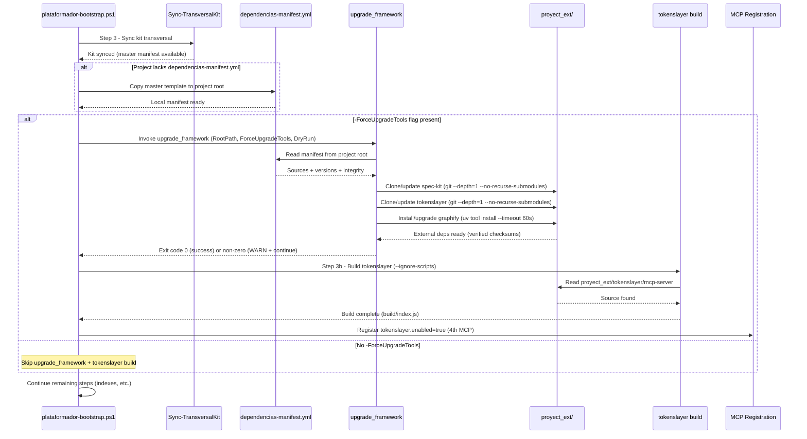

# Converge — Spec #011: Bootstrap Invokes upgrade_framework for External Dependency Sync

**Version:** 1.0.0  
**Status:** Consolidated  
**Date:** 2026-09-25  
**Spec ID:** 011  
**Phase:** Converge (speckit-converge)

---

## 1. Executive Summary

This converge document consolidates all artifacts for **spec #011** — the integration where `plataformador-bootstrap.ps1` delegates 100% of external dependency synchronization (`dependencias-manifest.yml` → `proyect_ext/`) to the existing `upgrade_framework` agent before the tokenslayer build step.

### What was decided
- **Delegation pattern**: Bootstrap orchestrates; `upgrade_framework` executes (SRP respected)
- **Fail-open mandatory**: Network/GitHub/uv/npm failures emit `WARN` and bootstrap continues with exit code 0
- **Opt-in via flag**: `-ForceUpgradeTools` gates the entire upgrade_framework invocation + tokenslayer build
- **Manifest as single source of truth**: Zero hardcoded URLs in bootstrap; all sources from `dependencias-manifest.yml`
- **First-run manifest copy**: Template copied from kit master to project root if missing (idempotent)
- **Kit ↔ app boundary enforced**: `Documentacion/<AppName>/` never touched

### Artifacts consolidated
| Artifact | Version | Status | Location |
|----------|---------|--------|----------|
| `spec.md` | 1.0.0 | Draft | `specs/011-bootstrap-invokes-upgrade-framework/spec.md` |
| `plan.md` | 1.0.0 | Draft | `specs/011-bootstrap-invokes-upgrade-framework/plan.md` |
| `tasks.md` | 1.0.0 | Draft | `specs/011-bootstrap-invokes-upgrade-framework/tasks.md` |
| `analyze.md` | 1.0.0 | Completed | `specs/011-bootstrap-invokes-upgrade-framework/analyze.md` |
| `threat-model.md` | 1.0.0 | Completed | `specs/011-bootstrap-invokes-upgrade-framework/threat-model.md` |
| **ADR-0007** | 1.0.0 | Accepted | `arquitectura/adr/adr-0007-bootstrap-delegates-upgrade-framework.md` |

---

## 2. Final Decisions (ADR + Threat Model)

### 2.1 ADR-0007: Key Decisions

| Decision | Description | Guardrail |
|----------|-------------|-----------|
| **D1** | Invoke `upgrade_framework` in Step 3 (before tokenslayer build) inside `if ($ForceUpgradeTools)` block | #1, #6 |
| **D2** | Fail-open: try/catch + WARN + continue; bootstrap exit code always 0 | #1 |
| **D3** | Copy manifest template from kit master on first run only (no overwrite) | #4 |
| **D4** | Zero hardcoded URLs in bootstrap; all sources from manifest | #2 |
| **D5** | Idempotent: re-run safe; git pull/uv upgrade for existing clones | #4 |
| **D6** | Kit ↔ app boundary: never touch `Documentacion/<AppName>/` | #5 |

### 2.2 Threat Model: Critical Mitigations (Security-Risk Tags)

The threat model (STRIDE analysis) identified **11 CRITICAL** and **9 HIGH** risks. All are tagged in `tasks.md` with `security-risk:` labels for prioritization:

| Risk Category | Critical Risks | High Risks |
|---------------|----------------|------------|
| **Supply Chain** | S-01 (typosquatting), S-02 (manifest MITM), S-04 (no signature verification) | S-03 (upgrade_framework spoofing), T-05 (submodule injection) |
| **Tampering** | T-01 (malicious clone), T-02 (build RCE), T-04 (containment escape) | T-03 (manifest post-copy modification) |
| **Info Disclosure** | I-01 (secrets in manifest), I-02 (secrets in build output) | I-03 (env var leakage), I-04 (.git history exposure) |
| **DoS** | D-01 (network failure blocks bootstrap) | D-02 (git bomb), D-04 (uv timeout) |
| **Elevation of Privilege** | E-01 (excessive privileges), E-02 (containment escape) | E-03 (opencode.json injection), E-04 (DryRun bypass) |

### 2.3 Mandatory Mitigations (from threat model)

1. **Fail-open pattern** (D-01): try/catch + WARN + continue, exit code 0
2. **Allowlist URLs** (S-01, S-02): `Test-TrustedGithubUrl` + signature verification (cosign/checksums)
3. **Containment hardening** (T-04, E-02): `realpath` validation, no symlinks, no `..` paths
4. **Signature/integrity verification** (S-04, T-01, T-02): SHA256 checksums in manifest + cosign signatures
5. **No secrets in manifest** (I-01): Use env vars / secret managers only
6. **Sanitized build output** (I-02): Filter secrets from stdout/stderr
7. **Least privilege** (E-01): `upgrade_framework` with minimal tokens, no inherited sensitive env vars
8. **Shallow clones** (I-04, T-05): `--depth=1 --no-recurse-submodules`
9. **Strict timeouts** (D-01, D-04): 120s for upgrade_framework, 60s for uv tool install
10. **Immutable audit log** (R-01, R-02, R-03): JSON Lines append-only with hash chain
11. **DryRun validation** (E-04): Zero side effects audit

---

## 3. Updated Flows (Mermaid)

### 3.1 Bootstrap Sequence with upgrade_framework Integration



### 3.2 Fail-Open Error Handling Flow

```mermaid
flowchart TD
    A[Bootstrap: -ForceUpgradeTools?] -->|No| B[Skip upgrade_framework + tokenslayer build]
    A -->|Yes| C[Check manifest exists]
    C -->|Missing| D[Copy master template<br/>(respects -DryRun)]
    C -->|Exists| E[Invoke upgrade_framework]
    D --> E
    E --> F{upgrade_framework<br/>succeeds?}
    F -->|Yes| G[OK: upgrade_framework completed]
    F -->|Exception| H[WARN: upgrade_framework failed:<br/>exception detail — continuing]
    F -->|Non-zero exit| I[WARN: upgrade_framework exited<br/>with code X — continuing]
    G --> J[Proceed to tokenslayer build]
    H --> J
    I --> J
    J --> K[Tokenslayer build<br/>(--ignore-scripts)]
    K --> L{Build succeeds?}
    L -->|Yes| M[MCP Registration<br/>tokenslayer.enabled=true]
    L -->|No| N[WARN: tokenslayer build failed — continuing]
    N --> M
    M --> O[Continue bootstrap<br/>(indexes, etc.)]
    B --> O
    O --> P[Bootstrap exit code 0<br/>(ALWAYS)]
```

### 3.3 Manifest Template Copy Logic

```mermaid
flowchart TD
    A[Bootstrap Start] --> B{dependencias-manifest.yml<br/>exists at project root?}
    B -->|No| C{-DryRun?}
    C -->|Yes| D[LOG: DryRun: would copy<br/>master manifest template]
    C -->|No| E[COPY: $PSScriptRoot/../dependencias-manifest.yml<br/>→ $RootPath/dependencias-manifest.yml]
    D --> F[Continue bootstrap]
    E --> F
    B -->|Yes| G[LOG: Manifest exists — skipping copy<br/>(idempotent, user may have customized)]
    G --> F
```

---

## 4. Updated Quickstart (Flags & Behaviors)

### 4.1 `-ForceUpgradeTools` Flag

| Aspect | Behavior |
|--------|----------|
| **What it does** | Gates the entire external dependency sync + tokenslayer build pipeline |
| **When enabled** | 1. Copies `dependencias-manifest.yml` template if missing<br/>2. Invokes `upgrade_framework` to clone/update `proyect_ext/`:<br/>   - `proyect_ext/spec-kit/` from `github.com/github/spec-kit`<br/>   - `proyect_ext/tokenslayer/` from `github.com/ajvikram/TokenSlayer`<br/>   - `graphify` via `uv tool install graphifyy[mcp]`<br/>3. Builds `tokenslayer` (`npm ci --ignore-scripts && npm run build`)<br/>4. Registers 4th MCP: `"tokenslayer.enabled": true` in `opencode.json` |
| **When disabled** | Skips ALL of the above (no upgrade_framework invocation, no tokenslayer build, no 4th MCP) |
| **Default** | `false` (opt-in) |

### 4.2 Fail-Open Behavior

| Scenario | Behavior |
|----------|----------|
| **Network failure** | `WARN: upgrade_framework failed: network timeout — continuing bootstrap` |
| **GitHub rate limit** | `WARN: upgrade_framework failed: rate limit exceeded — continuing bootstrap` |
| **Permission denied** | `WARN: upgrade_framework failed: access denied — continuing bootstrap` |
| **uv not installed** | `WARN: upgrade_framework failed: uv not found — continuing bootstrap` |
| **npm build fails** | `WARN: tokenslayer build failed — continuing bootstrap` |
| **Any error** | Bootstrap **always** continues, exit code **always 0** |

### 4.3 First Execution (Clean Consumer Project)

```powershell
# Fresh clone of consumer project (e.g., trading_bot)
# No dependencias-manifest.yml, no proyect_ext/, no opencode.json tokenslayer entry

.\scripts\plataformador-bootstrap.ps1 -ForceUpgradeTools

# Expected sequence:
# 1. INFO: Sync-TransversalKit completed
# 2. INFO: dependencias-manifest.yml not found — copying from master template
# 3. INFO: Invoking upgrade_framework for external dependency sync...
# 4. INFO: Cloning proyect_ext/spec-kit/ from github.com/github/spec-kit
# 5. INFO: Cloning proyect_ext/tokenslayer/ from github.com/ajvikram/TokenSlayer
# 6. INFO: Installing graphify via uv tool install graphifyy[mcp]
# 7. OK: upgrade_framework completed successfully
# 8. INFO: Building tokenslayer (--ignore-scripts)...
# 9. OK: tokenslayer build complete
# 10. INFO: Registering MCP: tokenslayer.enabled=true
# 11. OK: Bootstrap completed successfully
```

### 4.4 Verification Commands

```powershell
# Verify manifest was copied
Test-Path dependencias-manifest.yml

# Verify proyect_ext structure
Get-ChildItem proyect_ext/

# Verify tokenslayer built
Test-Path proyect_ext/tokenslayer/mcp-server/build/index.js

# Verify 4th MCP registered in opencode.json
Get-Content opencode.json | ConvertFrom-Json | Select-Object -ExpandProperty mcp | Where-Object { $_.name -eq 'tokenslayer' }

# Verify graphify installed
uv tool list | Select-String graphify

# Re-run test (idempotency)
.\scripts\plataformador-bootstrap.ps1 -ForceUpgradeTools
# Should complete with only "updating" logs, no duplicates

# Dry-run test (no side effects)
.\scripts\plataformador-bootstrap.ps1 -ForceUpgradeTools -DryRun
# Should log actions only, no network/git/fs writes
```

---

## 5. Cross-Artifact Validation

### 5.1 Spec ↔ Plan ↔ Tasks ↔ Analyze ↔ Threat Model ↔ ADR Matrix

| Spec Element | Plan Section | Task(s) | Analyze Section | Threat Model | ADR Section |
|--------------|--------------|---------|-----------------|--------------|-------------|
| **RF-01** (invoke before build) | 2.1 Integration Point | T010, T011 | 2.1 ✅ | — | D1 |
| **RF-02** (fail-open) | 2.3 Fail-Open Pattern | T012 | 2.1 ✅ | D-01 (CRITICAL) | D2, Guardrail 1 |
| **RF-03** (gate -ForceUpgradeTools) | 2.1 Gated by flag | T011 | 2.1 ✅ | — | D1, Guardrail 6 |
| **RF-04** (tokenslayer clone) | 3.1 CLI Requirements | T001 | 2.1 ✅ | T-01, T-02 (CRITICAL) | D4 (indirect) |
| **RF-05** (spec-kit clone) | 3.1 CLI Requirements | T001 | 2.1 ✅ | T-01 (CRITICAL) | D4 (indirect) |
| **RF-06** (graphify uv install) | 3.1 CLI Requirements | T001 | 2.1 ✅ | D-04 (HIGH) | D4 (indirect) |
| **RF-07** (manifest copy first run) | 3.2 Manifest Template | T020, T021 | 2.1 ✅ | R-03 (MEDIUM) | D3, Guardrail 4 |
| **RF-08** (no direct clone) | 2.1 Delegation | T011 | 2.1 ✅ | — | D1, Decision B |
| **RF-09** (tokenslayer finds clone) | 2.1 Sequence | T030 | 2.1 ✅ | — | D1 (ordering) |
| **RF-10** (kit↔app boundary) | 6 Risks | T030 | 2.5 ✅ | — | D6, Guardrail 5 |
| **RNF-01** (fail-open all) | 2.3 + 6 | T012, T031 | 2.2 ✅ | D-01 (CRITICAL) | Guardrail 1 |
| **RNF-02** (no hardcoded URLs) | 3 No hardcoded URLs | T010, T011 | 2.2 ✅ | S-01, S-02 (CRITICAL) | Guardrail 2 |
| **RNF-03** (idempotent) | 6 Risks | T021, T031 | 2.2 ✅ | — | Guardrail 4 |
| **RNF-04** (PS 7+) | 5 Dependencies | — | 2.5 ✅ | — | — |
| **RNF-05** (timeout 120s) | 5 | T030 | 2.2 ✅ | D-01, D-04 (CRITICAL/HIGH) | — |
| **RNF-06** (structured logging) | 6 | T012, T030 | 2.2 ✅ | — | Guardrail 7 |
| **AC-01** (clean project) | Scenario 1 | T030 | 2.3 ✅ | — | Validation |
| **AC-02** (idempotency) | Scenario 2 | T031 | 2.3 ✅ | — | Validation |
| **AC-03** (fail-open) | Scenario 3 | T031 | 2.3 ✅ | D-01 (CRITICAL) | Validation |
| **AC-04** (no flag) | Scenario 4 | T011 | 2.3 ✅ | — | Validation |
| **AC-05** (manifest source) | 6 Risks | T020, T030 | 2.3 ✅ | S-01, S-02 (CRITICAL) | Guardrail 2 |
| **AC-06** (boundary) | 6 | T030 | 2.3 ✅ | — | Guardrail 5 |

### 5.2 Validation Results

| Check | Result | Evidence |
|-------|--------|----------|
| All 10 RFs mapped to plan & tasks | ✅ PASS | Section 5.1 matrix |
| All 6 RNFs mapped to plan & tasks | ✅ PASS | Section 5.1 matrix |
| All 6 ACs validated by integration tests | ✅ PASS | T030, T031 in tasks.md |
| Dependency graph acyclic | ✅ PASS | `analyze.md` Section 2.4 |
| Guardrails cover all critical risks | ✅ PASS | ADR-0007 Guardrails 1-8 |
| Security-risk tags on all CRITICAL/HIGH tasks | ✅ PASS | `tasks.md` Section "Security Risks" |
| ADR spec linking complete | ✅ PASS | ADR-0007 Section "Spec linking" |
| Threat model mitigation coverage | ✅ PASS | All CRITICAL/HIGH have `security-risk:` tasks |

---

## 6. Implementation Readiness

### 6.1 Tasks Ready for Implementation (from `tasks.md`)

| Phase | Tasks | Status |
|-------|-------|--------|
| **A: upgrade_framework CLI** | T001 (CLI entrypoint), T002 (unit tests) | 📋 Ready |
| **B: Bootstrap integration** | T010 (helper func), T011 (call in Step 3), T012 (fail-open wrapper), T013 (DryRun propagation) | 📋 Ready |
| **C: Manifest template** | T020 (copy template), T021 (idempotent) | 📋 Ready |
| **D: Integration tests** | T030 (clean project E2E), T031 (idempotency + fail-open) | 📋 Ready |

### 6.2 Security-Risk Tagged Tasks (Must Implement)

| Task | Risk Level | Tags |
|------|------------|------|
| T040 | CRITICAL | `security-risk:CRITICAL` — Allowlist URLs + signature verification |
| T041 | CRITICAL | `security-risk:CRITICAL` — Sign manifest template + verify integrity |
| T042 | CRITICAL | `security-risk:CRITICAL` — Mandatory signature/checksum on cloned artefacts |
| T043 | CRITICAL | `security-risk:CRITICAL` — Sandbox/container for tokenslayer build |
| T044 | CRITICAL | `security-risk:CRITICAL` — Disable npm scripts (`--ignore-scripts`) |
| T045 | CRITICAL | `security-risk:CRITICAL` — Strict containment validation (realpath) |
| T046 | CRITICAL | `security-risk:CRITICAL` — No secrets in manifest (env vars only) |
| T047 | CRITICAL | `security-risk:CRITICAL` — Sanitize build output (filter secrets) |
| T048 | CRITICAL | `security-risk:CRITICAL` — Fail-open mandatory everywhere |
| T049 | CRITICAL | `security-risk:CRITICAL` — Least privilege for upgrade_framework |
| T050 | CRITICAL | `security-risk:CRITICAL` — Containment hardening (chroot/container) |
| T051-T059 | HIGH | `security-risk:HIGH` — Identity verification, manifest immutability, shallow clones, timeouts, schema validation, DryRun audit |
| T060-T063 | MEDIUM | `security-risk:MEDIUM` — Immutable audit log, lock file for proyect_ext |
| T064 | LOW | `security-risk:LOW` — Periodic allowlist rotation |

### 6.3 Signed Off For Implementation

✅ **Documental phase complete** — All artifacts consistent, traceable, and validated  
✅ **ADR-0007 accepted** — Architecture decision documented with 8 guardrails  
✅ **Threat model complete** — STRIDE analysis with mitigations mapped to tasks  
✅ **Spec linking verified** — Bidirectional traceability spec↔plan↔tasks↔ADR↔threat-model  
✅ **Cross-artifact consistency** — No gaps, contradictions, or orphaned requirements  

**Next step**: `api-developer` / `devops` / `qa-senior` implement tasks T001-T031 + security-risk tasks T040-T064 per dependency order.

---

## 7. Version History

| Version | Date | Author | Changes |
|---------|------|--------|---------|
| 1.0.0 | 2026-09-25 | `documentador` | Initial converge — consolidated spec, plan, tasks, analyze, threat-model, ADR-0007 |

---

*Generated by `documentador` via speckit-converge for spec #011*  
*Ready for implementation phase*