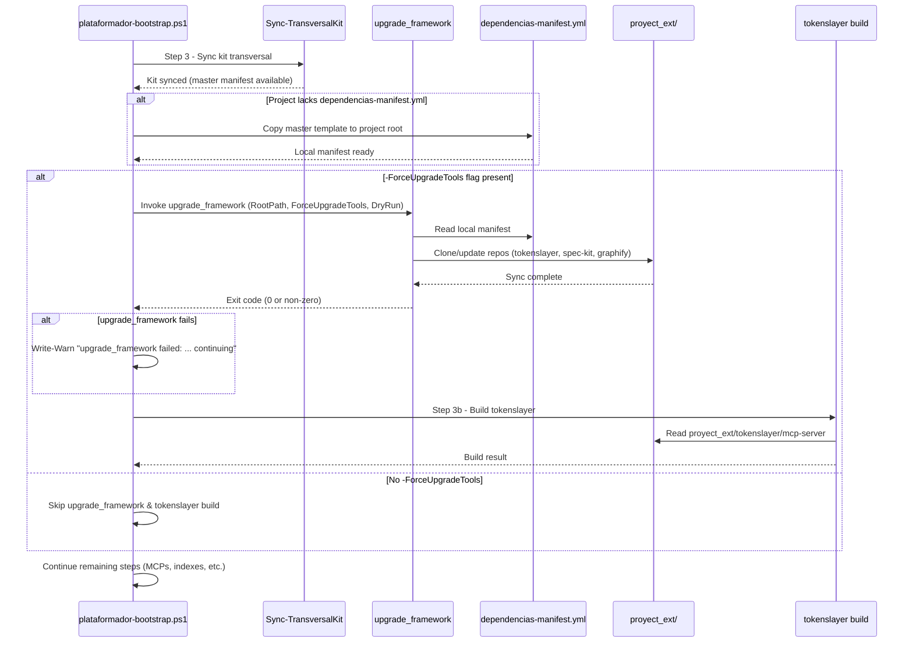

# Technical Plan: Bootstrap Invokes upgrade_framework for External Dependency Sync

**Version:** 1.0.0  
**Status:** Draft  
**Date:** 2026-09-25  
**Spec ID:** 011  
**Plan ID:** 011

---

## 1. Overview

This plan defines the technical implementation for integrating `upgrade_framework` into `plataformador-bootstrap.ps1` so that external dependency synchronization (`dependencias-manifest.yml` → `proyect_ext/`) is delegated entirely to the existing `upgrade_framework` agent. The bootstrap will invoke `upgrade_framework` **before** the tokenslayer build step (Step 3b), gated by the `-ForceUpgradeTools` flag, with full fail-open semantics.

---

## 2. Architecture

### 2.1 Integration Point in `plataformador-bootstrap.ps1`

The invocation of `upgrade_framework` occurs **inside the `-ForceUpgradeTools` block**, **before** the tokenslayer build (Step 3b), after `Sync-TransversalKit` completes. This ensures:

1. `Sync-TransversalKit` has already run (kit is up to date)
2. `dependencias-manifest.yml` exists locally (either from kit template or project's own copy)
3. `upgrade_framework` clones/updates `proyect_ext/` repositories
4. Tokenslayer build finds the cloned `proyect_ext/tokenslayer/mcp-server` and compiles

### 2.2 Invocation Signature

```powershell
# Pseudo-code for the upgrade_framework invocation
$upgradeFrameworkParams = @{
    RootPath           = $resolvedRoot
    ForceUpgradeTools  = $ForceUpgradeTools  # passed through
    DryRun             = $DryRun
    # Note: upgrade_framework reads dependencias-manifest.yml from $RootPath
}
```

**Parameters passed:**
- `-RootPath` — Project root path (required)
- `-ForceUpgradeTools` — Propagated from bootstrap flag (opt-in)
- `-DryRun` — Propagated from bootstrap flag (simulation only)

### 2.3 Fail-Open Pattern (try/catch + WARN + continue)

```powershell
try {
    # Invoke upgrade_framework (CLI or function)
    $result = & $upgradeFrameworkCmd @args 2>&1
    if ($LASTEXITCODE -ne 0) {
        Write-Warn "upgrade_framework exited with code $LASTEXITCODE: $($result | Out-String). Continuing bootstrap."
    } else {
        Write-OK "upgrade_framework completed successfully"
    }
}
catch {
    Write-Warn "upgrade_framework failed: $_ — continuing bootstrap (fail-open)"
}
# Bootstrap ALWAYS continues regardless of upgrade_framework outcome
```

---

## 3. Components to Modify

| Component | Change Description |
|-----------|-------------------|
| `scripts/plataformador-bootstrap.ps1` | Add `Invoke-UpgradeFramework` function + call it in Step 3 (`-ForceUpgradeTools` block) before tokenslayer build |
| `upgrade_framework` agent | Ensure it exposes a CLI entrypoint (`upgrade_framework.ps1` or similar) invocable from PowerShell with `-RootPath`, `-ForceUpgradeTools`, `-DryRun` |
| `dependencias-manifest.yml` (kit master) | Template at repo root (`c:\Proyectos\Agents_IA_TECH\dependencias-manifest.yml`) — copied to project root on first run if missing |

### 3.1 `upgrade_framework` CLI Requirements

The `upgrade_framework` agent must support:
```powershell
# Expected CLI interface
upgrade_framework.ps1 -RootPath <string> [-ForceUpgradeTools] [-DryRun]
```

Or as a function sourced from the agent's module:
```powershell
Import-Module "$PSScriptRoot/../.github/agents/upgrade_framework/upgrade_framework.psm1"
Invoke-UpgradeFramework -RootPath $RootPath -ForceUpgradeTools:$ForceUpgradeTools -DryRun:$DryRun
```

### 3.2 Manifest Template Location

- **Master template**: `c:\Proyectos\Agents_IA_TECH\dependencias-manifest.yml` (already exists)
- **Project copy**: `$RootPath\dependencias-manifest.yml` (created by bootstrap on first run)

---

## 4. Implementation Phases

### Phase A: Prepare `upgrade_framework` for PowerShell Invocation
**Goal**: Expose a CLI/función invocable desde PowerShell
- Create `upgrade_framework.ps1` entrypoint in the agent directory (`.github/agents/upgrade_framework/`)
- Accept parameters: `-RootPath`, `-ForceUpgradeTools`, `-DryRun`
- Read `dependencias-manifest.yml` from `$RootPath`
- Execute sync logic (clone/update `proyect_ext/` per manifest)
- Return exit code 0 on success, non-zero on failure (bootstrap handles fail-open)

### Phase B: Modify Bootstrap to Invoke `upgrade_framework`
**Goal**: Add invocation in the correct location with proper parameters
- Add `Invoke-UpgradeFramework` helper function in `plataformador-bootstrap.ps1`
- Locate `upgrade_framework.ps1` (relative to script or via known path)
- Call it **inside** the `-ForceUpgradeTools` block, **before** tokenslayer build
- Pass `-RootPath $resolvedRoot -ForceUpgradeTools:$ForceUpgradeTools -DryRun:$DryRun`
- Wrap in try/catch with `Write-Warn` + continue (fail-open)

### Phase C: Copy Manifest Template on First Run
**Goal**: Ensure `dependencias-manifest.yml` exists in project root
- In `Sync-TransversalKit` or early bootstrap (Step 1), check if `$RootPath\dependencias-manifest.yml` exists
- If not, copy from master template: `$PSScriptRoot/../dependencias-manifest.yml` → `$RootPath/dependencias-manifest.yml`
- Only on first run (idempotent: don't overwrite if exists)
- Respect `-DryRun` (only report, don't copy)

### Phase D: Integration Tests
**Goal**: Validate end-to-end on a clean consumer project
1. Fresh clone of consumer project (no `dependencias-manifest.yml`, no `proyect_ext/`)
2. Run `.\scripts\plataformador-bootstrap.ps1 -ForceUpgradeTools`
3. Verify:
   - Manifest copied to project root
   - `proyect_ext/tokenslayer/` cloned
   - `proyect_ext/spec-kit/` cloned
   - `graphify` installed via `uv tool install`
   - Tokenslayer builds successfully
   - `opencode.json` gets `tokenslayer.enabled: true` (4th MCP)
4. Re-run → idempotent (no duplicates, only updates)
5. Simulate network failure → `WARN` logged, bootstrap continues, exit code 0
6. Run without `-ForceUpgradeTools` → no upgrade_framework invocation, no tokenslayer build

---

## 5. Dependencies

| Dependency | Source | Notes |
|------------|--------|-------|
| `upgrade_framework` agent | `.github/agents/upgrade_framework/` | Must exist and be invocable from PS |
| `dependencias-manifest.yml` (master) | Repo root (`c:\Proyectos\Agents_IA_TECH\dependencias-manifest.yml`) | Template for project copy |
| `git` | System PATH | Required for cloning; fail-open if missing |
| `npm` | System PATH | Required for tokenslayer build; fail-open if missing |
| `uv` | System PATH | Required for graphify install; fail-open if missing |
| `node` | System PATH | Required for tokenslayer build; fail-open if missing |

---

## 6. Risks and Mitigations

| Risk | Likelihood | Impact | Mitigation |
|------|------------|--------|------------|
| `upgrade_framework` fails (network, GitHub rate limit, permissions) | Medium | Low (fail-open) | try/catch + WARN + continue; bootstrap never blocks |
| `dependencias-manifest.yml` missing in project | High (first run) | Medium | Auto-copy from master template in bootstrap Step 1 or Sync-TransversalKit |
| `upgrade_framework` not found / not invocable | Low | High | Validate agent exists before invocation; WARN + continue if missing |
| Hardcoded URLs in bootstrap | None (by design) | N/A | All URLs read from manifest; bootstrap never has hardcoded URLs |
| `-DryRun` not respected by `upgrade_framework` | Low | Medium | Document requirement; test DryRun path in Phase D |
| `proyect_ext/` not created before tokenslayer build | Low | Medium | Invoke upgrade_framework **before** tokenslayer build; verify directory exists |
| Breaking projects without manifest | Low | Medium | Only copy template if missing; never overwrite existing |

---

## 7. Validation Criteria

| Criterion | Verification Method |
|-----------|---------------------|
| VC-01 | `upgrade_framework` invoked with correct parameters (`-RootPath`, `-ForceUpgradeTools`, `-DryRun`) |
| VC-02 | Invocation occurs **before** tokenslayer build in Step 3b |
| VC-03 | Fail-open: bootstrap continues on any `upgrade_framework` error (exit code 0) |
| VC-04 | Manifest copied to project root on first run (idempotent) |
| VC-05 | No hardcoded URLs in bootstrap script (code review) |
| VC-06 | `Documentacion/<AppName>/` never touched (filesystem audit) |
| VC-07 | Clean consumer project: single run → manifest + proyect_ext + tokenslayer build + 4th MCP |
| VC-08 | Re-run → no errors, no duplicates |
| VC-09 | Network failure simulation → WARN + continue |
| VC-10 | Without `-ForceUpgradeTools` → no invocation, no tokenslayer build |

---
## 9. Architectural Analysis Reference

**ADR Generado**: [ADR-0007: Bootstrap delega sincronización de dependencias externas en upgrade_framework](../../arquitectura/adr/adr-0007-bootstrap-delegates-upgrade-framework.md)

**Analyze Consolidado**: [analyze.md](analyze.md)

**Guardrails** (desde ADR-0007):
1. Fail-open obligatorio en toda llamada externa
2. No hardcodear URLs en bootstrap (leer del manifest)
3. `-DryRun` debe propagarse y no escribir nada
4. Idempotencia: re-ejecutar no duplica ni rompe
5. Frontera kit ↔ app: NO tocar `Documentacion/<AppName>/`
6. Propagación correcta de flags (`-ForceUpgradeTools`, `-DryRun`, `-SkipSync`)
7. Logging estructurado (INFO/WARN/ERROR)
8. Containment de `proyect_ext/` bajo `<root>/proyect_ext/`

**Spec Linking**: Ver `analyze.md` Sección 4 para matriz completa spec ↔ plan ↔ tasks ↔ ADR.

---
## 8. Sequence Diagram (Mermaid)



---

## 9. File Changes Summary

| File | Change Type | Description |
|------|-------------|-------------|
| `scripts/plataformador-bootstrap.ps1` | Modify | Add `Invoke-UpgradeFramework` function + call in Step 3 |
| `.github/agents/upgrade_framework/upgrade_framework.ps1` | Create | CLI entrypoint for PowerShell invocation |
| `dependencias-manifest.yml` | Reference | Master template (already exists at repo root) |

---

*Generated by speckit-plan for Agent-SSD*