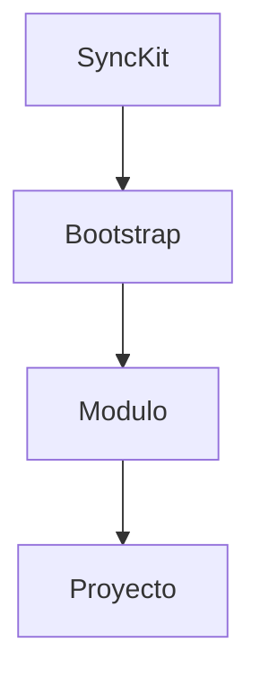

# Data Model 015
Estructura de sync-kit

## Entidades
SyncKit: id, nombre, ruta
Bootstrap: id, nombre, ruta
Modulo: id, nombre, ruta
Proyecto: id, nombre, ruta

## Atributos
SyncKit: id, nombre, ruta
Bootstrap: id, nombre, ruta
Modulo: id, nombre, ruta
Proyecto: id, nombre, ruta

## Relaciones
SyncKit 1..* Bootstrap
Bootstrap 1..* Modulo
Modulo *..* Proyecto

## Diagrama Mermaid

## Validaciones
- Ruta existe
- Módulo sincronizado

