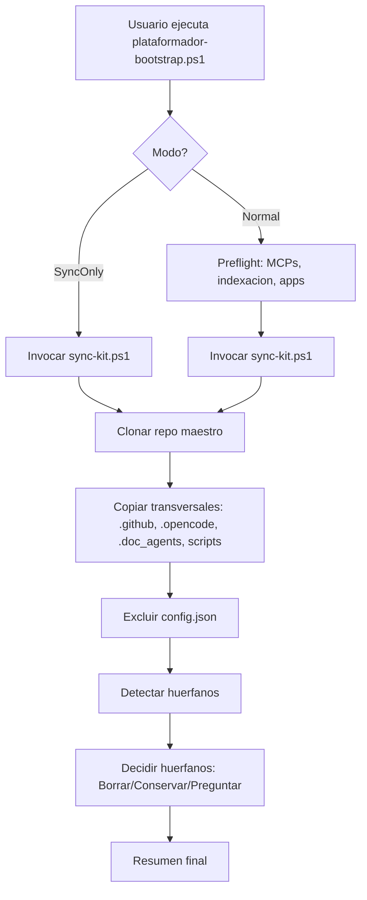

# Design 015: Sync-Kit y Bootstrap separados

Diseno tecnico completo de la division de `plataformador-bootstrap.ps1` en dos
responsabilidades: `sync-kit.ps1` (sincronizacion desde repo) y
`plataformador-bootstrap.ps1` (orquestacion del preflight).

Este documento es la fuente de verdad para el agente implementador (`devops`).
Contiene el codigo exacto a migrar, las lineas de origen y los cambios en el
bootstrap.

---

## 1. Objetivo del diseno

Separar la sincronizacion del kit transversal (descarga desde repo maestro +
copia de transversales + manejo de huerfanos) del resto del preflight
(instalacion de MCPs, indexacion, preparacion de apps, self-update).

Motivo: hoy la sincronizacion vive embebida en `plataformador-bootstrap.ps1`
(~700 lineas de funciones auxiliares + `Sync-TransversalKit`). Eso impide:

- Ejecutar solo la sincronizacion sin disparar todo el preflight.
- Sincronizar `scripts/` y `scripts/modules/` (necesarios para que el kit
  funcione en proyectos nuevos: `ManifestManager`, `ManifestHooks`,
  `YamlHelper`).
- Testear la sincronizacion de forma aislada.

---

## 2. Inventario de funciones a migrar

Todas las lineas referencian `scripts/plataformador-bootstrap.ps1` (version
actual, 3322 lineas).

| Funcion | Lineas origen | Proposito | Destino |
|---------|---------------|-----------|---------|
| `Write-Info/Step/OK/Warn/Fail` | 70-75 | Logging con acumulacion de WARN/ERROR | `sync-kit.ps1` |
| `Write-WarnOnce` | 78-83 | WARN deduplicado | `sync-kit.ps1` |
| `Show-ExecutionSummary` | 86-99 | Cuadro resumen final | `sync-kit.ps1` |
| `$TrustedOwners` | 139-145 | Allowlist de owners | `sync-kit.ps1` |
| `Test-TrustedGithubUrl` | 147-155 | Validacion fail-closed de URL | `sync-kit.ps1` |
| `Test-ToolArtifactPath` | 1637-1651 | Deteccion de artefactos OpenCode | `sync-kit.ps1` |
| `Find-OrphanKitFiles` | 1653-1708 | Deteccion de huerfanos | `sync-kit.ps1` |
| `Show-OrphanList` | 1712-1731 | Mostrar huerfanos | `sync-kit.ps1` |
| `Remove-OrphanFiles` | 1736-1775 | Borrar huerfanos | `sync-kit.ps1` |
| `Move-OrphanFilesToBackup` | 1783-1865 | Conservar huerfanos | `sync-kit.ps1` |
| `Invoke-OrphanDecision` | 1873-2010 | Decision de huerfanos | `sync-kit.ps1` |
| `Sync-TransversalKit` | 2182-2411 | Sincronizacion principal | `sync-kit.ps1` |

### Funciones que NO se migran (permanecen en el bootstrap)

| Funcion | Lineas | Motivo |
|---------|--------|--------|
| `Assert-ManifestApps` | 157-167 | Validacion de manifest, no de sync |
| `Read-DependenciasManifest` | 169-193 | Lectura de manifest, no de sync |
| `Invoke-CommandSafe` | 195+ | Utilidad general del bootstrap |
| `Resolve-AppList` | 110-133 | Resolucion de apps, no de sync |
| `Update-Self` | 2015-2097 | Self-update del bootstrap, no del kit |
| `Invoke-UpgradeFramework` | 2102-2171 | Upgrade de dependencias externas |

---

## 3. Estructura de `scripts/sync-kit.ps1`

Archivo nuevo, standalone (sin dependencias del bootstrap). ~600 lineas.

### 3.1 Cabecera y parametros

```powershell
#!/usr/bin/env powershell
#requires -Version 7.0
# =============================================================================
# sync-kit.ps1
# =============================================================================
# Sincroniza el kit transversal desde el repo maestro (GitHub) hacia el proyecto
# local. Migrado desde la funcion Sync-TransversalKit de
# plataformador-bootstrap.ps1 (Spec 015: division sync-kit / bootstrap).
#
# Responsabilidades:
#   - Clonar shallow el repo maestro (fail-closed: solo https://github.com/).
#   - Copiar SOLO los transversales: .github/, .opencode/, .doc_agents/,
#     scripts/, .specify/memory/constitution.md, AGENTS.md, opencode.json,
#     README.md, sync-agents.ps1, upgrade_framework.ps1.
#   - NUNCA tocar Documentacion/<AppName>/ (frontera kit <-> app, guardrail 1).
#   - Excluir .opencode/config.json (posibles credenciales).
#   - Detectar y decidir huerfanos (Borrar|Conservar|Preguntar).
#
# Uso:
#   .\scripts\sync-kit.ps1
#   .\scripts\sync-kit.ps1 -DryRun
#   .\scripts\sync-kit.ps1 -Force
#   .\scripts\sync-kit.ps1 -RepoUrl <url>
#   .\scripts\sync-kit.ps1 -OrphanAction Borrar|Conservar|Preguntar
#   .\scripts\sync-kit.ps1 -RootPath <ruta>
# Requisito: PowerShell 7+ (pwsh = 7). No funciona en Windows PowerShell 5.1.
# =============================================================================

[CmdletBinding()]
param(
    [string]$RepoUrl = "https://github.com/BUSCADO-LA-VIDA/Agents_IA_TECH",
    [string]$RootPath = "",
    [string]$OrphanAction = "Preguntar",
    [switch]$DryRun,
    [switch]$Force
)

$ErrorActionPreference = "Stop"

# Acumulacion de WARNs/ERRORs para el cuadro resumen final.
$script:Warnings = [System.Collections.Generic.List[string]]::new()
$script:Errors = [System.Collections.Generic.List[string]]::new()
$script:EmittedWarns = [System.Collections.Generic.List[string]]::new()
```

### 3.2 Bloque de logging (migrado de lineas 70-99)

```powershell
function Write-Info  { param([string]$Message) Write-Host "[INFO] $Message" -ForegroundColor Cyan }
function Write-Step  { param([string]$Message) Write-Host "[STEP] $Message" -ForegroundColor Yellow }
function Write-OK    { param([string]$Message) Write-Host "[OK]   $Message" -ForegroundColor Green }
function Write-Warn  { param([string]$Message) Write-Host "[WARN] $Message" -ForegroundColor DarkYellow; $script:Warnings.Add($Message) | Out-Null }
function Write-Fail  { param([string]$Message) Write-Host "[FAIL] $Message" -ForegroundColor Red; $script:Errors.Add($Message) | Out-Null }

function Write-WarnOnce {
    param([string]$Message)
    if ($script:EmittedWarns -contains $Message) { return }
    $script:EmittedWarns.Add($Message) | Out-Null
    Write-Warn $Message
}

function Show-ExecutionSummary {
    $uniqueWarns = @($script:Warnings | Select-Object -Unique)
    $uniqueErrors = @($script:Errors | Select-Object -Unique)
    Write-Host ""
    Write-Host "===============================================================" -ForegroundColor Yellow
    Write-Host " RESUMEN DE LA EJECUCION (sync-kit)" -ForegroundColor Yellow
    Write-Host "===============================================================" -ForegroundColor Yellow
    Write-Host " WARNs: $($uniqueWarns.Count)"
    foreach ($w in $uniqueWarns) { Write-Host "   - $w" }
    Write-Host " ERRORs: $($uniqueErrors.Count)"
    foreach ($e in $uniqueErrors) { Write-Host "   - $e" }
    Write-Host "===============================================================" -ForegroundColor Yellow
}
```

### 3.3 Allowlist y validacion de URL (migrado de lineas 139-155)

```powershell
$TrustedOwners = @(
    "BUSCADO-LA-VIDA",
    "github",
    "microsoft",
    "DeusData",
    "mksglu"
)

function Test-TrustedGithubUrl {
    param([string]$Url)
    # Solo https://github.com/<owner>/<repo> con owner en allowlist
    if ($Url -notmatch '^https://github\.com/([^/]+)/([^/]+?)(\.git)?/?$') {
        return $false
    }
    $owner = $matches[1]
    return $TrustedOwners -contains $owner
}
```

### 3.4 Deteccion de artefactos OpenCode (migrado de lineas 1637-1651)

```powershell
function Test-ToolArtifactPath {
    param([string]$Rel)

    # 1) node_modules en cualquier nivel dentro de .opencode/.
    if ($Rel -match '(^|/)node_modules(/|$)') { return $true }
    # 2) Manifiestos de dependencias dentro de .opencode/.
    if ($Rel -eq '.opencode/package.json' -or
        $Rel -eq '.opencode/package-lock.json' -or
        $Rel -eq '.opencode/bun.lock') { return $true }
    # 3) Carpetas lib/ y bin/ SOLO dentro de .opencode/.
    if ($Rel -match '^\.opencode/(lib|bin)(/|$)') { return $true }

    return $false
}
```

### 3.5 Funciones de huerfanos (migradas de lineas 1653-2010)

Migrar textualmente las cinco funciones, con estos ajustes:

- `Find-OrphanKitFiles`: reemplazar la resolucion de `$script:ProjectRoot` por
  `(Split-Path -Parent $PSScriptRoot)` (no existe `$script:ProjectRoot` en
  `sync-kit.ps1`).
- `Remove-OrphanFiles`: reemplazar `Get-Variable -Name DryRun -Scope Script` por
  `$script:DryRun` directo (ya es variable de script en `sync-kit.ps1`).
- `Move-OrphanFilesToBackup`: mismo ajuste que `Remove-OrphanFiles`.
- `Invoke-OrphanDecision`: reemplazar las lecturas de `$script:DryRun` y
  `$script:Force` por acceso directo (ya son variables de script).

Funciones: `Find-OrphanKitFiles`, `Show-OrphanList`, `Remove-OrphanFiles`,
`Move-OrphanFilesToBackup`, `Invoke-OrphanDecision`.

### 3.6 `Sync-TransversalKit` (migrado de lineas 2182-2411)

Cambios respecto al original:

1. **Nuevo transversal `scripts/`** en `$transversalDirs` y en
   `$transversalItems`. Esto resuelve FR-004 (sincronizar modulos con
   proyectos): `scripts/modules/Manifest/ManifestManager.psm1`,
   `ManifestHooks.psm1`, `ManifestReference.psm1`, `YamlHelper.psm1` viajan con
   el kit.

   ```powershell
   $transversalDirs = @(".github/", ".opencode/", ".doc_agents/", "scripts/")
   ```

   ```powershell
   @{ Source = (Join-Path $tempDir "scripts"); Target = (Join-Path $RootPath "scripts"); Type = "Dir"; Label = "scripts/" },
   ```

2. **Resolucion de `$RootPath`**: reemplazar el bloque que consulta
   `$script:ProjectRoot` por `(Split-Path -Parent $PSScriptRoot)`.

3. **`$DryRun` y `$Force`**: acceso directo a las variables de script (ya no
   hay que consultar el ambito del bootstrap).

4. **`$OrphanAction`**: se recibe por parametro (default `Preguntar`), sin
   herencia de ambito.

### 3.7 Punto de entrada

```powershell
$resolvedRoot = if ($RootPath) { $RootPath } else { (Split-Path -Parent $PSScriptRoot) }

Write-Step "sync-kit: sincronizando kit transversal en $resolvedRoot"
Sync-TransversalKit -RepoUrl $RepoUrl -RootPath $resolvedRoot -OrphanAction $OrphanAction
Show-ExecutionSummary
```

---

## 4. Cambios en `scripts/plataformador-bootstrap.ps1`

### 4.1 Eliminar funciones migradas

Borrar del bootstrap las funciones que ahora viven en `sync-kit.ps1`:

- `Write-Info/Step/OK/Warn/Fail`, `Write-WarnOnce`, `Show-ExecutionSummary`
  (lineas 70-99). **Excepcion**: el bootstrap las sigue necesitando para su
  propio logging. Decision: mantenerlas en el bootstrap (duplicadas) porque el
  bootstrap no puede depender de `sync-kit.ps1` para logging. La duplicacion es
  aceptable: son 30 lineas de logging puro.

- `Test-TrustedGithubUrl` + `$TrustedOwners` (139-155): el bootstrap las usa en
  `Assert-ManifestApps` y `Update-Self`. Mantener en el bootstrap.

- `Test-ToolArtifactPath`, `Find-OrphanKitFiles`, `Show-OrphanList`,
  `Remove-OrphanFiles`, `Move-OrphanFilesToBackup`, `Invoke-OrphanDecision`
  (1637-2010): **eliminar del bootstrap**. Solo las usaba `Sync-TransversalKit`.

- `Sync-TransversalKit` (2182-2411): **eliminar del bootstrap**. Se reemplaza
  por una llamada a `sync-kit.ps1`.

### 4.2 Reemplazar la llamada a `Sync-TransversalKit`

En el flujo normal (linea 3163-3164) y en el modo `-SyncOnly` (linea 3094-3096),
reemplazar:

```powershell
Sync-TransversalKit -RepoUrl $RepoUrl -RootPath $resolvedRoot -OrphanAction $OrphanAction
```

por una invocacion del script externo:

```powershell
$syncKitScript = Join-Path $PSScriptRoot "sync-kit.ps1"
if (-not (Test-Path -LiteralPath $syncKitScript)) {
    Write-Warn "sync-kit.ps1 no encontrado en $syncKitScript; se omite la sincronizacion (fail-open)."
} else {
    $syncArgs = @("-RepoUrl", $RepoUrl, "-RootPath", $resolvedRoot, "-OrphanAction", $OrphanAction)
    if ($DryRun) { $syncArgs += "-DryRun" }
    if ($Force)  { $syncArgs += "-Force" }
    try {
        pwsh -NoProfile -File $syncKitScript @syncArgs
        if ($LASTEXITCODE -ne 0) {
            Write-Warn "sync-kit.ps1 termino con exit code $LASTEXITCODE (fail-open: se continua)."
        }
    } catch {
        Write-Warn "Error invocando sync-kit.ps1: $_ (fail-open: se continua)."
    }
}
```

### 4.3 Modo `-SyncOnly`

El modo `-SyncOnly` (linea 3094) debe invocar `sync-kit.ps1` y salir. El resto
del preflight se omite.

---

## 5. Flujo resultante



---

## 6. Matriz de trazabilidad FR -> implementacion

| FR | Descripcion | Implementacion en design |
|----|-------------|--------------------------|
| FR-001 | `sync-kit.ps1` descarga codigo desde repo | Seccion 3.6: `git clone --depth 1` |
| FR-002 | Incluye carpetas necesarias para kit | Seccion 3.6: `$transversalDirs` con `scripts/` |
| FR-003 | `bootstrap.ps1` ejecuta con codigo actualizado | Seccion 4.2: invocacion de `sync-kit.ps1` |
| FR-004 | Sincroniza modulos con proyectos | Seccion 3.6: `scripts/` en transversales |
| FR-005 | Migra capacidades existentes | Seccion 2: inventario de funciones migradas |
| FR-006 | Amplia sincronizacion desde repos | Seccion 3.6: nuevo transversal `scripts/` |

---

## 7. Criterios de aceptacion tecnicos

| ID | Criterio | Verificacion |
|----|----------|--------------|
| AC-01 | `sync-kit.ps1` existe y es standalone | `Test-Path scripts/sync-kit.ps1` + ejecucion sin bootstrap |
| AC-02 | `sync-kit.ps1 -DryRun` no escribe nada | Ejecutar y confirmar que solo imprime |
| AC-03 | `sync-kit.ps1` copia `scripts/` al proyecto | Ejecutar en proyecto derivado y verificar `scripts/modules/` |
| AC-04 | `sync-kit.ps1` no toca `Documentacion/` | Verificar que `Documentacion/<App>/` queda intacta |
| AC-05 | `sync-kit.ps1` excluye `.opencode/config.json` | Verificar que no se copia |
| AC-06 | `plataformador-bootstrap.ps1` invoca `sync-kit.ps1` | Grep de `sync-kit.ps1` en el bootstrap |
| AC-07 | `plataformador-bootstrap.ps1 -SyncOnly` solo sincroniza | Ejecutar y confirmar que no dispara preflight |
| AC-08 | Huerfanos se manejan igual que antes | Ejecutar con huerfanos y verificar decision |

---

## 8. Riesgos y mitigaciones

| Riesgo | Probabilidad | Impacto | Mitigacion |
|--------|--------------|---------|------------|
| Duplicacion de logging entre bootstrap y sync-kit | Alta | Bajo | Aceptado: 30 lineas de logging puro, sin logica |
| `sync-kit.ps1` no encuentra funciones auxiliares | Media | Alto | Migrar TODAS las funciones listadas en seccion 2 |
| `robocopy` de `scripts/` sobrescribe scripts locales del proyecto | Media | Medio | Documentar que `scripts/` es del kit; proyectos no deben tener scripts propios ahi |
| Huerfanos de `scripts/` reportados como falsos positivos | Media | Bajo | `Find-OrphanKitFiles` solo mira `.github/`, `.opencode/`, `.doc_agents/`; no incluye `scripts/` |
| Perdida de la logica de self-update | Baja | Alto | `Update-Self` permanece en el bootstrap (no se migra) |

---

## 9. Orden de implementacion para `devops`

1. Crear `scripts/sync-kit.ps1` con las secciones 3.1 a 3.7.
2. Verificar que `sync-kit.ps1 -DryRun` ejecuta sin errores.
3. Eliminar del bootstrap las funciones de huerfanos (1637-2010) y
   `Sync-TransversalKit` (2182-2411).
4. Reemplazar las llamadas a `Sync-TransversalKit` por la invocacion de
   `sync-kit.ps1` (seccion 4.2).
5. Ajustar el modo `-SyncOnly` (seccion 4.3).
6. Ejecutar `plataformador-bootstrap.ps1 -DryRun` y confirmar que no hay errores.
7. Ejecutar `sync-kit.ps1` en un proyecto derivado y verificar AC-03, AC-04,
   AC-05.

---

## 10. Notas de seguridad

- La validacion fail-closed de URL se mantiene: solo `https://github.com/` con
  owner en allowlist.
- `.opencode/config.json` nunca se copia (posibles credenciales).
- Los huerfanos nunca se borran sin confirmacion explicita (default Conservar).
- `revisar_manualmente/` debe estar en `.gitignore` (WARN si no).
- El containment-check de rutas se mantiene en `Remove-OrphanFiles` y
  `Move-OrphanFilesToBackup`.
